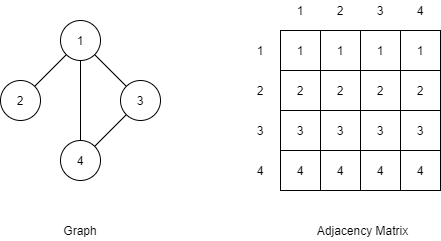

# [Graph] Graph 개념, 표현 방법

그래프(Graph)에 대해 알아볼겠습니다.

## 그래프(Graph)란?

### 강의 영상에서의 설명

> 트리는 노드가 있고 노드를 연결하는 엣지가 있다.
>
> 엣지의 방향은 위에서 아래로 간다.
>
> 만약, 엣지의 방향이 위아래로 있고 방향을 안 갖고 있을수 있고 ...
>
> 자기 자신을 가리키기도 하면... !@#$%
>
> 그것이 그래프입니다.

### 위키백과 설명

그래프는 vertex와 edge로 구성된 한정된 자료구조를 의미한다.

vertex는 정점, edge는 정점과 정점을 연결하는 간선이다.

* [위키백과 - 그래프](https://ko.wikipedia.org/wiki/%EA%B7%B8%EB%9E%98%ED%94%84_(%EC%9E%90%EB%A3%8C_%EA%B5%AC%EC%A1%B0))

### 나의 설명

간선을 통해 연결된 정점들이 모인 자료구조...

**그냥 그림을 보고 이해하자!**

> 참조 - 트리도 그래프의 한 종류이다.
>
> 모든 트리는 방향이 아래로 가기 때문에 화살표를 생략 가능.

## Directed VS Undirected

* Directed - edge의 방향을 있다.

* Undirected - edge가 방향이 없다.

## Cyclic VS Acyclic

* Cyclic - 사이클이 하나 이상 존재
* Acyclic - 사이클이 없음

## 그래프를 표현하는 방법

* 인접 행렬 (Adjacency Matrix) - 2차원 배열에 표현
* 인접 리스트 (Adjacency List) - 배열에 노드들을 나열하고 관계를 Linked Lsit로 표현

### Adjacency Matrix

* 각각의 노드들의 번호로 구성된 노드들을 테이블로 구성
* 서로 연결되면 1, 연결되지 않았으면 0으로 채운다.

아래 그래프를 Adjacency Matrix로 표현해보자.

### Adjacency List

* 배열에 모든 노드를 넣는다.
* 배열에 들어간 각 노드에 인접한 노드들을 Linked List로 채워준다.
* Linked List를 채울때 순서는 상관없다.
* List의 총 노드의 개수는 엣지의 개수x2
  * 서로 연결된걸 모두 적어주기 때문에

아래 그래프를 Adjacency List로 표현해보자.

엣지의 개수 m(위 예제에서는 4)

리스트 안의 원소의 개수 2m(위 예제에서는 2, 3, 4, 1, 1, 4, 1, 3 이므로 8)

## 링크

아래 강의를 참고하여 작성하였습니다.

* [엔지니어대한민국 - 그래프(Graph)에 대해서](https://www.youtube.com/watch?v=fVcKN42YXXI&list=PLjSkJdbr_gFY8VgactUs6_Jc9Ke8cPzZP&index=5)

