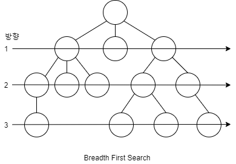
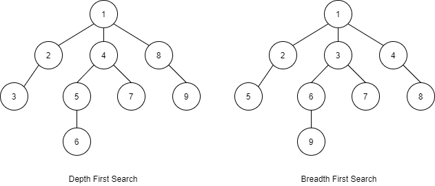
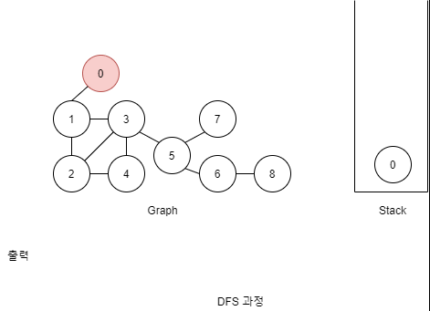
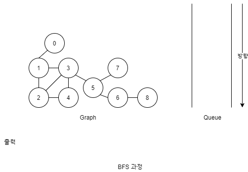
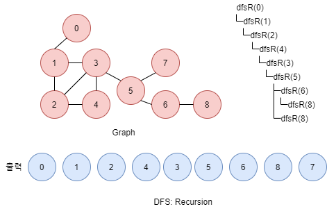

# [Graph] Graph 탐색 DFS, BFS

그래프(Graph)를 탐색하는 방법인 DFS(Depth First Search)와 BFS(Breadth First Search) 대해 알아볼겠습니다.


## Graph Search 종류

그래프를 탐색하는 방법

* 깊이 우선 탐색(Depth First Search)
* 너비 우선 탐색(Breadth First Search)


### Depth First Search(DFS)

Binary Tree를 검색할때 사용했던 아래 3개가 DFS에 속한다.

* Inorder
* Preorder
* Postorder


1. 자식의 자식의 자식...을 계속해서 방문
2. 잎 노드를 만나면 다시 올라온다.


### Breadth First Search(BFS)

순서대로 레벨별로 자식들을 탐색





## DFS, BSF 순서 비교

탐색하는 과정을 순서대로 비교해보며 이해해보겠습니다.





## DFS, BSF 과정

과정은 이용하는 자료구조만 바뀌고 동일하다.


### DFS: Stack을 이용

1. 빈 스택을 만든다.
2. 시작할 노드를 스택에 넣어준다.
3. 아래를 반복
   1. 스택에서 노드 하나를 꺼낸다.
   2. 꺼낸 노드의 인접한 노드를 전부 스택에 넣는다.
      * 꺼냈던 노드는 다시 스택에 넣지 않음
      * 인접한 노드가 없다면 다음으로 진행
   3. 꺼낸 노드는 출력한다.
4. 모든 노드를 탐색했다면 종료.





### BFS: Queue를 이용

1. 빈 큐를 만든다.
2. 시작할 노드를 큐에 넣어준다.
3. 아래를 반복
   1. 큐에서 노드 하나를 꺼낸다.
   2. 꺼낸 노드의 인접한 노드를 전부 큐에 넣는다.
      * 꺼냈던 노드는 다시 큐에 넣지 않음
      * 인접한 노드가 없다면 다음으로 진행
   3. 꺼낸 노드는 출력한다.
4. 모든 노드를 탐색했다면 종료.





### 시작점은 항상 0?

위 그래프의 0에서 시작한 DFS, BFS 결과값이다.

* DFS(0) = 0 1 3 5 7 6 8 4 2
* BFS(0) = 0 1 2 3 4 5 6 7 8


그래프는 트리만 있는게 아니기 때문에 시작은 0에서 할 필요는 없다.

예를 들어 3에서 시작해도 순회는 잘 된다.

* DFS(3) = 3 5 7 6 8 4 2 1 0
* BFS(3) = 3 1 2 4 5 0 6 7 8


### DFS: Recursion

DFS는 재귀를 통해 보다 쉽게 구현할 수 있다.

* 방문하면 자신을 출력하고 인접한 노드를 넣어 재귀호출 한다.

* 재귀는 정방향이기 때문에 자신이 먼저 출력된다.
* 먼저 입력된 연결 관계에 따라 결과가 달라진다.





## DFS, BFS 구현 코드 in Java

```java
import java.util.LinkedList;
import java.util.Stack;

// Queue 강의 참고
class Queue<T> {
	// 메소드명 수정
	// add    => enqueue
    // remove => dequeqe
    // 생략 ...
}

class Graph {
	class Node{
		int data;
		LinkedList<Node> adjacent;
		boolean marked;
		Node (int data) {
			this.data = data;
			this.marked = false;
			adjacent = new LinkedList<Node>();
		}
	}
	Node[] nodes;
	Graph(int size) {
		nodes = new Node[size];
		for(int i = 0; i < size; i++) {
			// 편의상 인덱스를 값으로 사용
			nodes[i] = new Node(i);
		}
	}
	void addEdge(int i1, int i2) {
		Node n1 = nodes[i1];
		Node n2 = nodes[i2];
		if(!n1.adjacent.contains(n2)) {
			n1.adjacent.add(n2);
		}
		if(!n2.adjacent.contains(n1)) {
			n2.adjacent.add(n1);
		}
	}
	
	void dfs() {
		dfs(0);
	}
	void dfs(int index) {
		Node root = nodes[index];
		Stack<Node> stack = new Stack<Node>();
		stack.push(root);
		root.marked = true;
		while(!stack.isEmpty()) {
			Node r = stack.pop();
			for(Node n : r.adjacent) {
				if(n.marked == false) {
					n.marked = true;
					stack.push(n);
				}
			}
			visit(r);
		}
	}
	
	void bfs() {
		bfs(0);
	}
	void bfs(int index) {
		Node root = nodes[index];
		Queue<Node> queue = new Queue<Node>();
		queue.enqueue(root);
		root.marked = true;
		while(!queue.isEmpty()) {
			Node r = queue.dequeue();
			for(Node n : r.adjacent) {
				if(n.marked == false) {
					n.marked = true;
					queue.enqueue(n);
				}
			}
			visit(r);
		}
	}
	
	// 재귀를 이용
	void dfsR(Node r) {
		if(r == null) return;
		r.marked = true;
		visit(r);
		for(Node n : r.adjacent) {
			if(n.marked == false) {
				dfsR(n);
			}
		}
	}
	void dfsR(int index) {
		Node r = nodes[index];
		dfsR(r);
	}
	void dfsR() {
		dfsR(0);
	}
	
	void visit(Node n) {
		System.out.println(n.data + " ");
	}	
}

/*
------------------
 0
/
1 -- 3    7
│  / │ \ /
│ /  │  5
2 -- 4   \
          6 - 8
------------------
DFS(0)
0 1 3 5 7 6 8 4 2
BFS(0)
0 1 2 3 4 5 6 7 8
DFS(0) - Recursive
0 1 2 4 3 5 6 8 7
------------------
DFS(3)
3 5 7 6 8 4 2 1 0
BFS(3)
3 1 2 4 5 0 6 7 8
DFS(0) - Recursive
3 1 0 2 4 5 6 8 7
------------------
*/
public class Test {
	public static void main(String[] args) {
		Graph g = new Graph(9);
		g.addEdge(0, 1);
		g.addEdge(1, 2);
		g.addEdge(1, 3);
		g.addEdge(2, 4);
		g.addEdge(2, 3);
		g.addEdge(3, 4);
		g.addEdge(3, 5);
		g.addEdge(5, 6);
		g.addEdge(5, 7);
		g.addEdge(6, 8);
		System.out.println("DFS(0) : ");
//		g.dfs();
		System.out.println("BFS(0) : ");
//		g.bfs();
		System.out.println("DFS(0) - Recursive : ");
		g.dfsR();
	}
}
```


## 링크

아래 강의를 참고하여 작성하였습니다.

* [엔지니어대한민국 - Graph 검색 DFS, BFS 구현 in Java](https://www.youtube.com/watch?v=_hxFgg7TLZQ&list=PLjSkJdbr_gFY8VgactUs6_Jc9Ke8cPzZP&index=6)


