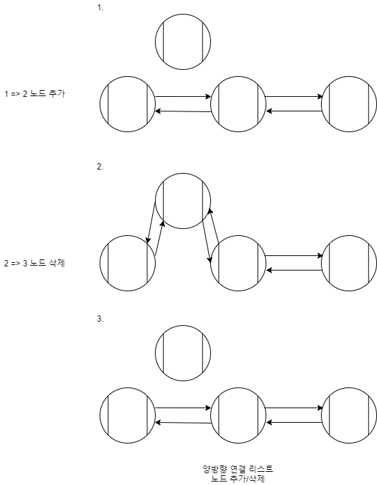

# [LinkedList] 단방향, 양방향 연결 리스트

단방향 연결 리스트(Singly Linked List)와 양방향 연결 리스트(Doubly Linked List)에 대해 알아볼겠습니다.

## 단방향/양방향 연결 리스트란?

### 단방향 연결 리스트(Singly Linked List)

* 다음 노드의 주소만 가지고 있다.
* 양방향 연결 리스트에 비해 메모리 공간을 절약할 수 있다.

### 양방향 연결 리스트(Doubly Linked List)

* 이전 노드와 다음 노드의 주소를 가지고 있다.
* 리스트의 앞, 뒤에서 모두 접근 가능하다.
* 메모리 공간이 더 필요하게 된다.

## 양방향 연결 리스트 노드 추가 및 삭제

## 링크

아래 강의를 참고하여 작성하였습니다.

* [엔지니어대한민국 - 단방향/양방향 Linked List 개념](https://www.youtube.com/watch?v=G4IIDyfoHeY&list=PLjSkJdbr_gFZQp0KEoo0Y4KkCI5YqxtjZ&index=2)

