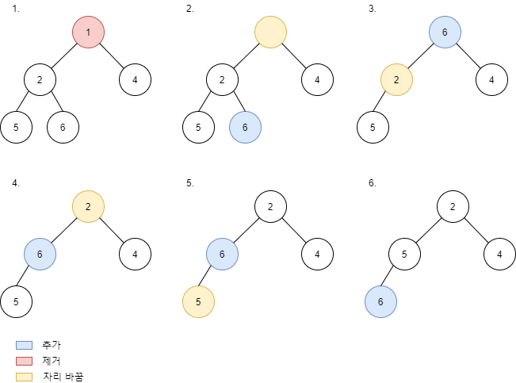

# [Tree] Binary Heaps 개념

이진 힙(Binary Heaps)에 대해 알아볼겠습니다.

## 힙(Heap) 이란?

>    최대값이나 최솟값을 빠르게 찾기 위해 고안된 완전 이진 트리를 기본으로한 자료구조

### 최소힙(Min Heap)

* 항상 부모 노드에 작은 값을 위치

* 루트에는 가장 작은 값이 위치

### 최대힙(Max Heap)

* 항상 부모 노드에 큰 값을 위치

* 루트에는 가장 작은 값이 위치

## 최소힙에 노드 삽입하기

1. 새로운 노드를 마지막 레벨의 왼쪽부터 채운다.
2. 자신(새로운 노드)과 부모랑 비교하여 자신이 작으면 부모랑 자리를 바꾼다.
3. 루트에 도달하거나 부모가 자신 보다 클때까지 2번을 반복한다.

* 시간 복잡도는 O(logN)

## 최소힙에서 노드 꺼내오기

1. 루트에서 최소값을 꺼낸다.
2. 맨마지막 노드의 값을 루트에 채운다.
3. 자신과 자식 노드들과 값을 비교하여 자기보다 더 작은 값이랑 위치를 바꾼다.
4. 잎 노드에 도착하거나 자식이 모두 자기보다 클때까지 3번을 반복한다.

## 링크

아래 강의를 참고하여 작성하였습니다.

* [엔지니어대한민국 - Binary Heaps (Min-Heaps and Max-Heaps)](https://www.youtube.com/watch?v=jfwjyJvbbBI&list=PLjSkJdbr_gFY8VgactUs6_Jc9Ke8cPzZP&index=3) 

