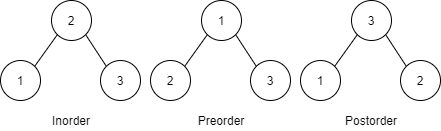
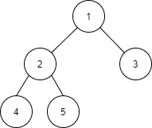

# [Tree] Binary Tree 순회 방법

Binary Tree 순회 방법에 대해 알아볼겠습니다.


## Binary Tree Traversal

>  이진 트리를 횡단하면서 트리의 모든 데이터를 가져오는 방법


* Inorder
  * Left - Root - Right
* Preorder
  * Root - Left - Right
* Postorder
  * Left - Right - Root





## Exemple

예제를 통한 순서 알아보기



### Inorder

* 4 - 2 - 5 - 1 - 3

### Preorder

* 1 - 2 - 4 - 5 - 3

### Postorder

* 4 - 5 - 2 - 3 - 1


## Binary Tree 구현 코드 in Java

```java
class Node {
	int data;
	Node left;
	Node right;
}

class Tree {
	public Node root;
	
	public void setRoot(Node node) {
		this.root = node;
	}
	public Node getRoot() {
		return root;
	}
	public Node makeNode(Node left, int data, Node right) {
		Node node = new Node();
		node.data = data;
		node.left = left;
		node.right = right;
		return node;
	}
	public void inorder(Node node) {
		if(node != null) {
			inorder(node.left);
			System.out.println(node.data);
			inorder(node.right);
		}
	}
	public void preorder(Node node) {
		if(node != null) {
			System.out.println(node.data);
			preorder(node.left);
			preorder(node.right);
		}
	}
	public void postorder(Node node) {
		if(node != null) {
			postorder(node.left);
			postorder(node.right);
			System.out.println(node.data);
		}
	}
}

/*
      (1)
     ↙   ↘
   (2)    (3)
  ↙   ↘
(4)   (5)
Inorder   (Left, Root, Right): 4 2 5 1 3
Preorder  (Root, Left, Right): 1 2 4 5 3
Postorder (Left, Right, Root): 4 5 2 3 1
*/
public class Traversal {
	
	public static void main(String[] args) {		
		Tree t = new Tree();
		Node n4 = t.makeNode(null, 4, null);
		Node n5 = t.makeNode(null, 5, null);
		Node n2 = t.makeNode(n4, 2, n5);
		Node n3 = t.makeNode(null, 3, null);
		Node n1 = t.makeNode(n2, 1, n3);
		
		t.setRoot(n1);
		System.out.println("Inorder : ");
		t.inorder(t.getRoot());
		System.out.println("Preorder : ");
		t.preorder(t.getRoot());
		System.out.println("Postorder : ");
		t.postorder(t.getRoot());
	}
}
```


## 링크

아래 강의를 참고하여 작성하였습니다.

* [엔지니어대한민국 - Binary Tree의 3가지 순회방법 구현하기](https://www.youtube.com/watch?v=QN1rZYX6QaA&list=PLjSkJdbr_gFY8VgactUs6_Jc9Ke8cPzZP&index=2)

