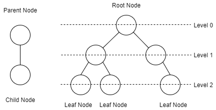
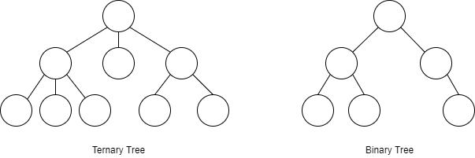
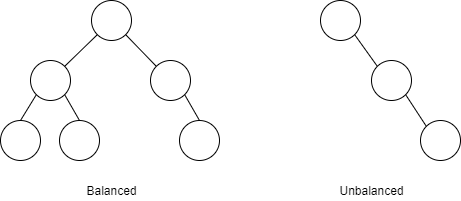
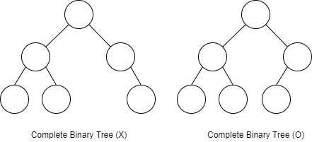
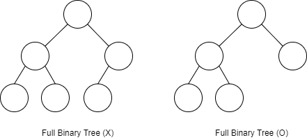
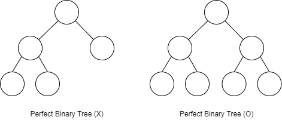

# [Tree] Tree의 개념, 종류

트리(Tree)에 대해 알아볼겠습니다.

## 트리(Tree)란?

* 부모 자식관계를 가지는 자료 구조
* 계층, 그룹이 있다.
* 부모 노드(Parent Node)는 하나 이상의 자식(Child Node)을 갖고 있다.(Leaf Node 제외)
* 부모가 없는 맨 위의 노드 루트 노드(Root Node)라 부른다
* 트리의 맨 끝에 자식이 없는 노드를 잎 노드(Leaf Node)라 부른다.
* 루트 노드부터 잎 노드까지 Level이 0, 1, 2 ... 하나씩 증가한다.

## 이진 트리(Binary Tree)

* 자식 노드가 최대 2개까지면 이진트리(Binary Tree)
* 자식 노드가 최대 3개까지면 Ternary Tree

## 이진 탐색 트리(Binary Search Tree)

* 왼쪽 자식 노드들과 그 이하 노드들은 자신보다 작아야하고 오른쪽 노드들과 그 이하 노드들은 자신보다 커야한다.
* 왼쪽 자식들 < 자신 < 오른쪽 자식들
* 값을 찾을때 용의함

## 균형(Balance)

* 한쪽으로 치우치면 unbalanced
* balanced는 양쪽의 노드가 정확하게 일치할 필요없다
* balanced Tree의 종류
  * red-black tree
  * AVL tree

## 완전 이진 트리(Complete Binary Tree)

* 노드들이 레벨별로 왼쪽부터 채워져 있는 트리

## 정 이진 트리(Full Binary Tree)

* 한개의 자식 노드를 가진 노드가 하나도 없는 트리
* 모든 노드가 자식이 0개 또는 2개

## 포화 이진 트리(Perfect Binary Tree)

* 모든 노드가 2개의 자식 노드를 가진다.
* 모든 노드의 개수가 2^n -1

## 링크

아래 강의를 참고하여 작성하였습니다.

* [엔지니어대한민국 - Tree의 종류](https://www.youtube.com/watch?v=LnxEBW29DOw&list=PLjSkJdbr_gFY8VgactUs6_Jc9Ke8cPzZP)

