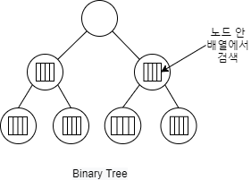

# [Tree] Trie Tree 개념

트라이 트리(Trie Tree)에 대해 알아볼겠습니다.

## 트라이 트리(Trie Tree) 란?

> 특히 문자열에서 빠르게 검색을 해주는 트리 구조

### Binary Tree의 경우

* 노드의 배열에서 검색을 하기 O(long n) 시간복잡도를 갖아 비효율적이다.

### Trie Tree의 경우

* 사전을 만든다고 가정

* 단어의 한글자씩 노드에 저장시켜 다음 글자를 Child Node에서 찾는다.

* 트리에 문자열이 세로로 저장되어 있다.
* Root Node는 비운다

* 시간 복잡도는 O(M)

## 링크

아래 강의를 참고하여 작성하였습니다.

* [엔지니어대한민국 - Trie(트라이) Tree에 대해서](https://www.youtube.com/watch?v=TohdsR58i3Q&list=PLjSkJdbr_gFY8VgactUs6_Jc9Ke8cPzZP&index=4)

