# [Database] MariaDB 설치

MariaDB는 MySQL을 기반으로 만들어진 관계형 데이터베이스 관리 시스템입니다.

그리고 오픈 소스로 **무료**입니다.

이제 설치를 진행 해보겠습니다.

## MariaDB 설치

1. <https://mariadb.org/> ← 사이트에 접속

2. Download 버튼 선택

   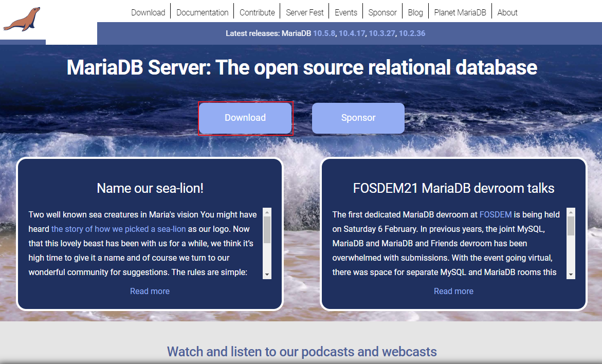

3. 자신이 원하는 버전과 운영 체제 확인 후 Download

   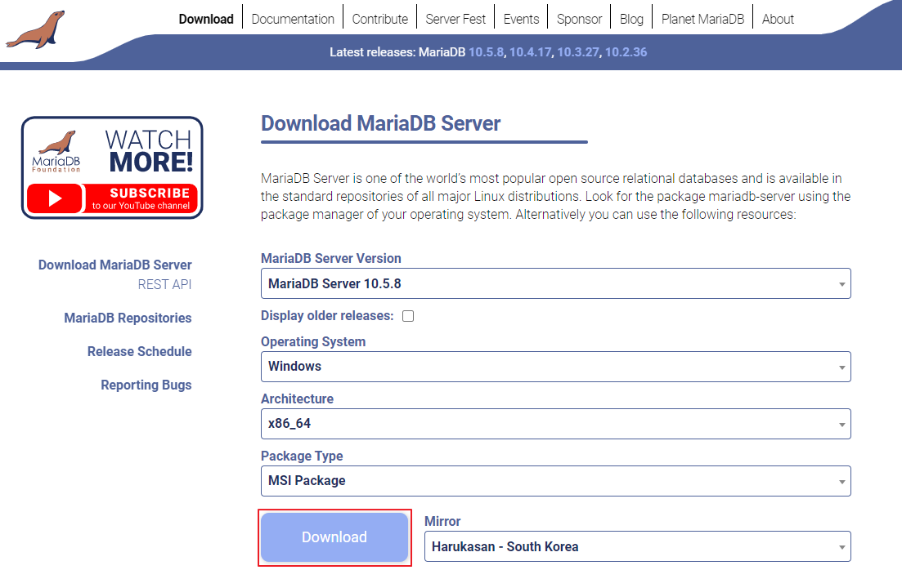

4. 설치 파일 실행

5. Next

   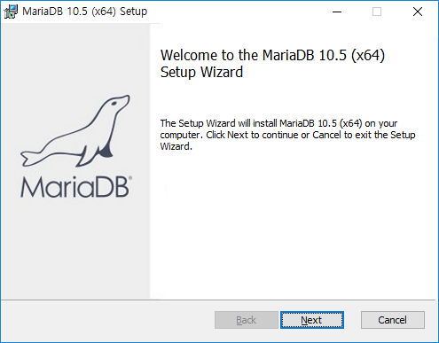

6. 체크박스 체크 후 Next

   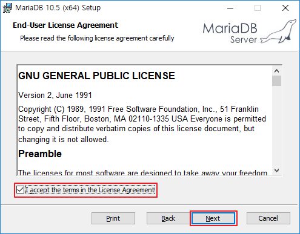

7. 설치 경로 설정 후 Next

   만약 HeidiSQL을 사용하지 않고 싶다면 디스크 모양을 클릭하여 X로 체크한다.

   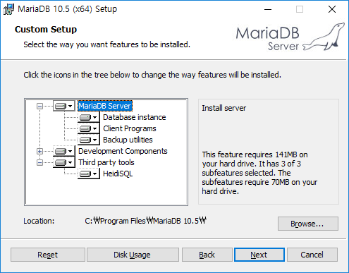

8. 비밀번호를 입력한다.

   - Enable access ... 은 개인용으로 사용할것이기에 체크를 해제

   * Use UTF8 ... 은 체크

   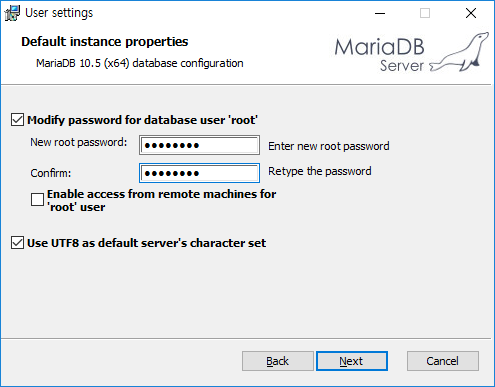

9. 서비스명과 포트를 지정하고 Next

   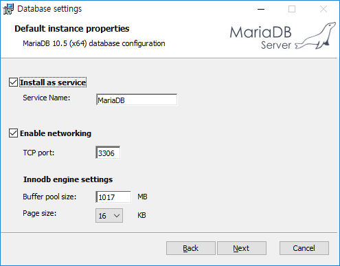

10. Install

    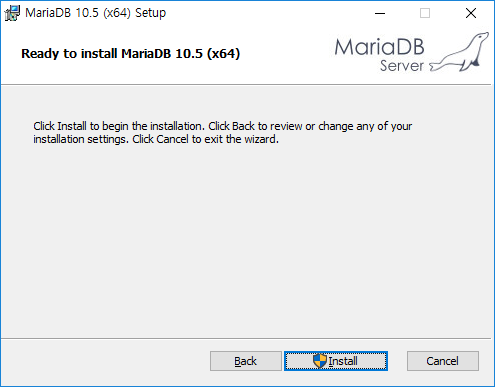

11. Finish

    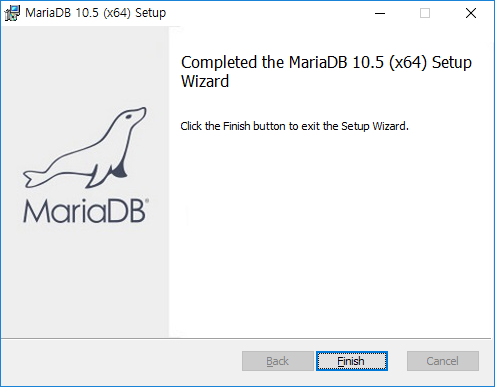

12. 설치 완료

## MariaDB 테스트

1. 윈도우키 mysql 검색

2. MySQL Client 실행

   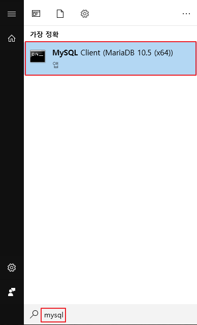

3. 설치시 입력했던 비밀번호 입력

   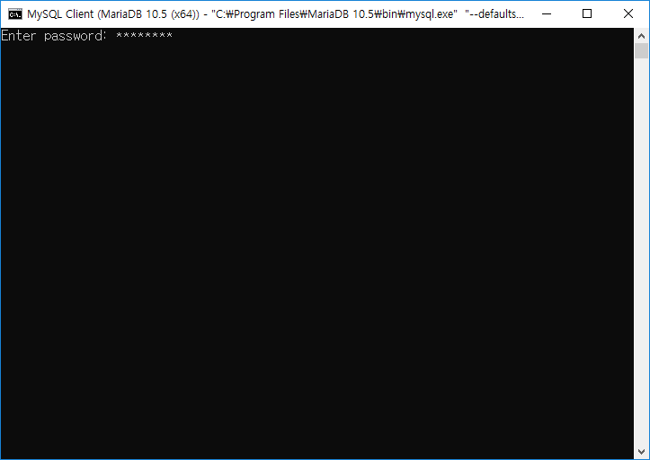

4. 접속된것을 확인 한 후 `show databases;` 입력

   > show databases; 는 모든 데이터베이스 목록을 보여주는 것입니다.

   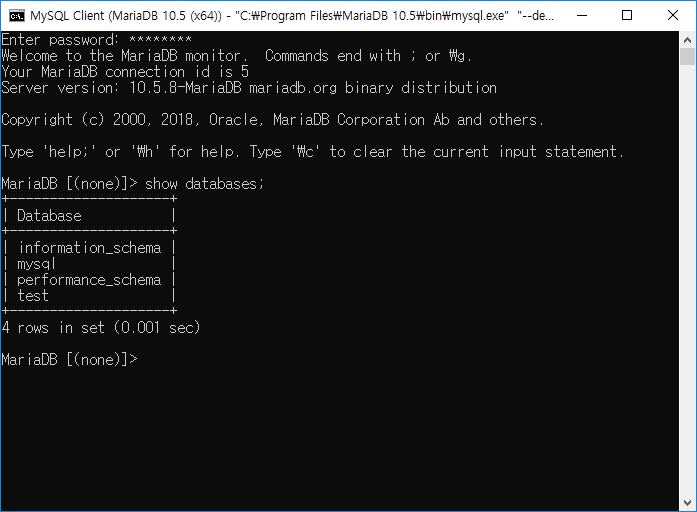

5. 테스트가 끝났다면 설치가 잘 된 것입니다.

## 링크

* [MariaDB 공식 홈](https://mariadb.org/)
* [MariaDB 다운로드 페이지](https://mariadb.org/download/)

