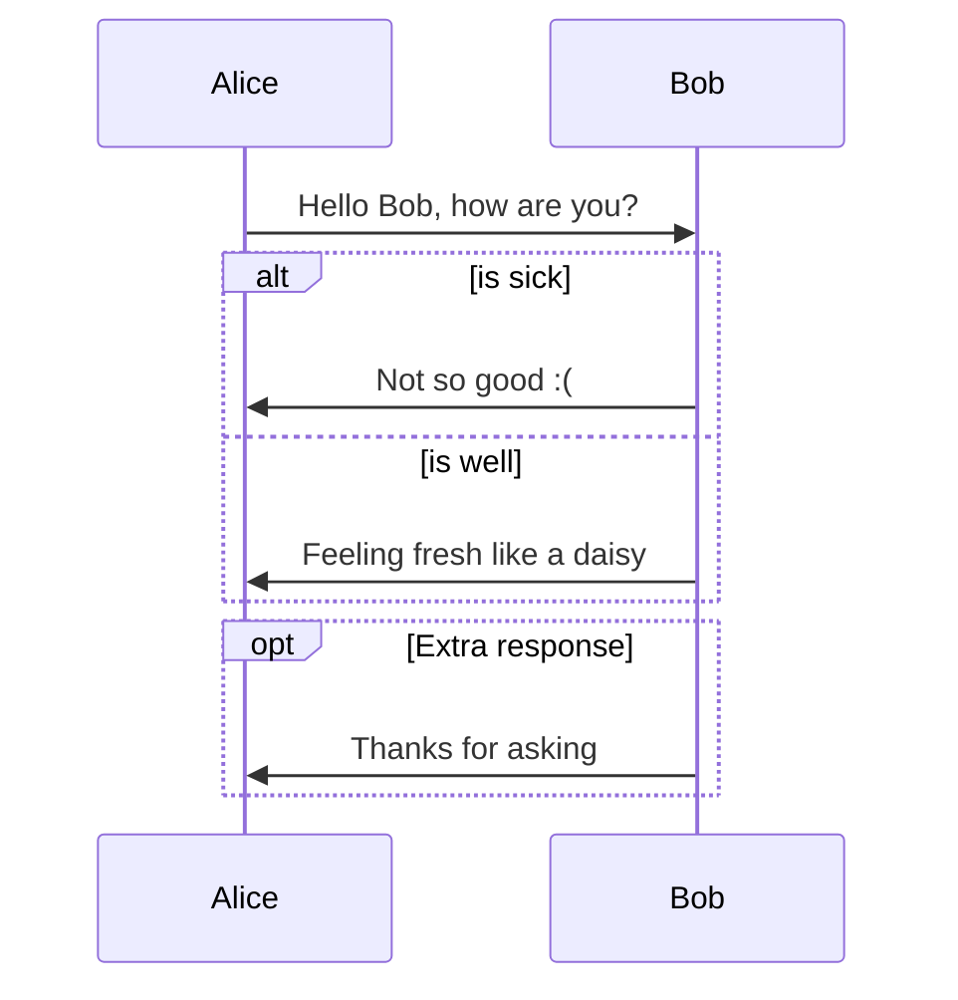
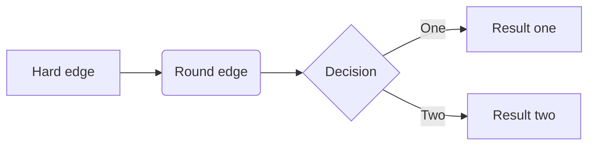
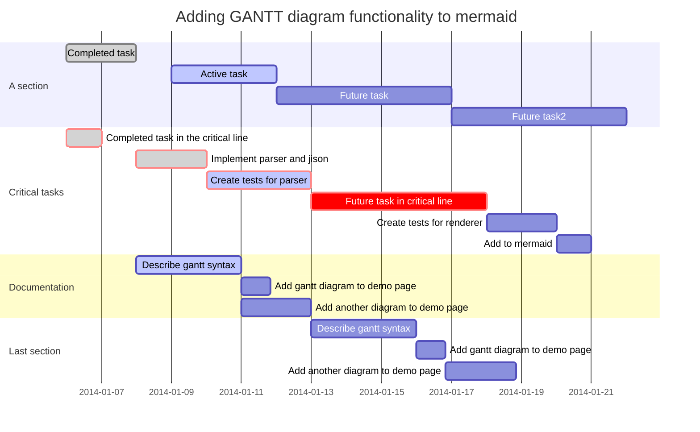
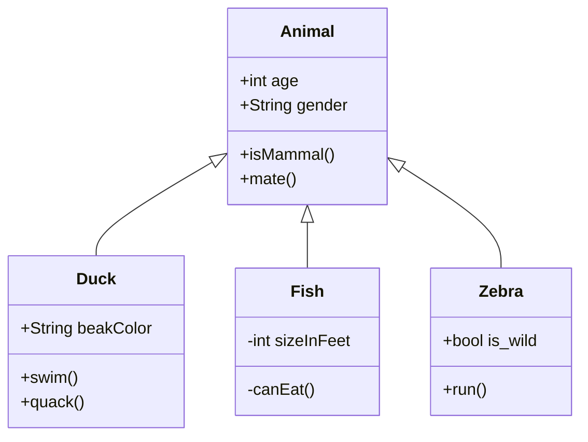
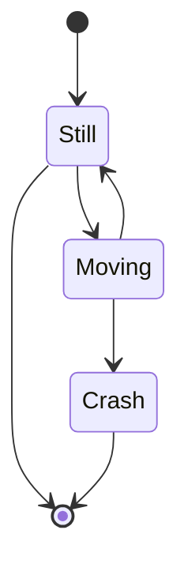
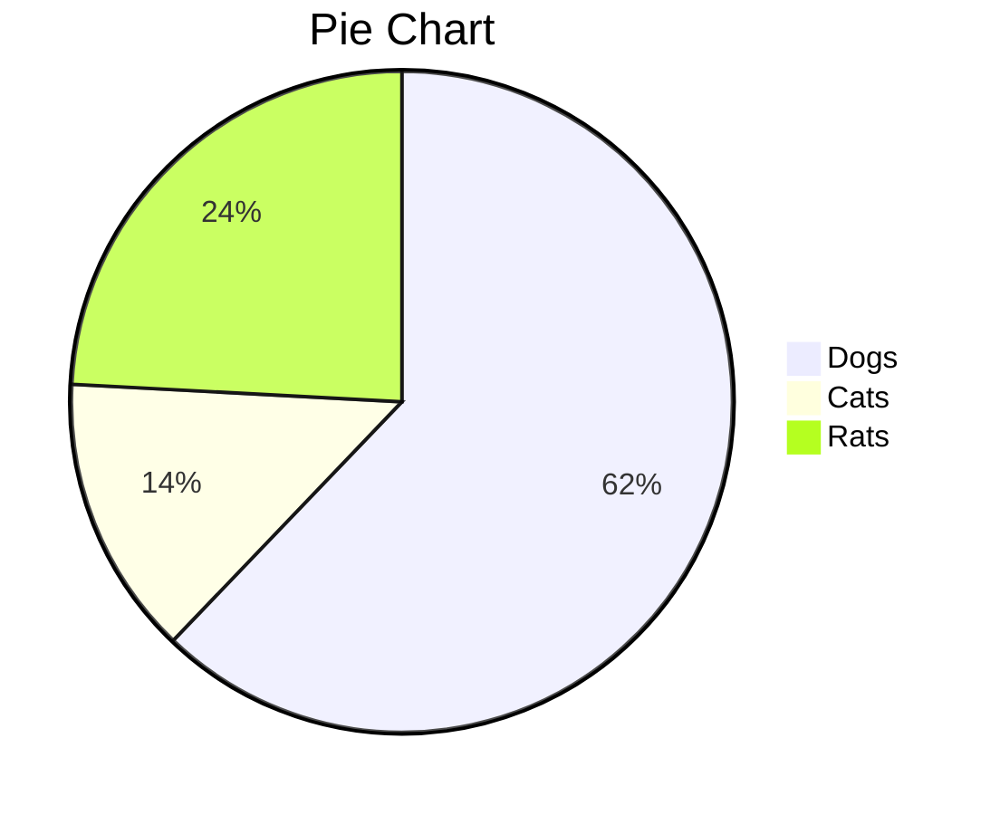

- [Back](https://support.typora.io/)

# Draw Diagrams With Markdown

August 15, 2016 by typora.io

Typora supports some Markdown extensions for diagrams, once they are enabled from preference panel.

When exporting as HTML, PDF, epub, docx, those rendered diagrams will also be included, but diagrams features are not supported when exporting markdown into other file formats in current version. Besides, you should also notice that diagrams is not supported by standard Markdown, CommonMark or GFM. Therefore, we still recommend you to insert an image of these diagrams instead of write them in Markdown directly.

# Sequence Diagrams

This feature uses [js-sequence](https://bramp.github.io/js-sequence-diagrams/), which turns the following code block into a rendered diagram:

~~~gfm
```sequence
Alice->Bob: Hello Bob, how are you?
Note right of Bob: Bob thinks
Bob-->Alice: I am good thanks!
```
~~~


For more details, please see [this syntax explanation](https://bramp.github.io/js-sequence-diagrams/#syntax).

# Flowcharts

이 기능은 다음 코드 블록을 렌더링 된 다이어그램으로 변환하는 [순서도 .js를](http://flowchart.js.org/) 사용합니다 .

~~~gfm
```flow
st=>start: Start
op=>operation: Your Operation
cond=>condition: Yes or No?
e=>end

st->op->cond
cond(yes)->e
cond(no)->op
```
~~~


# 인어

Typora 는 시퀀스 다이어그램, 순서도, Gantt 차트, 클래스 및 상태 다이어그램, 파이 차트를 지원 하는 [mermaid](https://mermaid-js.github.io/mermaid/#/) 와도 통합됩니다 .

## 시퀀스 다이어그램

자세한 내용은 [이 지침을](https://mermaid-js.github.io/mermaid/#/sequenceDiagram) 참조하십시오 .

~~~gfm

~~~


## 순서도

자세한 내용은 [이 지침을](https://mermaid-js.github.io/mermaid/#/flowchart) 참조하십시오 .

~~~gfm

~~~


## 간트 차트

자세한 내용은 [이 지침을](https://mermaid-js.github.io/mermaid/#gantt) 참조하십시오 .

~~~gfm

~~~


## 클래스 다이어그램

자세한 내용은 [이 지침을](https://mermaid-js.github.io/mermaid/#/classDiagram) 참조하십시오 .

~~~gfm

~~~


## 상태 다이어그램

자세한 내용은 [이 지침을](https://mermaidjs.github.io/#/stateDiagram) 참조하십시오 .

~~~gfm

~~~


## 파이 차트

~~~gfm

~~~


[Github에서](https://github.com/typora/wiki-website) 호스팅됩니다 .

<iframe id="_atssh615" title="AddThis 유틸리티 프레임" src="https://s7.addthis.com/static/sh.f48a1a04fe8dbf021b4cda1d.html#rand=0.411534069529085&amp;iit=1600965632071&amp;tmr=load%3D1600965632026%26core%3D1600965632059%26main%3D1600965632064%26ifr%3D1600965632078&amp;cb=0&amp;cdn=0&amp;md=0&amp;kw=&amp;ab=-&amp;dh=support.typora.io&amp;dr=https%3A%2F%2Fwww.google.com%2F&amp;du=https%3A%2F%2Fsupport.typora.io%2FDraw-Diagrams-With-Markdown%2F&amp;href=https%3A%2F%2Fsupport.typora.io%2FDraw-Diagrams-With-Markdown%2F&amp;dt=Draw%20Diagrams%20With%20Markdown&amp;dbg=0&amp;cap=tc%3D0%26ab%3D0&amp;inst=1&amp;jsl=0&amp;prod=undefined&amp;lng=ko&amp;ogt=&amp;pc=men&amp;pub=ra-5ed23a5bcf8c017f&amp;ssl=1&amp;sid=5f6ccc00082e4cbc&amp;srf=0.01&amp;ver=300&amp;xck=0&amp;xtr=0&amp;og=&amp;csi=undefined&amp;rev=v8.28.7-wp&amp;ct=1&amp;xld=1&amp;xd=1" style="height: 1px; width: 1px; position: absolute; top: 0px; z-index: 100000; border: 0px; left: 0px;"></iframe>


[
  ](https://support.typora.io/Draw-Diagrams-With-Markdown/#)