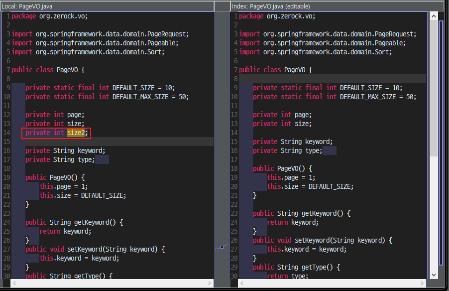
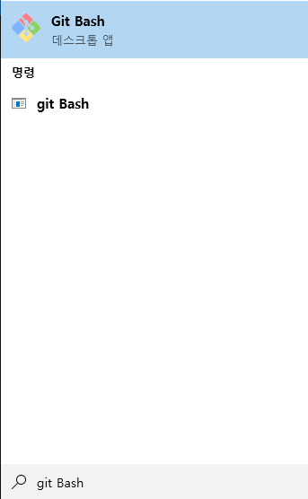
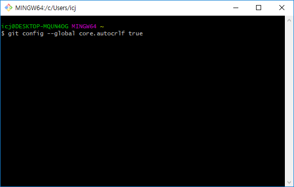
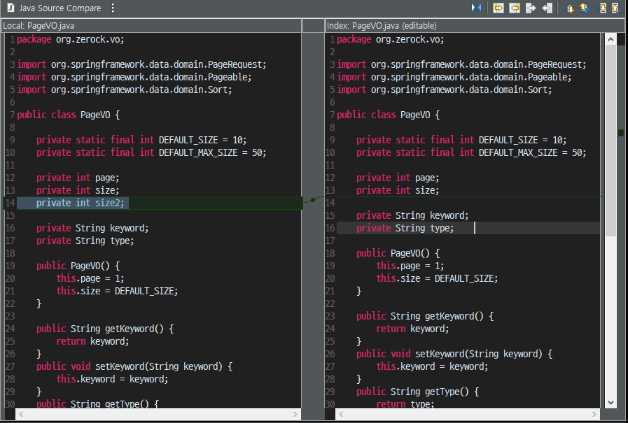

# [Git] Changes 파일 단위에서 줄 단위로 변경

Git을 사용중에 한 줄을 바꿨는데 파일 전체가 바뀐것처럼 보일때가 있습니다.

개행 문자 차이로 생긴 문제인데 Git의 설정으로 변경할 수 있습니다.


## 이슈

이클립스에서 14라인 코드를 추가하고 Git Perspective에 들어가 파일을 확인한 모습입니다.




위 화면을 보시면 파일 전체가 수정된 것처럼 보입니다.

운영체제별 개행문자를 다르게 사용하기 때문에 발생하는 문제라고 합니다.


## 해결 방법

1. git bash 실행

   

2. 아래 명령어 입력

   ```shell
   git config --global core.autocrlf true
   ```

   

3. 다시 아까 수정한 파일의 Compare를 열어봅니다.

   

4. 줄 단위로 변경된것을 확인할 수 있습니다.


## 링크

* [git 에서 CRLF 개행 문자 차이로 인한 문제 해결하기](https://www.lesstif.com/gitbook/git-crlf-20776404.html)


