# [Git] Git 설치 및 초기 설정

Git은 소스 코드를 버전관리할 수 있는 툴입니다.

설치 방법에 대해 알아보겠습니다.


## Git 설치

1. <https://git-scm.com/downloads> <= 접속합니다.
2. Download for Winodws 클릭 (버전은 상이할수 있습니다.)

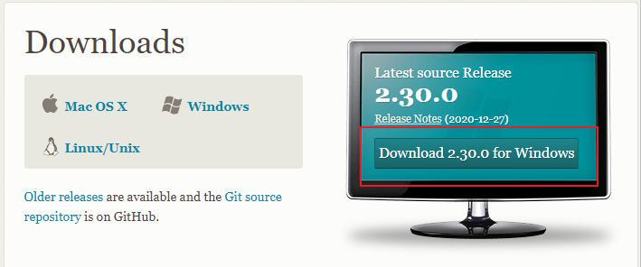

3. 다운로드된 파일 실행
   * 이후 과정에서 모르겠다면 기본값으로 설정해서 Next를 선택하세요.

4. Next 클릭

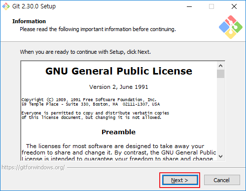

5. 설치 받고 싶은 곳을 지정 후 Next 클릭

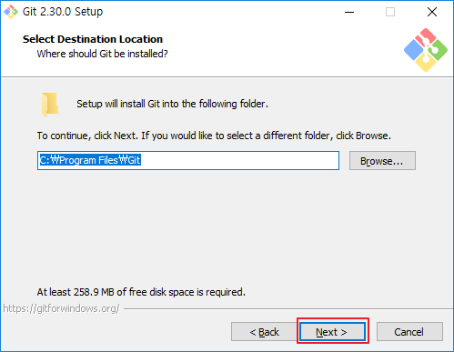

6. 기본값으로 Next

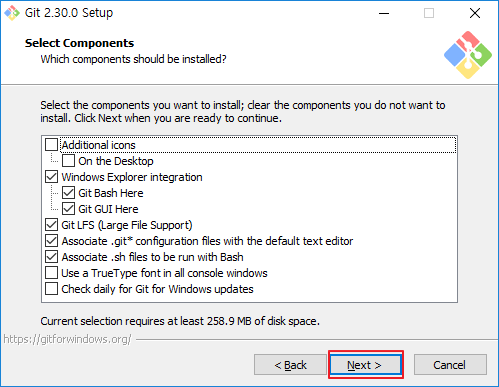

7. Next (시작 메뉴에 추가하지 않으려면 Don't create a Start Menu folder 체크)

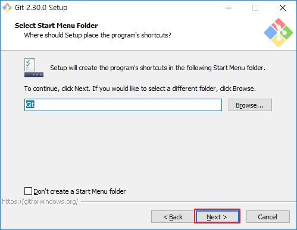

8. 원하는 에디터를 선택후 Next

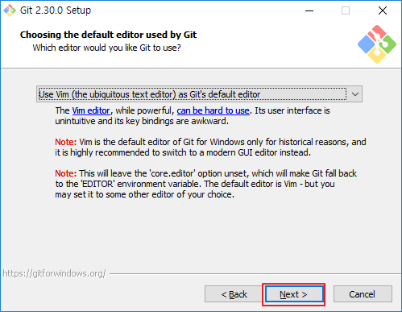

9. Next (기본 브랜치명을 설정하고 싶다면 두번째 클릭)

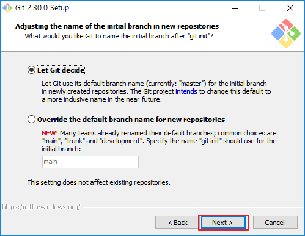

10. 기본값으로 Next

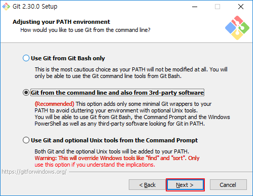

11. 기본값으로 Next

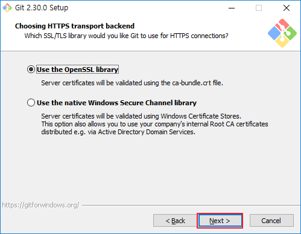

12. 원하는 체크아웃, 커밋 엔딩 선택후 Next

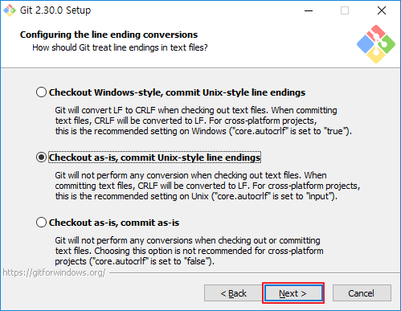

13. Git Bash 터미널 종류 선택 후 Next

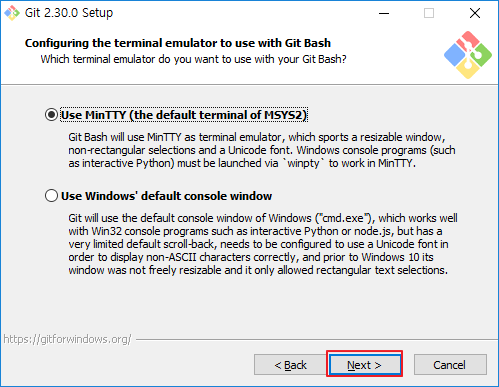

14. 기본값으로 Next

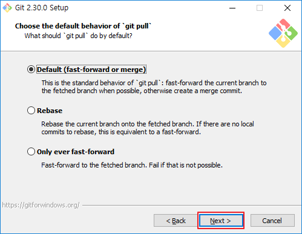

15. 기본값으로 Next

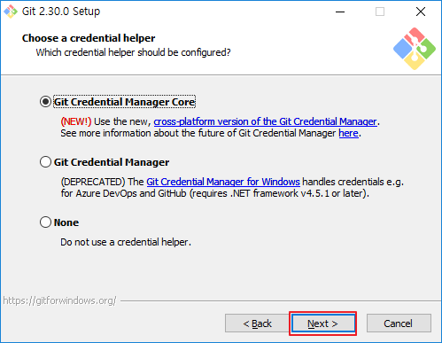

16. 기본값으로 Next

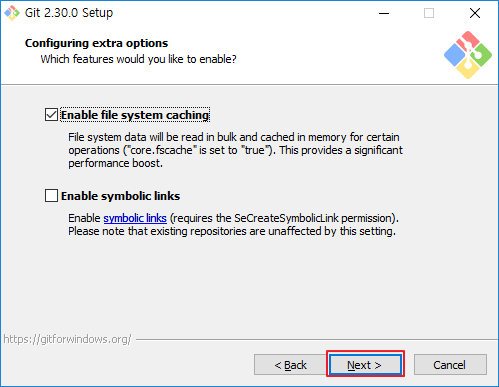

17. 대망의 Install

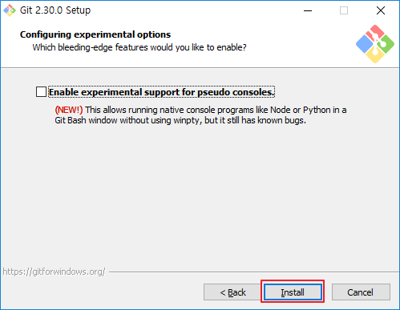

18. 설치가 끝나면 Launch Git Bash 선택 후 Finish

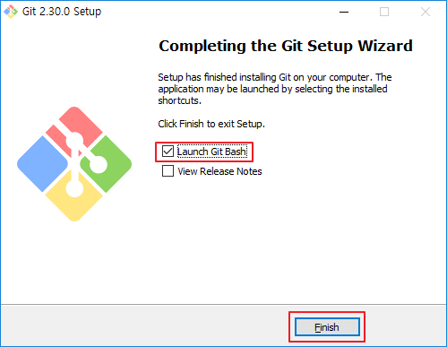


## Git 이름, 이메일 설정

1. 설치 이후 실행된 Git Bash에서 다음 명령어 입력
   * '이름'과 '이메일'은 본인꺼

```shell
git config --global user.name [이름]
git config --global user.email [이메일]
```

2. `git config --list` 명령어를 사용하여 방금 등록한 이름과, 이메일이 맞는지 확인

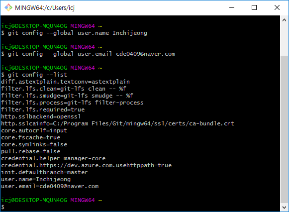


## 링크

* [Git 다운로드 페이지](https://git-scm.com/downloads)

