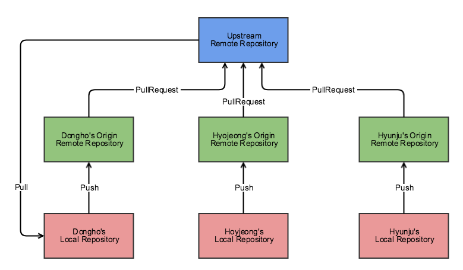

# [Git] Git-flow

## Git Repository 구성

* **Upstream Remote Repositroy**
  * 개발자들이 공유하는 저장소(최신 소스 코드)
* **Origin Remote Repository**
  * Upstream Remote Repository를 Fork한 개인 저장소
* **Local Repository**
  * 로컬 컴퓨터에 저장되어 있는 개인 저장소

## 워크플로우

1. Local Repository에서 작업 완료
2. Origin Repository에 push
3. Origin Repository에서 Upstream Repository로 merge하는 Pull Request 생성
4. 코드 리뷰 이후 merge
5. 새로운 작업을 할때 Local Repository에서 Upstream Repository를 pull

## Git-flow 브랜치들

* master: 제품으로 출시될 수 있는 브랜치
* develop: 다음 출시 버전을 개발하는 브랜치
* feature: 기능을 개발한느 브랜치
* release: 이번 출시 버전을 준비하는 브랜치ß
* hotfix: 출시 버전에서 발생한 버그를 수정하는 브랜치

> 메인 브랜치(항상 유지됨) - master, develop
>
> 보조 브랜치(일정 기간 동안만 유지됨) - feature, release, hotfix

1. master와 develop 브랜치 존재

   (develop는 master에서 시작된 브랜치)

2. develop 브랜치에서 상시로 버그를 수정한 커밋들이 추가됨

3. 새로운 기능 추가 작업이 있는 경우 develop 브랜치에서 feature 브랜치를 생성

   (feature 브랜치는 항상 develop 브랜치에서 부터 시작)

4. 추가 작업 완료시 feature 브랜치는 develop 브랜치로 merge

5. develop에 이번 버전에 포함되는 모든 기능이 merge 되었다면 QA를 하기 위해 develop 브랜치에서부터 release 브랜치를 생성

6. QA를 진행하면서 발생한 버그들은 release 브랜치에 수정

7. QA를 무사히 통과했다면 release 브랜치를 master와 develop 브랜치로 merge

8. 출시된 master 브랜치에서 버전 태그를 추가

## 출처

* [우아한형제들 기술블로그 - 우린 Git-flow를 사용하고 있어요](https://woowabros.github.io/experience/2017/10/30/baemin-mobile-git-branch-strategy.html)

