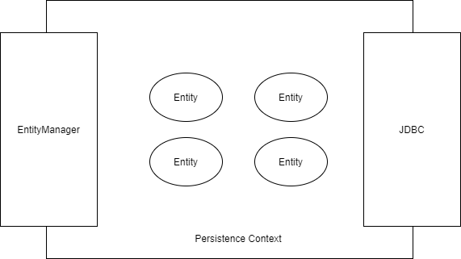
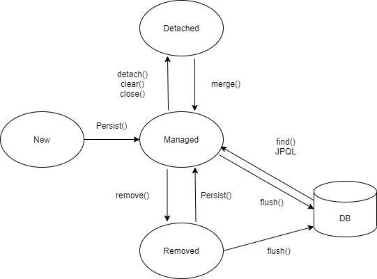

# [JPA] JPA(Java Persistence API) 란

JPA에 대해 알아보겠습니다.

## JPA(Java Persistence API) 란?

* JPA는 Java를 이용해서 데이터를 관리(유지)하는 기법을 하나의 스펙으로 정리한 표준

* JPA를 이용하면 다양한 데이터베이스에 종속적인 SQL문 없이 개발 가능

* ORM(Object Relational Mapping) 은 객체지향과 관계형 데이터베이스를 매핑시킨다는 추상화된 개념

* 쉽게 말해 JAP는 ORM을 JAVA 언어에서 구현하기 위한 스펙

## 엔티티(Entity), 엔티티 매니저(EntityManager)

### 엔티티란?

데이터베이스상에서 관리하는 대상. '상품', '회사', '직원' 등을 예로 들 수 있습니다.

JAP에서 '하나의 엔티티 타입을 생성한다' 라는 의미는 '하나의 클래스'를 작성한다는 의미입니다.

### 엔티티 매니저란?

엔티티 객체들을 관리하는 역할. 여기서 관리란 'Life Cycle'.

영속 컨텍스트(Persistence Context)라는 곳에 넣어두고 객체들의 생사를 관리합니다.

### 영속 컨텍스트와 엔티티 객체

- New(비영속): Java 영역에 객체만 존재하고, 데이터베이스와 연동된 적이 업는 상태. 엔티티 매니저의 관리하에 있는 것이 아니기 때문에 순수한 Java 객체
- Managed(영속): 데이터베이스에 저장되고, 메모리상에서도 같은 상태로 존재하는 상태. 객체는 역속 컨텍스트 내에 들어가게 되고, id(PK)값을 통해 필요한 엔티티 객체를 꺼내 사용할수 있게 됩니다.
- Removed(삭제): 데이터베이스상에서 삭제된 상태. 객체는 더 이상 영속 컨텍스트에 존재하지 않습니다.
- Detached(준영속): 영속 컨텍스트에서 엔티티 객체를 꺼내서 사용하는 상태. 준영속 상태의 객체는 고한 id(PK)를 가지고 있지만, 아직 데이터베이스와 동기화가 이루어지지 않은 상태

