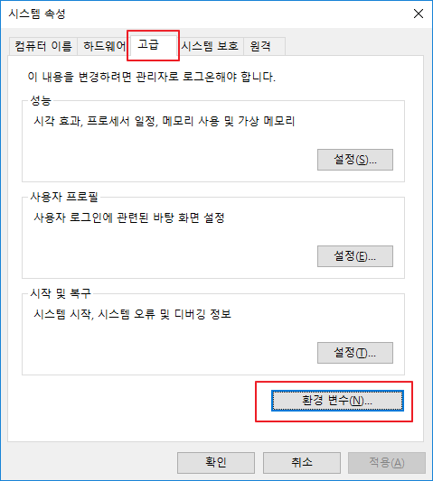

# [Java] JDK8 설치 및 환경변수 설정

Java 사용법에 대해 알아볼겠습니다.

Java 프로그램을 실행시키기 위해서 JRE, 개발하기 위해 JDK를 사용합니다.

저는 JDK8 버전을 다운받도록 하겠습니다.


## JDK 8 설치

1. [오라클 JDK8 다운로드 페이지](https://www.oracle.com/kr/java/technologies/javase/javase-jdk8-downloads.html) <= 클릭하여 접속
   - 혹은 구글에 jdk8 downloads 검색


2. 스크롤을 내려 *'jdk-8u271-windows-x64.exe'* 선택

   * 윈도우 64비트 기준입니다.
   * 다음에서 본인의 운영체제를 확인할 수 있습니다.
     * 윈도우키 - 내 PC 우클릭 - 속성
  * 혹은 제어판 - 시스템 및 보안 - 시스템 (위와 동일한 창)

   

3. 회원가입 및 로그인

4. 다운로드한 설치 파일 실행

5. 다음을 누르다가 설치 위치 조정

   * 저는 기본값으로 설정하였습니다.
   * **설치 경로를 복사해 둡니다.** 환경 변수 설정시 필요!!
   * C:\Program Files\Java\jdk1.8.0_271

   

   

6. 아래 화면에서 close를 누릅니다.


## 환경 변수 설정

1. 윈도우키 - 내 PC 우클릭 - 속성 - 고급 시스템 설정


2. 고급 탭 - 환경 변수



3. 시스템 변수에 새로 만들기 선택


4. 아래 값을 입력 이후 확인
   * 변수 이름 : JAVA_HOME
   * 변수 값 : C:\Program Files\Java\jdk1.8.0_271 (아까 복사했던 jdk 설치 경로)


5. 시스템 변수 - Path 선택 - 편집


6. 요즘에는 기본으로 Path가 잡혀져 있습니다. 하지만 해당 경로에는 java, javaw, javaws만 존재하기 때문에 별개로 새로 만들기를 클릭해 줍니다.

   

7. %JAVA_HOME%\bin\    <= 입력 후 확인


8. 설정이 잘 되었는지 확인
   1. 윈도우키 - 명령 프롬프트 실행
   2. java -version 입력
   3. javac -version

```shell
C:\>java -version
java version "1.8.0_271"
Java(TM) SE Runtime Environment (build 1.8.0_271-b09)
Java HotSpot(TM) 64-Bit Server VM (build 25.271-b09, mixed mode)

C:\>javac -version
javac 1.8.0_271
```


## 링크

* [오라클 JDK8 다운로드 페이지](https://www.oracle.com/kr/java/technologies/javase/javase-jdk8-downloads.html)
* [환경 변수에 대해 잘 설명한 글](https://m.blog.naver.com/PostView.nhn?blogId=zxwnstn&logNo=221521038431&proxyReferer=https:%2F%2Fwww.google.com%2F)

* [JDK, JRE, JVM 차이를 잘 설명한 글](https://arer.tistory.com/156)