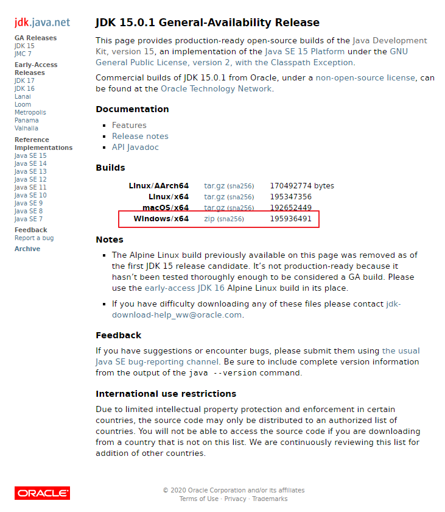
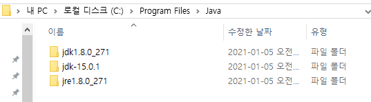
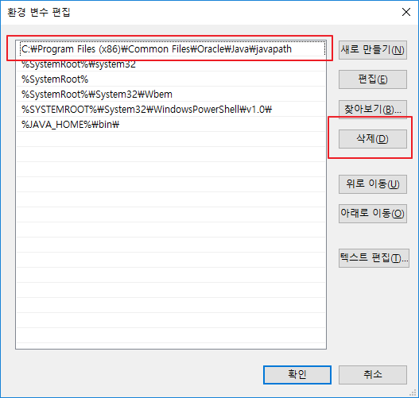

# [Java] Open JDK15 설치

Eclipse 4.17 (2020-09) 버전 이후 부터 기존 Java8에서 Java11이상으로 요구사항이 변경됐습니다.

Oracle에서 제공되는 11버전은 유료입니다.

따라서, 무료인 Open JDK15를 설치해보겠습니다.


## Open JDK 15 설치

1. <https://jdk.java.net/15/>    <= 접속
2. Windows / x64 옆에 zip 클릭



3. 기존에 Java8을 사용중이였다면 JDK 설치 위치에 압축 풀기

   * JDK를 처음 받는다면 원하는 곳에 압축 풀기
   * 저는 다음과 같이 Java 디렉토리를 구성하였습니다.

   

3. 환경변수를 JDK15로 설정 및 수정

   * [[Java] JDK8 설치 및 환경변수 설정](https://poetic-code.tistory.com/75?category=832502) <= 여기에 있는 환경 변수 설정을 참고

   * 시스템변수 - Path -편집 - Oracle Javapath 삭제

     

   * 시스템변수 - JAVA_HOME - 편집 - JDK15 디렉토리로 값 수정

     

4. 설정이 잘 되었는지 확인
   1. 윈도우키 - 명령 프롬프트 실행
   2. java -version 입력
   3. javac -version

```shell
C:\>java -version
openjdk version "15.0.1" 2020-10-20
OpenJDK Runtime Environment (build 15.0.1+9-18)
OpenJDK 64-Bit Server VM (build 15.0.1+9-18, mixed mode, sharing)

C:\>javac -version
javac 15.0.1
```


## 링크

* [[Java] JDK8 설치 및 환경변수 설정](https://poetic-code.tistory.com/75?category=832502)


