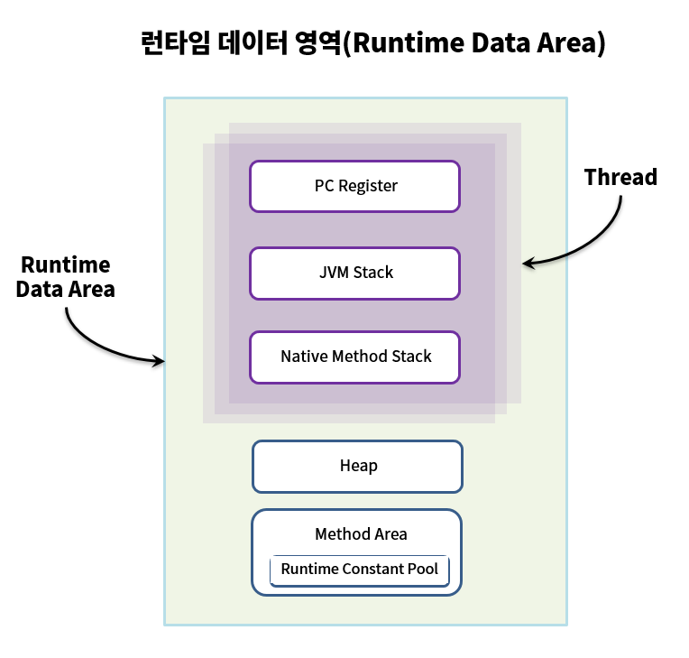

# [Java] 런타임 데이터 영역(Runtime Data Area)

JVM이 OS위에서 실행되면서 할당받는 메모리 영역이 바로 런타임 데이터 영역(Runtime Data Arae) 입니다. 이 영역은 크게 5가지 조금 세분화하면 6가지 영역으로 나눌 수 있습니다.

## 스레드 관점

* 스레드(Thread)마다 하나씩 생성
  * PC 레지스터(PC Register)
  * JVM 스택(JVM Stack)
  * 네이티브 메서드 스택(Native Method Stack)
* 모든 스레드가 공유해서 사용 **(☆GC의 대상)**
  * 힙(Heap)
  * 메서드 영역(Method Area)

## 각 영역 저장 값

* 메서드 영역: 클래스, 메서드, 클래스 변수(static), 전역변수
* 힙 영역: new 연산자를 통해 생성된 객체(인스턴스)
* 스택 영역: 지역변수, 매개변수, 리턴값, 참조변수

## 각 영역 역할

* PC 레지스터(PC Register)
  * 스레드가 어떤 명령어로 실행되어야 할지 기록하는 부분입니다.
  * 현재 수행 중인 명령의 주소를 가집니다.
* JVM 스택(JVM Stack)
  * 스택 프레임(Stack Frame)이라는 구조체를 저장하는 스택입니다.
  * 예외 발생시 printStackTrace() 메서드로 보여주는 Stack Trace의 각 라인 하나가 스택 프레임을 표현합니다.
* 네이티브 메서드 스택(Native Method Stack)
  * Java 외의 언어로 작성된 네이티브 코드를 위한 스택입니다.
  * 실제 실행할 수 있는 기계어로 저장된 프로그램을 실행시키는 영역입니다.

* 힙(Heap)
  * 런타임에 동적으로 할당되는 데이터가 저장되는 영역입니다.
  * 배열이나 객체 등 인스턴스를 저장하는 공간입니다.
  * 객체가 더 이상 안쓰이거나 명시적 NULL 선언시, 가비지 컬렉션(Carbage Collection) 대상입니다.
* 메서드 영역(Method Area)
  * JVM이 읽은 각각의 클래스와 인터페이스에 대한 런타임 상수 풀, 필드 및 메서드 코드, 정적 변수, 메서드의 바이트 코드 등을 보관합니다.
  * 명시적 NULL 선언시, 가비지 컬렉션(Carbage Collection) 대상입니다.

### 런타임 상수 풀(Runtime Constant Pool)

JVM 동작에서 가장 핵심적인 역할을 수행하는 곳으로 명세에서도 따로 중요하게 기술합니다. 각 클래스와 인터페이스의 상수 뿐만 아니라, 메서드와 필드에 대한 모든 레퍼런스까지 담고 있는 테이블로 어떤 메서드나 필드를 참조할 때 JVM은 런타임 상수 풀을 통해 해당 메서드나 필드의 실제 메모리상 주소를 찾아서 참조합니다.

## 참조 링크

* <https://gyoogle.dev/blog/computer-language/Java/%EC%BB%B4%ED%8C%8C%EC%9D%BC%20%EA%B3%BC%EC%A0%95.html>
* <https://ttuk-ttak.tistory.com/38>
* <https://aljjabaegi.tistory.com/387>
* <https://gbsb.tistory.com/2>
* <https://steady-snail.tistory.com/67>

