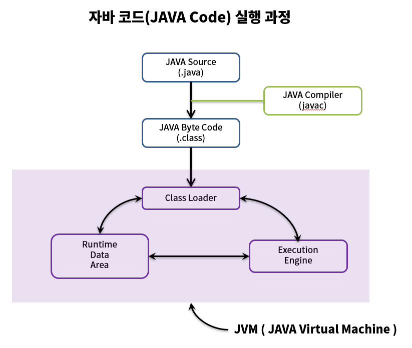
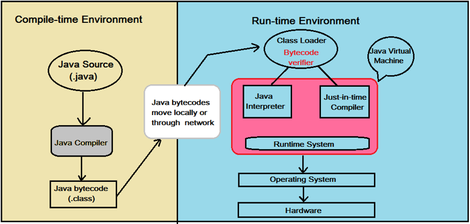

# [Java] 컴파일 과정

Java는 OS에 독립적인 특징을 가지고 있습니다.

어떤 OS든 Java가 설치되어 있다면 실행할 수 있다는 말입니다.

그게 가능한 이유는 JVM(Java Vitual Machine) 덕분입니다.

우선, 자바 컴파일 과정을 알아보겠습니다.

## 자바 컴파일 과정(요약)

1. 소스 코드 작성
2. 컴파일러가 소스코드를 바이트 코드로 변환 (컴파일 타임)
3. 바이트 코드를 클래스 로더에 전달 (이후로는 런타임)
4. 클래스 로더는 바이트 코드를 런타임 데이터 영역(JVM 메모리)에 올림 
5. 실행 엔진이 JVM 메모리에 올라온 바이트 코드들을 명령어 단위로 실행

## 자바 컴파일 과정(상세)

1. 개발자가 자바 소스(.java) 작성
2. 자바 컴파일러(javac.exe)가 자바 소스(.java)를 바이트 코드(.class)로 바꿔줍니다.(빌드)
   * .class 파일: 컴퓨터가 읽을 수 없고, JVM이 읽을 수 있는 중간 단계의 언어 바이트 코드, 바이트 코드의 각 명령어는 1바이트 크기의 Opcode와 추가 피연산자로 이루어져있습니다.
3. 런타임시, 컴파일된 바이트 코드를 JVM의 클래스로더(Class Loader)에게 전달합니다.
4. 클래스 로더는 동적 로딩(Dynamic Loading)을 통해 필요한 클래스들을 로딩 및 링크하여 런타임 데이터 영역(Runtime Data Area), 즉  JVM의 메모리에 올립니다.
   * 클래스 로더 세부 동작
     1. 로드: 클래스 파일을 가져와서 JVM의 메모리에 로드합니다.
     2. 검증: 자바 언어 명세(Java Language Specification) 및 JVM 명세에 명시된 대로 구성되어 있는지 검사합니다.
     3. 준비: 클래스가 필요로 하는 메모리를 할당합니다. (필드, 메소드, 인터페이스 등)
     4. 분석: 클래스의 상수 풀 내 모든 심볼릭 레퍼런스를 다이렉트 레퍼런스로 변경합니다.
     5. 초기화: 클래스 변수들을 적절한 값으로 초기화합니다. (static 필드)
5. 실행 엔진(Excution Engine)은 JVM 메모리에 올라온 바이트 코드들을 명령어 단위로 하나씩 가져와서 실행합니다. 이때 실행 엔진은 두 가지 방식으로 변경합니다.
   1. 인터프리터: 바이트 코드 명령어를 하나씩 읽어서 해석하고 실행합니다.
      * 하나하나의 실행은 빠름
      * 전체적인 실행 속도가 느림
   2. JIT 컴파일러(Just-In-Time Compiler): 바이트 코드 전체를 컴파일하여 바이너리 코드로 변경하고 이후 해당 메소드를 더 이상 인터프리팅하지 않고, 바이너리 코드로 직접 실행하는 방식입니다. 
      * 인터프리터의 단점을 보완하기 위해 도입된 방식
      * 전체적인 실행 속도는 인터프리팅 방식보다 빠름
      * 캐시 사용으로 한번 컴파일하면 다음에는 빠름

## 참조 링크

* <https://gyoogle.dev/blog/computer-language/Java/%EC%BB%B4%ED%8C%8C%EC%9D%BC%20%EA%B3%BC%EC%A0%95.html>
* <https://ttuk-ttak.tistory.com/38>
* <https://aljjabaegi.tistory.com/387>
* <https://gbsb.tistory.com/2>
* <https://steady-snail.tistory.com/67>

