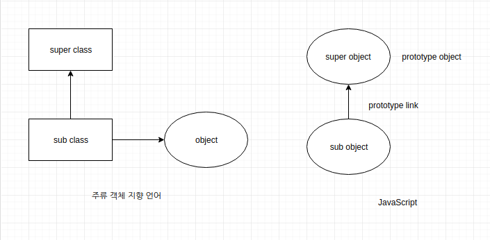
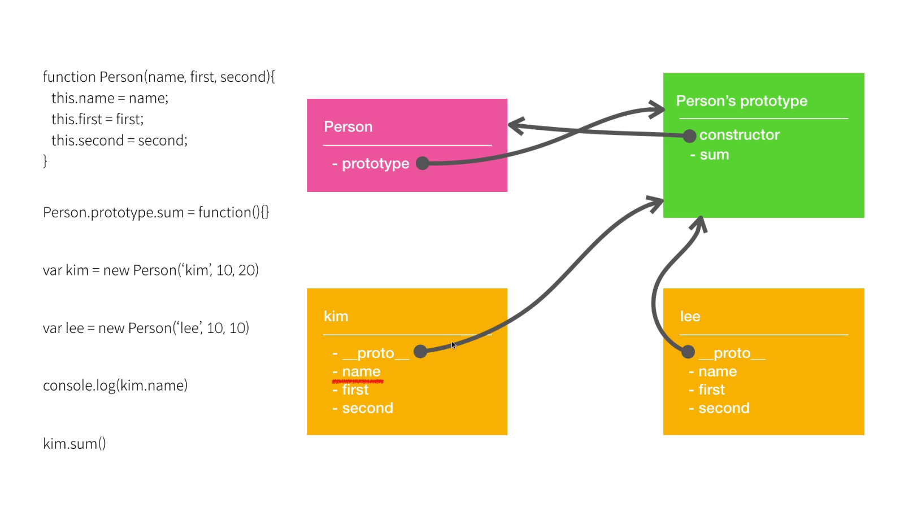
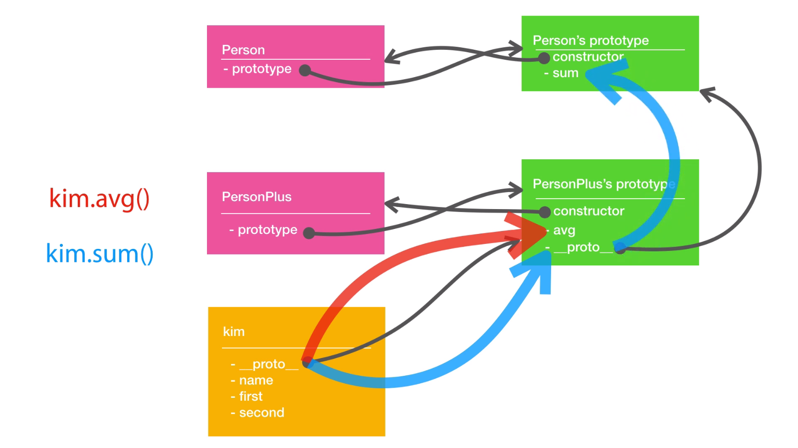

# [JavaScript]  객체 지향 프로그래밍


> 생활코딩의 [JavaScript  객체 지향 프로그래밍] 을 학습하고 정리한 글입니다.
>
> 일부 이미지는 영상의 이미지를 캡처하였습니다.
>
> [생활코딩 JavaScript  객체 지향 프로그래밍](https://www.opentutorials.org/module/4047)


[TOC]


물건을 보관한다.

물건이 많아지면 정리가 필요하다.

이때 각각의 특성에 맞게 정리해서 보관한다면?

코드들도 마찬가지다.

처음에는 그냥 보관하면 된다.

하지만 많아지면 정리해서 보관하면된다.

복잡한 코드들이 정리된다.


## 객체란?

서로 연관된 변수와 함수를 그룹핑하고 이름을 붙인것.


## 객체 vs 배열

```javascript
// 배열
var memberArray = ['egoing', 'graphittie', 'leezhce'];
console.log("memberArray[2]", memberArray[2]);
// 객체
var memberObject = {
    manager:'egoing',
    developer:'graphittie',
    designer:'leezhce'
}
// 읽기
console.log("memberObject.designer", memberObject.designer);
console.log("memberObject[designer]", memberObject['designer']);
// 수정
memberObject.designer = 'leezche';
console.log("memberObject[designer]", memberObject['designer']);
// 삭제
delete memberObject.manager
console.log('after delete memberObject', memberObject.manager);
```


다음과 같이 Math 라는 객체로 다양한 기능을 불러서 사용할 수 있다.

```javascrip
console.log("Math.PI", Math.PI);
console.log("Math.random()", Math.random());
console.log("Math.floor(3,9)", Math.floor(3,9));
```

이렇게 미리 정해두지 않았다면 개발이 힘들었을 것.


위의 `random` 처럼 객체에 속해있는 함수를 메소드라고 한다.

마찬가지로 어떤 비슷한 기능들을 모아서 우리도 다음과 같이 객체를 만들수 있다.

``` javascript
var MyMath = {
    PI:Math.PI,
    random: function(){
        return Math.random();
    },
    floor: function(val){
        return Math.floor(val);
    }
}
console.log("MyMath.PI", MyMath.PI);
console.log("MyMath.random()", MyMath.random());
console.log("MyMath.floor(3.9)", MyMath.floor(3.9));
```


만약 객체가 없다면 다음과 같이 선언을 하며 사용해야 한다.

```javascript
var MyMath_PI = Math.PI;
function MyMath_random(){
    return Math.random();
}
function MyMath_floor(val){
    return Math.floor(val);
}
```


## this

this 는 객체 자기 자신을 가리킨다.


다음과 같이 `sum`은 `kim` 객체의  `first` 와  `second`의 합을 리턴하는 메소드이다.

```javascript
var kim = {
    name: 'kim',
    first: 10,
    second: 20,
    sum: function(){
        // return kim.first+kim.second; --- 1
        return this.first+this.second; // --- 2
    }
}
console.log("kim.sum(kim.first, kim.second)", kim.sum(kim.first, kim.second));
console.log("kim.sum()", kim.sum());
```

만약 1 처럼 만들었고 후에 객체의 이름을 `kim` 에서 `lee`로 변경한다면 오류가 날것이다.

그렇기 때문에 2 처럼 `this`를 사용하는 방법을 사용한다.


## 객체 공장

`kim`과 비슷한 `lee` 객체를 만든다.

그리고 `third`라는 속성을 추가하고 싶을때 각각의 개체에 적용해야하는 번거로움이 생긴다.

```javascript
var kim = {
    name: 'kim',
    first: 10,
    second: 20,
    third: 30,
    sum: function(){
        return this.first+this.second+this.thrid;
    }
}
var lee = {
    name: 'kim',
    first: 10,
    second: 10,
    third: 10,
    sum: function(){
        return this.first+this.second+this.thrid;
    }
}
console.log("kim.sum()", kim.sum());
console.log("lee.sum()", lee.sum());
```


아래 코드를 보면 `new` 키워드를 통해 `Date` 객체를 생성해 반환해주는 것을 알수 있다.

```javascript
var d1 = new Date('2019-10-16');
console.log('d1.getFullYear()', d1.getFullYear());
console.log('d1.getMonth()', d1.getMonth());
```


우리도 이처럼 생성자(constructor function)를 통해 `Date` 처럼 동작하는 코드를 작성할 수 있다.

```javascript
function Person(name, first, second){
    this.name=name;
    this.first=first;
    this.second=second;
    this.sum = function(){
        return this.first+this.second;
    }
}

var pak = new Person('pak', 10, 20);
var sin = new Person('sin', 10, 10);
console.log("pak.sum()", pak.sum());
console.log("sin.sum()", sin.sum());
```


__생성자의 역할__

1. 객체를 만든다.
2. 그 객체의 초기 상태를 세팅한다.


## prototype

JavaScript 를 prototype based language 로 부르기도 함.


전에 만들었던 `sum` 이라는 메소드를 일괄적으로 수정하고 싶다.

다음과 같이 변경하게 되면 메모리상 비효율적이다.

```javascript
function Person(name, first, second){
    this.name=name;
    this.first=first;
    this.second=second;
    this.sum = function(){
        return this.first+this.second;
    }
}
pak.sum = function(){
    return 'modified : '+(this.first+this.second);
}
sin.sum = function(){
    return 'modified : '+(this.first+this.second);
}
```


아래와 같이 Person의 prototype에 메소드를 추가하는 식으로 바꾸면 메모리를 절약할 수 있다.

```javascript
function Person(name, first, second){
    this.name=name;
    this.first=first;
    this.second=second;
}
Person.prototype.sum = function(){
    return 'prototype : '+(this.first+this.second);
}
```


또한 객체 별로 메소드를 변경할 수 있다.

```javascript
pak.sum = function(){
    return 'this : '+(this.first+this.second);
}
```


이를 통해 알아보는 prototype의 특징

1. 객체의 메소드 `sum` 을 실행했을때 객체 자신이 `sum` 을 가지고 있는지 찾는다.
2. 만약, 없다면 그 객체의 prototype에서 `sum` 을 찾는다.


## class

ES6 부터 사용가능한 `class` 를 살펴보자

[CanIUse](https://caniuse.com/) 를 통해 ECMA 표준별 사용가능 브라우저 버전을 살펴볼수 있다.

[Babeljs](https://babeljs.io/) 를 통해 상위 버전의 JavaScript를 하위 버전의 코드로 변경할 수 있다.

(컴파일러 또는 트랜스파일러 라고 부름)


다음과 같이 class 키워드를 사용하여 생상자를 만들어본다.

```javascript
class Person{
    
}
```


## class constructor

`constructor` 는 어떤 객체가 생성되기 직전에 호출되어 객체의 초기 상태를 지정해주는 함수 이다.

아래와 같이 `constructor` 함수를 통해 초기값을 설정할 수 있다.

```javascript
class Person{
    constructor(name, first, second){
        this.name=name;
        this.first=first;
        this.second=second;
        // console.log('constructor');
    }
}

var kim = new Person('kim', 10, 20);
console.log('kim ', kim);
```


`class` 키워드를 사용한 문법으로 이전에 작성했던 `Person` 을 작성해본다.

```javascript
class Person{
    constructor(name, first, second){
        this.name=name;
        this.first=first;
        this.second=second;
    }
    sum(){
        return 'prototype : '+(this.first+this.second);
    }
}

var kim = new Person('kim', 10, 20);
console.log('kim ', kim);
kim.sum = function(){
    return 'this : '+(this.first+this.second);
}
var lee = new Person('lee', 10, 10);
console.log("kim.sum()", kim.sum());
console.log("lee.sum()", lee.sum());
```


## 상속

`Person` 클래스에 함수를 추가하고 싶다.

만약, `Person` 이 기존에 작성된 라이브러리나 가져와사용한 코드라면 직접 수정하게되면 곤란한 상황에 빠진다.


다음과 같이 기존 `Person` 에 `avg` 메소드를 추가한 새로운 `PersonPlus` 클래스를 작성해보자.

괜찮은 방법 같지만 중복된 코드들이 많아진다.

```javascript
class Person{
    constructor(name, first, second){
        this.name=name;
        this.first=first;
        this.second=second;
    }
    sum(){
        return 'prototype : '+(this.first+this.second);
    }
}

class PersonPlus{
    constructor(name, first, second){
        this.name=name;
        this.first=first;
        this.second=second;
    }
    sum(){
        return 'prototype : '+(this.first+this.second);
    }
    avg(){
        return (this.first+this.second)/2;
    }
}
```


따라서 `extends` 키워드를 이용하여 `Person` 클래스를 상속받고 중복된 코드를 제거하자.

```javascript
class PersonPlus extends Person{
    avg(){
        return (this.first+this.second)/2;
    }
}
var kim = new PersonPlus('kim', 10, 20);
console.log("kim.sum()", kim.sum());
console.log("kim.avg()", kim.avg());
```


## super

이제 `PersonPlus` 로 만들어진 객체가 `third` 라는 속성을 갖고있길 바란다.

다음과 같이 `PersonPlus` 를 수정하면 될까?

```javascript
class PersonPlus extends Person{
    constructor(name, first, second, third){
        this.name=name;
        this.first=first;
        this.second=second;
        this.third=third;
    }
    sum(){
        return this.first+this.second+this.third;
    }
    avg(){
        return (this.first+this.second+this.third)/3;
    }
}
```


이때 `super` 키워드를 사용할 수 있다.

`super` 는 2가지 용법이 있는데

1. 바로 뒤에 `()`(괄호) 가 붙으면 부모 클래스의 생성자
2. `()`(괄호) 가 아닌것이 오면 부모 클래스 가리킨다.

```javascript
class PersonPlus extends Person{
    constructor(name, first, second, third){
        super(name, first, second); // super => 부모 클래스의 생성자
        super.third=third;
    }
    sum(){
        return super.sum()+this.third;// super => 부모 클래스
    }
    avg(){
        return (this.first+this.second+this.third)/3;
    }
}
```


## 객체간의 상속





`__proto__`  실제 표준으로 인정하지 않아 정석적인 방법이 아니다.

하지만 대부분의 브라우저에서 구현하기 때문에 사용할 수 있다.

다음과 같이 `subObj` 의 `__proto__` 라는 속성을 통해 `superObj` 와 연결 시켰다.

```javascript
var superObj = {superVal:'super'}
var subObj = {subVal:'sub'}
subObj.__proto__=superObj;
console.log('subObj.subVal =>', subObj.subVal); // subObj.subVal => sub
console.log('subObj.superVal =>', subObj.superVal); // subObj.superVal => super
```


그후 `subObj` 의 `superVal` 의 값을 변경해보자.

```javascript
subObj.superVal = 'sub';
console.log('superObj.superVal =>', superObj.superVal); // superObj.superVal => super
```

실제 자신의 객체를 바꾼것이지 다른 객체를 바꾼것이 아니다.


더 좋은 상속방법은 `Object.create` 를 사용하여 다음과 같이 객체를 상속받는 것이다.

```javascript
var subObj = Object.create(superObj);
subObj.subVal = 'sub';
```


+ 추가 내용: `debugger` 사용

`debugger`  를사용하면 브라우저가 해당 위치에서 실행을 멈추고 그때의 상태를 보다 상세하게 살펴볼 수 있다.


## 객체와 함수


모든 함수는 `call` 이라는 메소드를 가지고 있다.

```javascript
function sum(){
    return this.first+this.second;
}
sum.call(); // sum(); 과 같다
```


`call` 의 인자로 `kim` 을 주게되면 그 순간 `sum` 의 내부에서 `tihs` 는 `kim` 이된다.

```javascript
var kim = {name:'kim', first:10, second:20}
var lee = {name:'kim', first:10, second:10}
function sum(){
    // this = kim;
    return this.first+this.second;
}
sum.call(kim); // sum(); 과 같다
```


`call` 의 매개변수

* 첫번째 매개변수는 그 함수의 this에 해당 되는 것
* 두번째 매개변수는 호출된 함수의 인자값으로 사용될 것


`call` 과 비슷한 기능을 가진 `apply`, `bind` 가 있다.


`call` 은 실행할때 컨텍스트의 `this` 의 값을 바꾼다.

`bind` 는 어떤 함수의 `this` 의 값을 영구적 바꾼 새로운 함수를 반환한다.

```javascript
var kim = {name:'kim', first:10, second:20}
var lee = {name:'kim', first:10, second:10}
function sum(prefix){
    return prefix+(this.first+this.second);
}
var kimSum = sum.bind(kim, '-> ');
console.log('kimSum()', kimSum());
```


## prototype vs \__proto__

아래의 두 표현은 같은 의미다.

```javascript
function Person(){}
var Person = new Function();
```


JavaScript 에서 함수는 객체이다.

`Person` 함수를 선언하면 해당 객체와 `prototype object` 가 생성된다.

`Person` 의 `prototype` 은  `prototype object` 을 가리키고

`prototype object`의 `constructor` 은 `Person` 을 가리킨다.

또한 `Person` 을 통해 생성된 `kim`, `lee` 의 `__proto__` 는 `Person` 의 `prototype object` 를 가리킨다.

`kim` 의 `name` 속성을 사용할 때 자신이 갖고 있는 속성이기 때문에 바로 사용한다.

하지만 `sum` 의 경우에는  자신이 가지고 있지않기 때문에

 `__proto__` 가 가리키고 있는 `prototype object` 에 가서 찾는다.





## 생상자를 통한 상속


`PersonPlus` 는 `call` 을 통해 `Person` 의 속성들을 상속받았다.

그러나 아직 `sum` 은 사용할 수 없다.

```javascript
function Person(name, first, second){
    this.name = name;
    this.first = first;
    this.second = second;
}
Person.prototype.sum = function(){
    return this.first + this.second;
}
 
function PersonPlus(name, first, second, third){
    Person.call(this, name,first,second);
    this.third = third;
}
 
PersonPlus.prototype.avg = function(){
    return (this.first+this.second+this.thrid)/3;
}
var kim = new PersonPlus('kim', 10, 20, 30);
console.log("kim.sum()", kim.sum());
console.log("kim.avg()", kim.avg());
```


1 처럼 `__proto__` 로 연결 시킬수 있으나 비표준이기에 2 로 사용하는게 비교적 나은 방법이다.

```javascript
function Person(name, first, second){
    this.name = name;
    this.first = first;
    this.second = second;
}
Person.prototype.sum = function(){
    return this.first + this.second;
}

function PersonPlus(name, first, second, third){
    Person.call(this, name, first, second);
    this.third = third;
}

// PersonPlus.prototype.__proto__ = Person.prototype; // 1
PersonPlus.prototype = Object.create(Person.prototype); // 2
PersonPlus.prototype.constructor = PersonPlus; // 2

PersonPlus.prototype.avg = function(){
    return (this.first+this.second+this.third)/3;
}
var kim = new PersonPlus('kim', 10, 20, 30);
console.log("kim.sum()", kim.sum());
console.log("kim.avg)", kim.avg());
console.log("kim.constructor", kim.constructor);
```


`kim` 이 `sum` 을 사용하고 싶다면

`Person` 의 `__proto__` 가 `PersonPlus` 의 `prototype object` 를 가리키면된다.





개념을 알아두고 사용은 `class` 를 사용하도록 하자.


