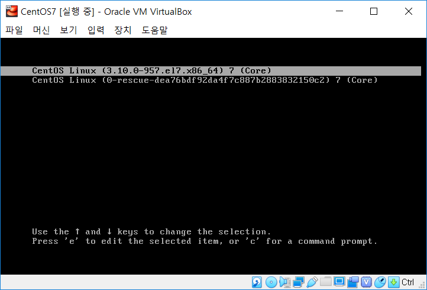

# VirtualBox 에 CentOS 설치 및 설정

**목차**

[TOC]

## VirtualBox & CentOS 파일 다운로드

1. 아래 사이트에 들어가

   <https://www.virtualbox.org/wiki/Downloads>

   현재 컴퓨터의 맞는 버전의 VirtualBox를 설치받습니다.

2. CentOS 공식 홈에서 Download 탭의 Minimal ISO 를 선택하여 CentOS를 설치받습니다.

   

   > 아래와 같이 다양한 다운로드 방법이 존재하는데 큰 차이는 없는것 같습니다.

   

## VirtualBox 에 CentOS 설치

1.  맨처음 받은 VirtualBox를 실행하여 Yes 를 눌러 진행하고, 앱을 실행시켜 새로만들기를 누릅니다.

   

2. 이름을 지정하고 Linux read Hat (64-bit) 를 선택합니다.

   

3. 메모리 크기를 할당합니다.

   

4. 지금 새 가상 하드 디스크 만들기를 선택하고 만들기를 누릅니다.

   

5. VDI를 선택하고 다음을 누릅니다.

   

6. 동적 할당을 선택합니다.

   

7.  CentOS 인트턴스가 생긴것을 확인합니다.

   

## VirtualBox 설정

설정에 들어갑니다.

* 시스템 탭
  + 플로피 디스크 체크 해제
  + 다음 순서가 되도록 설정
    1. 광 디스크
    2. 하드 디스크

* 저장소탭

  1. 다음과 같은 아이콘 선택

  2. 디스크 선택하기

     

  3. 추가 버튼 클릭

     

  4. 아까 설치했던 centOS iso 파일 선택

     

  5. 이미지가 삽인된것을 확인하고 Choose 선택

     

* 네트워크탭

  1. 어댑터에 브리지 선택

     

     

  ## CentOS 실행 및 초기 설정

  1. `I` 키를 눌러서 Install CentOS 7 선택 `Enter`

     * Ctrl 버튼을 누른채로 클릭하면 가상 OS 를 빠져나올 수 있습니다.
     * 우측 하단에 나와있는 키 참고

     

  2. 한국어 찾아서 선택

     

  3. 네트워크 및 호스트명 선택

     

  4. 켬 버튼 스위치

     

  5. 설치 대상 클릭

     

  6. 완료 누르기

     

  7. 설치 완료

     

  8. ROOT 암호 클릭

     

  9. 비밀번호 설정 이후 완료 -> 설정 완료

     

  10. 재부팅 선택

      

  11. CentOS Linux (3.10.....) 7 (Core) 선택

      

  12. root 의 아까 설정했던 비밀번호 설정

      

