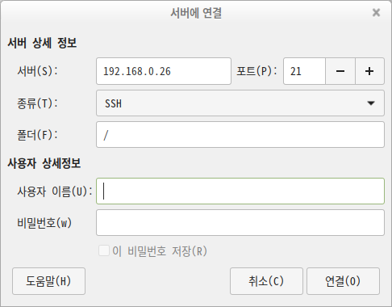

#  민트에서 SSH & SFTP 연결


## Key 생성 및 사전 작업

내 공개키를 접속하려는 호스트가 가지고 있어야 합니다.


순차적으로 진행하자면


1. 키 생성 및 복사

   > 클라이언트(접속하는 컴퓨터)에서 작업

   ```sh
   cd ~/.ssh/
   
   ssh-keygen -t rsa -b 4096 -C "icj@icj0409"
   ```

   - -t : Type
   - -b : Bit 수
   - -C : Comm

2. 키 붙여넣기

   > 서버(연결을 허용하는 컴퓨터)에서 작업

   생성된 공개키 (id_rsa.pub) 의 내용을

   ~/.ssh/authorized_keys 에 붙여넣으면 SSH 접속이 가능해집니다.


## SSH

터미널에서 아래와 같이 SSH 접속가능

```sh
ssh 유저@IP주소

#example
ssh devb@192.168.0.26
```


## SFTP

파일(파일시스템)을 열어 상단 메뉴에서 파일 -> 서버에 연결 클릭





* 포트: (기본값) 22 

  > 실패한다면 방화벽을 살펴봅니다.

* 종류: SSH

* 폴더: (기본값) /

  > 열고 싶은 디렉토리를 선택가능합니다.

* 사용자 이름과 비밀번호는 해당 호스트에서 만들어준 계정을 사용합니다.


