# [Redis] Redis 설치 in Windows

Windows에서 Redis를 설치해보겠습니다.

Redis Windows는 공식적으로 지원하지 않습니다.

Microsoft에서 제공하고 있는 프로젝트를 이용하겠습니다.


## 설치 방법

1. https://github.com/MicrosoftArchive/redis/releases 접속

   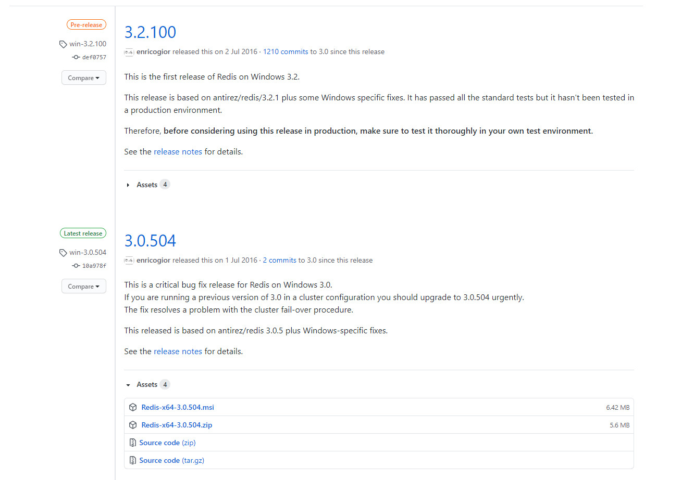

2. redis-x64-x.x.xxx.msi 선택

   - Pre-release: 새로운 기능이 추가된 사전 배포 버전
   - Latest release: 안정성이 높은 배포 버전

3. Next

   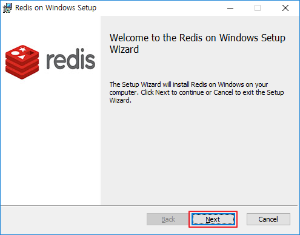

4. I accept ... - Next

   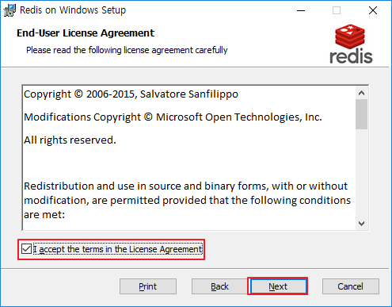

5. Change..로 저장하고 싶은 경로 지정 - PATH 등록 체크 - Next

   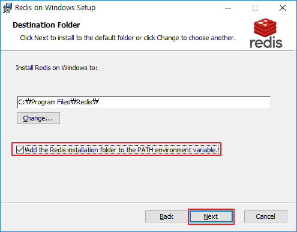

6. 포트 지정, 방화벽 제외 체크 - Next

   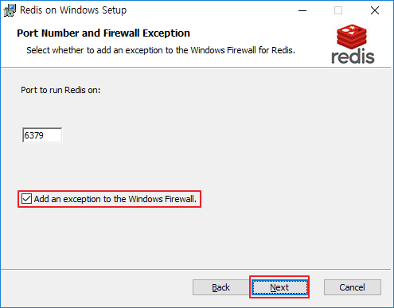

7. 최대 메모리 지정 후 - Next

   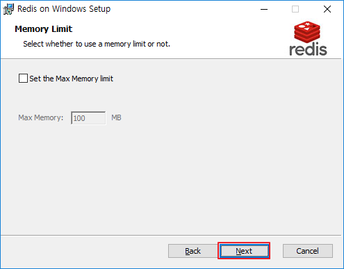

8. Install

   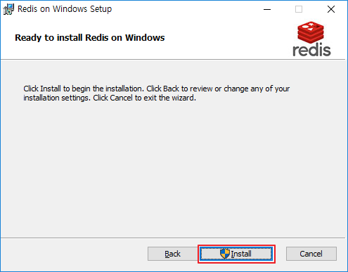

9. Finish

   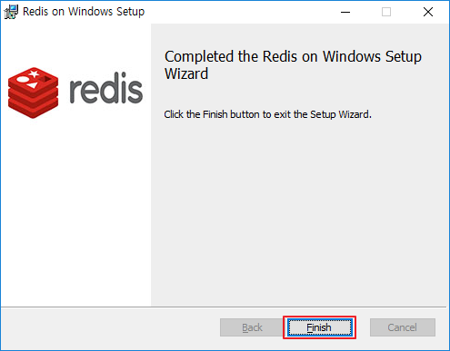


## 실행 / 중지

1. 윈도우 - 서비스

   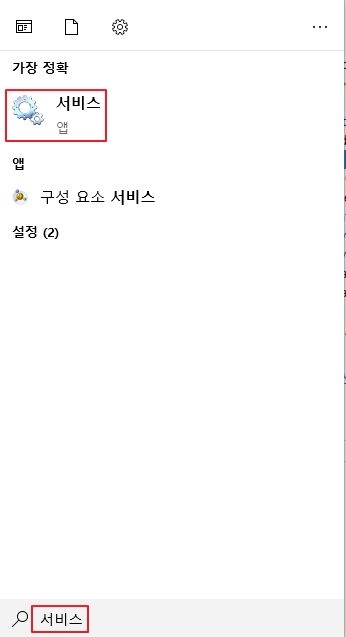

2. 시작, 중지, 다시 시작 등...

   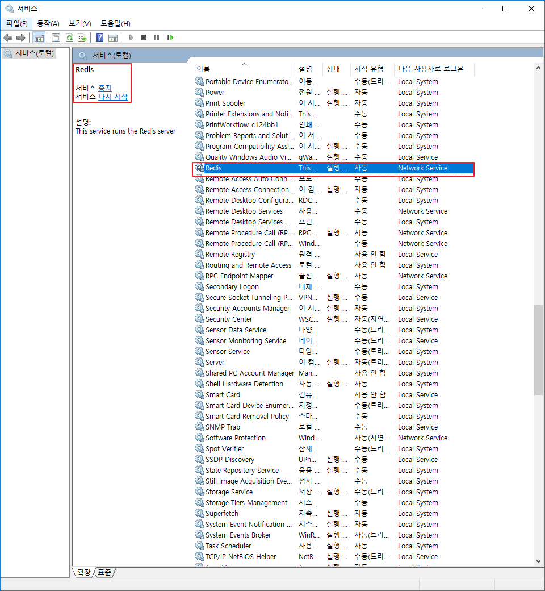


## 테스트

1. 실행(윈도우 + R) - cmd

2. redis-cli

   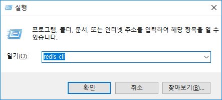

3. 테스트 명령어 입력

   ```
   127.0.0.1:6379> ping
   PONG
   127.0.0.1:6379> keys *
   (empty list or set)
   127.0.0.1:6379> set hello world
   OK
   127.0.0.1:6379> get hello
   "world"
   127.0.0.1:6379> set num1 1
   OK
   127.0.0.1:6379> incr num1
   (integer) 2
   127.0.0.1:6379> get num1
   "2"
   127.0.0.1:6379> keys *
   1) "hello"
   2) "num1"
   ```

   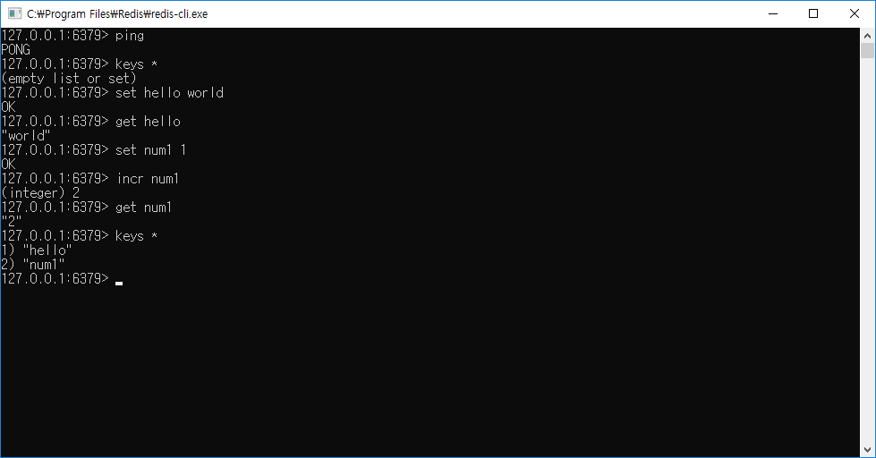


## 링크

- [EasyEasy (쉽게쉽게) - Windows Redis 설치 (윈도우즈 레디스)](https://gofnrk.tistory.com/35)
- [Microsoft - redis](https://github.com/MicrosoftArchive/redis/releases)


