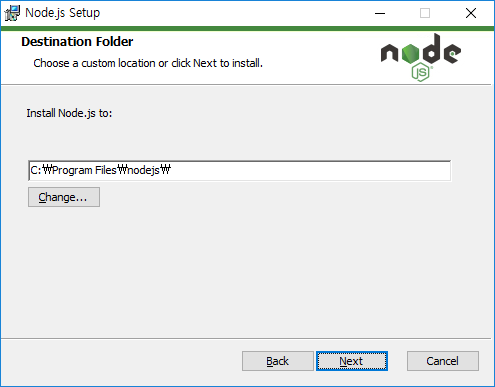

# [NodeJS] Node.js 설치

Node.js를 설치해보겠습니다.

운영체제는 Windows 기준입니다.


## Node.js 설치

1. <https://nodejs.org/ko/> ← 사이트에 접속합니다.

2. 현재 버전과 안정된 버전인 LTS 2개가 있지만 LTS로 선택합니다.

   

3. 설치 파일을 실행시킵니다.

4. Next

   

5. I accept ... 체크 후 Next

   

6. 설치할 경로를 설정한 뒤 Next (기본값이 무난합니다.)

   

7. 기본값으로 Next

   

8. Automatically install the necessary tools... 체크 후 Next

   **빠른 설치를 원하신다면 체크를 해제!**

   

9. Install

   

10. finish 선택후 다음 화면에서 Enter 등 아무키나 누르기

    

11. PowerShell이 실행되면 완료될때까지 기다리기

    
    
12. 윈도우키 + R

13. cmd 확인

    

14. 다음 명령어 순서대로 써보기

    ```shell
    node -v
    npm -v
    ```

    

15. 버전이 잘 나온다면 설치 성공!


## 링크

* [Node.js 공식 홈](https://nodejs.org/ko/)


