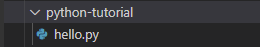

# [Python] 01. Introduction & Install


## Python 개요

* 1991년 프로그래머인 귀도 반 로섬이 발표.
* 플랫폼에 독립적.
* 인터프리터식, 객체지향적, 동적 타이핑 대화형 언어 .


## Python 특징

* 배우기 쉬움(Shallow learning curve)
* 코드 블럭 대신 들여쓰기(Indentation) 사용
* 따라서, 간결하고 가녹성이 높음
* Web, Database, Data Analysis 등에 사용 가능
* 무료


## Python 설치

[Pyhton 공식 홈](https://www.python.org/) 에서 Downloads를 이용하여 설치 가능.


> 2021.04.11 기준
>
> TensorFlow2를 사용하기 위해서는 Python 3.5~3.8 다운로드


VSCode에서 이용시 확장 기능으로 다운 가능.

따라서, 학습하고자 하는 버전을 잘 선택해 다운습니다.

본인은 VSCode를 사용합니다.


### Python 3.8.9 다운로드

(윈도우 7 이상 환경)

1. <https://www.python.org/downloads/release/python-389/> 접속

2. 스크롤 내려 Files - Windows installer (64-bit) 클릭

   

3. 설치 실행

4. Add Python 3.8 to PATH 체크 후 Install Now

   

5. Disable path length limit 클릭

   

6. 완료


## Python 테스트

1. 윈도우 - cmd 실행

2. `python --version` 입력

3. `Python 3.8.9` 나오면 성공

   


## Python in VSCode

1. Ctrl + Shift + x 로 확장 기능 열기

2. Python 입력

3. Python Extension Pack, Python for VSCode 설치

   


## 테스트 in VSCode

1. hello.py 파일 생성

   

2. 아래 코드 입력후 저장

   ```python
   print("Hello Python")
   ```

3. Ctrl + F5 로 실행

4. 결과 확인

   


## 참조

* [https://moon9342.github.io/](https://moon9342.github.io/python-lecture-python-introduction)

* [https://yjshin.tistory.com/](https://yjshin.tistory.com/entry/Python-%ED%8C%8C%EC%9D%B4%EC%8D%AC-Visual-Studio-Code-%EA%B0%9C%EB%B0%9C-%ED%99%98%EA%B2%BD-%EA%B5%AC%EC%B6%95)

  

