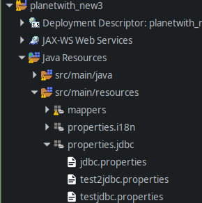
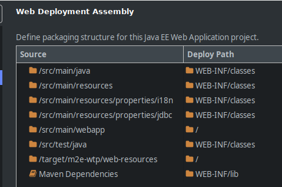

# Spring Classpath 설정


아래와 같이 properties 패키지를 만들고 





xml 파일에서 다음과 같이 주소를 연결해서 사용하려고 하면

test.properties가 없다고 오류가 뜬다.


그 이유는 classpath 설정이 안돼있기 때문인데


프로젝트 우클릭 -> properties -> Deployment Assembly 에서

다음과 같이 추가해준다.


add -> folder -> 사용할 properties 파일들이 있는 패키지





이후 방금 추가했던 아이템의 Deploy Path 를 WEB-INF/classes 경로로 바꿔준다.

그러면,

```xml
<property name='test' value='classpath:프로퍼티명.properties'></property>
```


 를 오류없이 사용할 수 있다.


