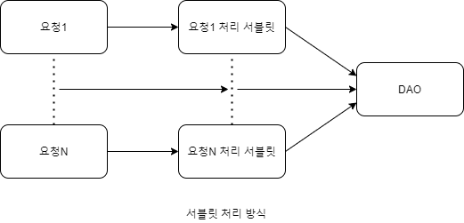
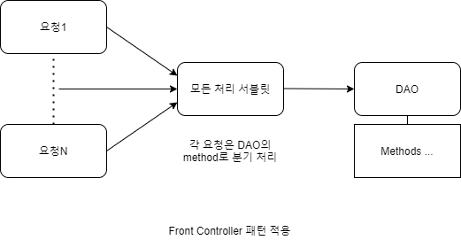
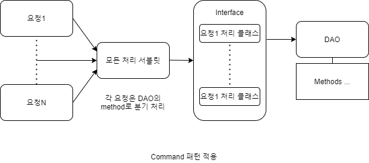

# [Spring] Spring MVC 와 Servlet

Spring에서 MVC 패턴이 무엇인지 알아보겠습니다.

## Spring MVC 설계

Spring은 Servelt 기반으로 설계되었습니다. Front Controller, Command 패턴은 MVC 패턴 디자인에 많이 사용됩니다.

### Front Controller 패턴

클라이언트의 다양한 요청들을 한곳으로 집중시켜서 개발 및 유지보수에 효율성을 극대화 시키는 패턴입니다. 하지만 모든 요청을 하나의 컨트롤러에서 처리하면 소스가 길어지고 관리하기 힘들어집니다. 이에 대한 대처가 Servlet입니다.

### Command 패턴

확장자가 같은 요청을 한곳으로 모은 후 각 요청의 처리를 다른 servlet 클래스로 보내서 처리하게 하는 방식입니다.

> 실행될 기능을 캡슐화함으로써 주어진 여러 기능을 실행할 수 있는 재사용성이높은 클래스를 설계하는 패턴입니다.

## Servlet

클라이언트로부터 요청이 오면 처리하고 결과를 다시 클라이언트에게 전송하는 자바 프로그래밍입니다.

> Spring에서 Front Controller에 해당하는 것이 DispatcherServlet 클래스입니다. DispatcherServlet은 단순 Front Controller의 역할 뿐만 아니라 Spring에서 제공하는 많은 기능을 사용할 수 있게 해줍니다.

### DispatcherServlet의 동작원리

1. 최초 Servlet container(tomcat)이 실행됩니다.
2. Servlet container는 [ServletContainerInitializer](https://docs.oracle.com/javaee/7/api/javax/servlet/ServletContainerInitializer.html?is-external=true)를 구현한 [SpringServletContainerInitializer](https://docs.spring.io/spring/docs/current/javadoc-api/org/springframework/web/SpringServletContainerInitializer.html)를 실행시킵니다.
3. SpringServletContainerInitializer는 [WebApplicationInitializer](https://docs.spring.io/spring/docs/current/javadoc-api/org/springframework/web/WebApplicationInitializer.html)를 구현한 클래스를 찾아 onStartup메소드를 실행시킵니다.
4. onStartup 메소드를 실행하면 DispatcherServlet 설정뿐만 아니라 ContextLoaderListener를 설정해야 합니다.

### Spring 구동시 Context

* Root WebApplicationContext
  * ContextLoaderListener가 생성
  * Service, Repository를 포함한 독립적인 Beans를 담고 있는 Context
* WebApplicationContext
  * DispatcherServlet이 생성
  * Controller를 포함한 웹관련 Beans를 담고 있는 Context

## Spring MVC의 Life Cycle

1. 클라이언트가 서버에 요청을 보내면 Servlet Container가 DispatcherServlet에 요청을 전달합니다.
2. DispatcherServlet은 HandlerMapping을 사용하여 컨트롤러를 찾습니다. HandlerMapping은 @Controller로 선언되었거나 HttpRequestHandler 인터페이스로 구현한 클래스를 찾아 DispatcherServlet에 리턴하며 컨트롤러의 클래스, 메소드, 리턴타입, 파라미터타입 등 모든 정보를 가지고 있습니다. 컨트롤러가 결정되었지만 호출방법은 호출타입별로 다르기 때문에 DispatcherServlet은 실행할 메소드를 찾지 못합니다.
3. DispatcherServlet에서 찾은 컨트롤러의 메소드를 실행하기 위해 HandlerAdapter객체에게 요청을 위임합니다. HandlerAdapter는 컨트롤러의 메소드를 실행하고 리턴타입을 ModelAndView 객체로 변환까지 해줍니다.
4. 반환된 ModelAndView를 DispatcherServlet에 리턴합니다.
5. ModelAndView를 받은 DispatcherServlet은 ViewResolver객체를 이용하여 결과를 보여줄 View를 찾습니다.
6. DispatcherServlet은 ViewResolver가 리턴한 View객채에게 응답 결과를 생성하도록 요청합니다.
7. JSP를 사용하는 경우, View 객체는 JSP를 실행함으로써 브라우저에게 전송할 응답 결과를 생성합니다.

## 참조

* [Hwangro Lee - Spring MVC 의 구조 및 처리 과정](https://lhr0419.medium.com/spring-mvc-%EC%9D%98-%EA%B5%AC%EC%A1%B0-%EB%B0%8F-%EC%B2%98%EB%A6%AC-%EA%B3%BC%EC%A0%95-4fc9ac7798eb)
* [미래를 설계하는 개발자 - Front Controller 패턴](https://chrismare.tistory.com/entry/FrontController-%ED%8C%A8%ED%84%B4-Command-%ED%8C%A8%ED%84%B4-%EC%98%88%EC%A0%9C)
* [망나니개발자 - 서블릿이란?](https://mangkyu.tistory.com/14)
* [heejeong Kwon - 커맨트 패턴](https://gmlwjd9405.github.io/2018/07/07/command-pattern.html)

