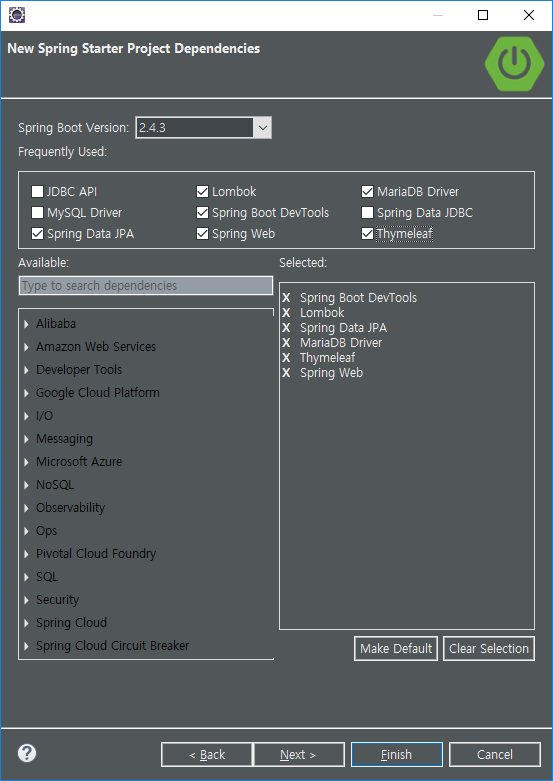
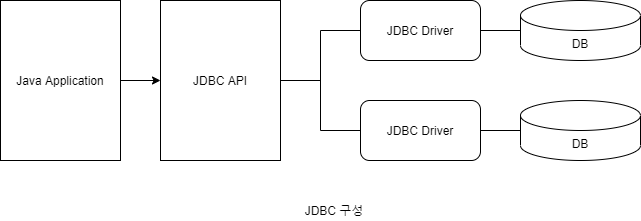
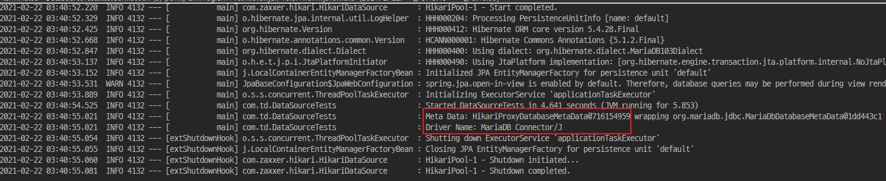

# [SpringBoot] DataBase 연동

Spring Boot에 DataBase를 연동해 보겠습니다.


## 사전 준비

※ Spring Starter Project를 만들어주세요. 자세한 설명은 [여기](https://poetic-code.tistory.com/111)를 참조하세요.


※ 사전에 dependency을 추가할 수 있습니다.



※ MariaDB에 다음과 같이 Database, User, Password, Privileges가 선행되어야 합니다. 자세한것은 [Database, User 추가 - Privileges 부여](https://poetic-code.tistory.com/109)를 참조하세요.

| -        | 값       |
| -------- | -------- |
| Database | todo     |
| User     | todo_usr |
| password | todo_pw  |


## Connection Pool 란

Pool에 Connection을 미리 만들어 두고 데이터베이스 접근시 Pool에 남아 있는 것 중 하나를 사용한 뒤 반환하는 기법입니다.


## DataSource 란

* Java에서 Connection Pool을 지원하기 위한 인터페이스

* Connection Pool을 관리하는 목적으로 사용되는 객체


## JDBC(Java Database Connectivity) 란

Java 애플리케이션에서 SQL문을 실행하기 위한 Java API




## HikariCP

빠르고 가볍고 안정적인 JDBC Connection Pool 입니다.

* Default DBCP
  * Spring Boot 2.0 이전: Tomcat JDBC Connection Pool
  * Spring Boot 2.0 이후: HikariCP

따라서, JDBC를 사용하면 기본으로 HikariCP를 사용하게 됩니다.


## DBCP(DataBase Connection Pool) 설정

※ 저는 Gradle로 MariaDB에 연동하겠습니다.

1. Dependency 추가

   1. Gradle의 경우 *build.gradle*

      ```
      dependencies {
      	...
      	runtimeOnly 'org.mariadb.jdbc:mariadb-java-client' // MariaDB
      	// runtimeOnly 'mysql:mysql-connector-java' // MySQL
      	// runtimeOnly 'com.oracle.database.jdbc:ojdbc8' // Oracle
          // runtimeOnly 'com.h2database:h2' // h2
          ...
      }
      ```
      
   2. Maven의 경우 *pom.xml*
   
      ```xml
      <dependencies>
          ...
          <!-- mariadb -->
          <dependency>
              <groupId>org.mariadb.jdbc</groupId>
              <artifactId>mariadb-java-client</artifactId>
              <scope>runtime</scope>
          </dependency>
          <!-- mysql -->
      <!--<dependency>
      		<groupId>mysql</groupId>
      		<artifactId>mysql-connector-java</artifactId>
      		<scope>runtime</scope>
      	</dependency>-->
          <!-- Oracle -->
      <!--<dependency>
      		<groupId>com.oracle.database.jdbc</groupId>
      		<artifactId>ojdbc8</artifactId>
      		<scope>runtime</scope>
      	</dependency>-->
          <!-- h2 -->
      <!--<dependency>
      		<groupId>com.h2database</groupId>
      		<artifactId>h2</artifactId>
      		<scope>runtime</scope>
      	</dependency>-->
          ...
      <dependencies>
      ```
   
      
   
2. *src/main/resources/application.properties*

   ```properties
   # Datasource
   spring.datasource.username=todo_usr
   spring.datasource.password=todo_pw
   
   # MariaDB
   spring.datasource.driver-class-name=org.mariadb.jdbc.Driver
   spring.datasource.url=jdbc:mariadb://localhost:3306/todo?serverTimezone=UTC&useUnicode=true&characterEncoding=utf8&useSSL=false
   
   # MySQL
   # spring.datasource.driver-class-name=com.mysql.cj.jdbc.Driver
   # spring.datasource.url=jdbc:mysql://localhost:3306/todo?serverTimezone=UTC&useUnicode=true&characterEncoding=utf8&useSSL=false
   
   # H2
   # spring.datasource.driver-class-name=org.hibernate.dialect.H2Dialect
   # spring.datasource.url=jdbc:h2://localhost:3306/todo?serverTimezone=UTC&useUnicode=true&characterEncoding=utf8&useSSL=false
   
   # Oracle
   # spring.datasource.driver-class-name=org.hibernate.dialect.Oracle10gDialect
   # spring.datasource.url=jdbc:oracle://localhost:3306/todo?serverTimezone=UTC&useUnicode=true&characterEncoding=utf8&useSSL=false
   ```


## 테스트

1. 아래 파일을 추가합니다.

   *src/test/java/com/td/DataSourceTests.java*

   

   ```java
   package com.td;
   
   import java.sql.Connection;
   
   import javax.sql.DataSource;
   
   import org.junit.jupiter.api.Test;
   import org.springframework.beans.factory.annotation.Autowired;
   import org.springframework.boot.test.context.SpringBootTest;
   
   import lombok.extern.java.Log;
   
   @Log
   @SpringBootTest
   public class DataSourceTests {
   
   	@Autowired
   	private DataSource dataSource;
   	
   	@Test
   	public void testConnection() {
   		
   		try{
   			Connection con = dataSource.getConnection();
   			log.info("Meta Data: " + con.getMetaData());
   			log.info("Driver Name: " + con.getMetaData().getDriverName());
   		}catch(Exception e) {
   			e.printStackTrace();
   		}
   	}
   	
   }
   ```

2. testConnection - 우클릭 - Run AS - JUnit Test

   

3. 로그가 찍힌 것을 확인할 수 있습니다.

   


## 참조

* [코딩수첩 - DataSource란?](https://codingnotes.tistory.com/27)
* [개발일기 - JDBC](https://dyjung.tistory.com/50)
* [갓대희의 작은공간 - Spring Boot DataBase 연동하기](https://goddaehee.tistory.com/205?category=367461)
* [linked2ev - 스프링부트 + HikariCP](https://linked2ev.github.io/gitlog/2019/08/21/springboot-mvc-4-%EC%8A%A4%ED%94%84%EB%A7%81%EB%B6%80%ED%8A%B8-MyBatis-+-HikariCP-+-MariaDB-%EC%84%A4%EC%A0%95/)
* [철철 - spring boot HikariCP](https://charlie-choi.tistory.com/203)


