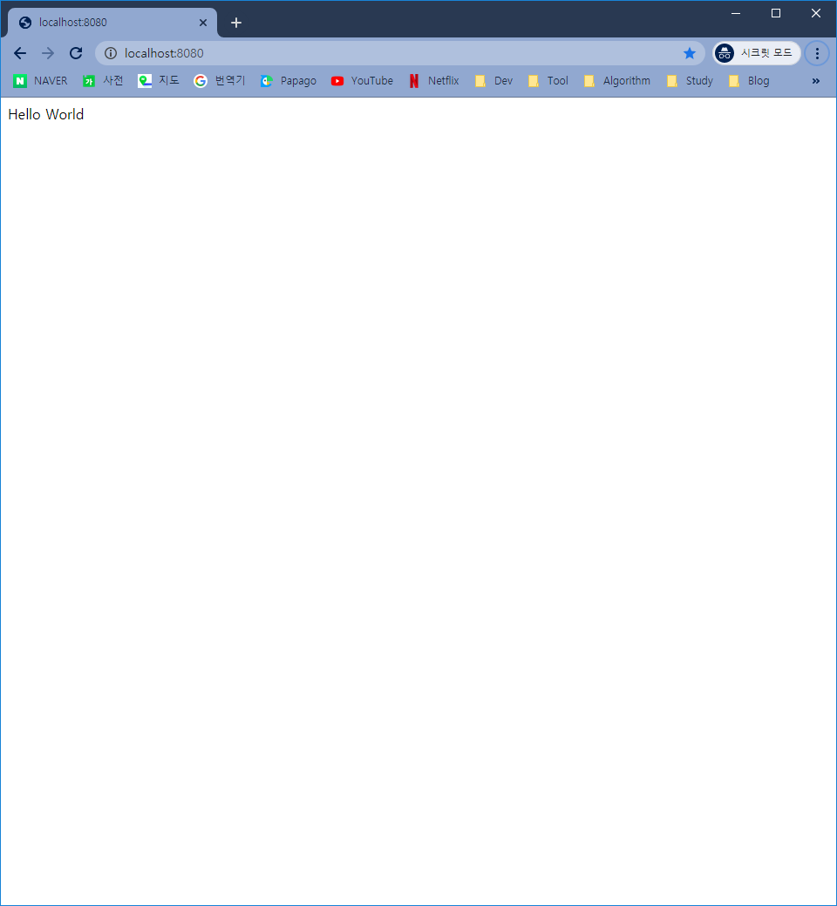

# [SpringBoot] MVC 패턴 적용

Spring Boot에 MVC 패턴을 적용해 보겠습니다.


## MVC 패턴이란?

MVC 패턴이란 Model, View, Controller의 유기적인 구조로 데이터 흐름을 각 단계별 체계적인 역할 구분을 골자로하는 디자인 패턴입니다.


### 모델(Model)

데이터를 처리하는 영역으로, 비즈니스 로직을 처리하는 영역입니다.

데이터 베이스와 통신하고 사용자가 원하는 데이터를 가공하는 역할을 합니다.


### 뷰(View)

사용자가 보는 화면을 의미합니다.

스프링 부트에서는 HTML과 Thymeleaf를 사용해서 화면을 처리합니다.


### 컨트롤러(Controller)

모델과 뷰의 중간 다리 역할을 합니다.

사용자 요청에 따라 처리할 로직을 호출하고 호출한 결과를 사용자에게 전달합니다.


## 컨트롤러(Controller) 생성

1. *com.example.demo* 하위에 *controller* 패키지 생성

2. 방금 생성된 *controller*에 *TestController.java* 생성

   

3. *TestController* 아래 코드 입력

   ```java
   package com.example.demo.controller;
   
   import org.springframework.web.bind.annotation.GetMapping;
   import org.springframework.web.bind.annotation.RestController;
   
   @RestController
   public class TestController {
   
   	@GetMapping("/")
   	public String hello() {
   		return "Hello World";
   	}
   }
   ```

4. <http://localhost:8080/> 새로고침

   

   

## 참조

* [AyoteraLab 지식 스케치 - MVC 구조](https://ayoteralab.tistory.com/entry/Spring-Boot-03-MVC-%EA%B5%AC%EC%A1%B0)
* [Lets Develop - 프로젝트 구조 알아보기](https://congsong.tistory.com/13)

