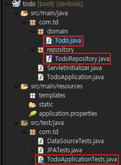
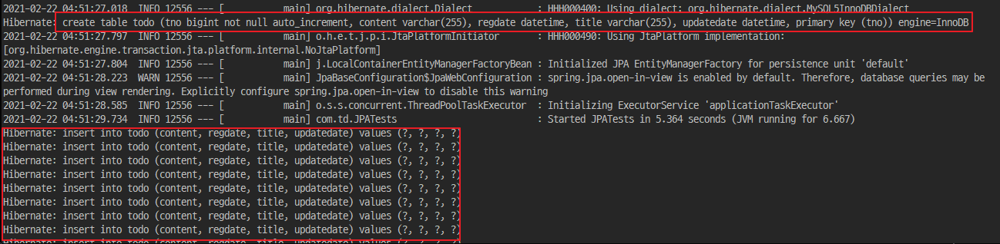
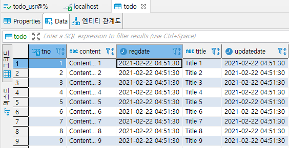

# [SpringBoot] Spring Data JPA

Spring Boot에서 JAP를 사용해 보겠습니다.


## JPA 란?

JPA(Java Persistence API)는 Java를 이용해서 데이터를 관리(유지)하는 기법을 하나의 스펙으로 정리한 표준입니다. 자세한 것은 [여기](https://poetic-code.tistory.com/114)를 참조하세요.


## 사전 준비

※ DataBase 연동 이후 작업을 하겠습니다. 자세한 설명은 [여기](https://poetic-code.tistory.com/113)를 참조하세요.


## JPA 연동

1. Dependency 추가

   1. Gradle의 경우 *build.gradle*

      ```
      dependencies {
      	implementation 'org.springframework.boot:spring-boot-starter-data-jpa'
      }
      ```

   2. Maven의 경우 *pom.xml*

      ```xml
      <dependencies>
          ...
          <dependency>
              <groupId>org.springframework.boot</groupId>
              <artifactId>spring-boot-starter-data-jpa</artifactId>
          </dependency>
          ...
      </dependencies>
      ```

2. *src/main/resources/application.properties*

   ```properties
   # JPA
   spring.jpa.hibernate.ddl-auto=update
   spring.jpa.generate-ddl=true
   spring.jpa.show-sql=true
   spring.jpa.database=mysql
   spring.jpa.database-latform=org.hibernate.dialect.MySQL5InnoDBDialect
   ```

3. 아래 파일들 생성

   

   1. *src/main/java/com/td/domain/Todo.java*

      ```java
      package com.td.domain;
      
      import java.sql.Timestamp;
      
      import javax.persistence.Entity;
      import javax.persistence.GeneratedValue;
      import javax.persistence.GenerationType;
      import javax.persistence.Id;
      import javax.persistence.Table;
      
      import org.hibernate.annotations.CreationTimestamp;
      import org.hibernate.annotations.UpdateTimestamp;
      
      import lombok.Data;
      
      @Data
      @Entity
      @Table
      public class Todo {
      
      	@Id
      	@GeneratedValue(strategy = GenerationType.IDENTITY)
      	private Long tno;
      	private String title;
      	private String content;
      	
      	@CreationTimestamp
      	private Timestamp regdate; // LocalDateTime
      	@UpdateTimestamp
      	private Timestamp updatedate; // LocalDateTime
      }
      ```

   2. *src/main/java/com/td/repository/TodoRepository.java*

      ```java
      package com.td.repository;
      
      import org.springframework.data.repository.CrudRepository;
      import org.springframework.stereotype.Repository;
      
      import com.td.domain.Todo;
      
      @Repository
      public interface TodoRepository extends CrudRepository<Todo, Long>{
      
      }
      ```

   3. *src/test/java/com/td/JPATests.java*

      ```java
      package com.td;
      
      import java.util.stream.IntStream;
      
      import org.junit.jupiter.api.Test;
      import org.springframework.beans.factory.annotation.Autowired;
      import org.springframework.boot.test.context.SpringBootTest;
      
      import com.td.domain.Todo;
      import com.td.repository.TodoRepository;
      
      @SpringBootTest
      public class JPATests {
      
      	@Autowired
      	TodoRepository todoRepo;
      	
      	@Test
      	public void insertDummy() {
      		
      		IntStream.range(1, 20).forEach(i -> {
      			
      			Todo todo = new Todo();
      			todo.setTitle("Title " + i);
      			todo.setContent("Content... " + i);
      			
      			todoRepo.save(todo);
      		});
      	}
      }
      ```

4. Junit Test - insertTodo

5. 다음과 같이 쿼리가 동작

   

6. 데이터가 삽입된 것을 확인

   


