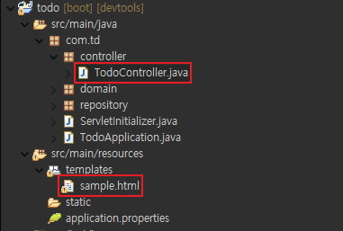
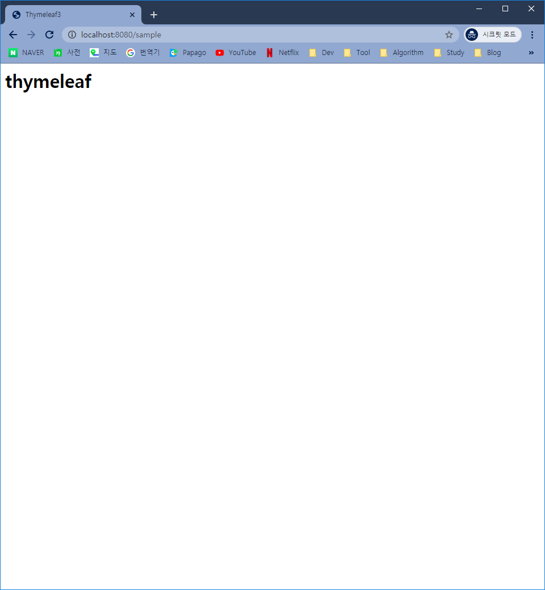

# [SpringBoot] Thymeleaf 사용

Spring Boot에 Thymeleaf 템플릿 엔진을 적용해 보겠습니다.


## Thymeleaf 란?

컨트롤러가 전달하는 데이터를 이용하여 HTML을 꾸밀수 있도록하는 뷰 템플릿(View Template)입니다.


## Thymeleaf 연동 및 설정

1. Dependency 추가

   1. Gradle의 경우 *build.gradle*

      ```
      dependencies {
      	...
      	implementation 'org.springframework.boot:spring-boot-starter-thymeleaf'
      	...
      }
      ```

   2. Maven의 경우 *pom.xml*

      ```xml
      <dependencies>
          ...
          <dependency>
              <groupId>org.springframework.boot</groupId>
              <artifactId>spring-boot-starter-thymeleaf</artifactId>
          </dependency>
          ...
      </dependencies>
      ```

2. *src/main/resources/application.properties*

   ```properties
   # Thymeleaf
   spring.thymeleaf.cache=false
   ```

3. 아래 파일들 생성

   

   1. *src/main/java/com/td/controller/TodoController.java*

      ```java
      package com.td.controller;
      
      import org.springframework.stereotype.Controller;
      import org.springframework.ui.Model;
      import org.springframework.web.bind.annotation.RequestMapping;
      
      @Controller
      public class TodoController {
      
      	@GetMapping("/todo")
      	public void todo(Model model) {
      		
      		model.addAttribute("title", "Todo!!");
      	}
      }
      ```

   2. *src/main/resources/templates/sample.html*

      ```html
      <html xmls:th="http://www.thymeleaf.org">
      
      	<head>
      		<title>Thymeleaf3</title>
      		<meta http-equiv="Content-Type" content="text/html; charset=UTF-8" />
      	</head>
      	<body>
      		<h1 th:text="${title}">Todo View Page</h1>
      	</body>
      </html>
      ```

4. Run as - Spring Boot App

5. localhost:8080/sample 접속

   


