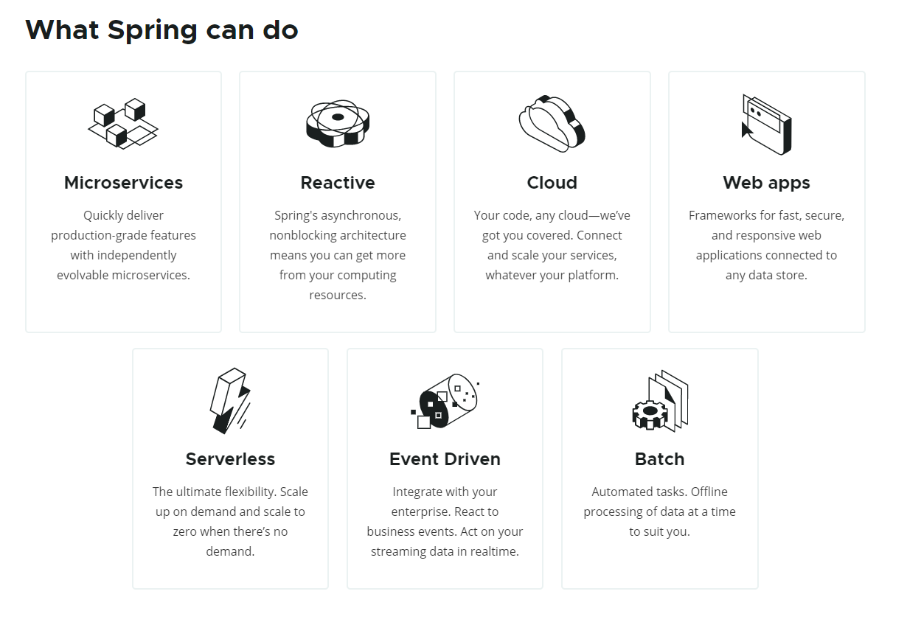

# [SpringBoot] 스프링 부트(Spring Boot) 란

스프링 부트(Spring Boot)에 대해 알아보겠습니다.

## 스프링 부트란?

> 아래는 spring.io에 나와 있는 Spring에서 할 수 있는 것들입니다.

단독으로 스프링 어플리케이션을 실행할 수 있게 해주는 스프링 프로젝트입니다.

또한, 스프링을 쉽게 사용할 수 있도록 설정들이 미리 되어있습니다.

그렇기 때문에 쉽고 빠른 개발이 가능합니다.

## 스프링부트 특징

* 단독으로 실행이 가능한 스프링 애플리케이션을 생성함
* Tomcat, Jetty, Undertow 를 내장
* 기본설정이 되어있는 starter 컴포넌트를 제공
* 가능한 자동으로 설정되어 있음
* 상용화에 필요한 통계, 상태 체크, 외부 설정 등을 제공
* 설정을 위한 XML 코드를 생성하거나 요구하지 않음

## 출처

* <https://noahlogs.tistory.com/46>
* <https://spring.io/>

