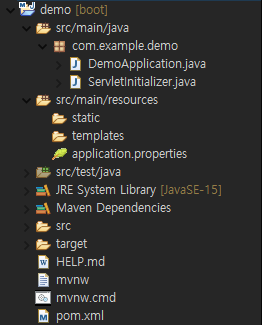

# [SpringBoot] 프로젝트 구조

Spring Boot 프로젝트 구조에 대해 알아보겠습니다.


## 프로젝트 구조(Project Structure)

프로젝트를 생성하면 기본적으로 다음과 같은 구조로 만들어집니다.

(Eclipse에서 Spring Starter Project로 Maven 사용)



### 구조 설명

* *src/main/java*: 프로젝트에서 사용하는 class, interface 파일을 모아둔 디렉토리

  * *DemoApplication.java*
    
    * `SpringApplication.run `: 웹 애플리케이션을 실행하는 역할
    * `@SpringBootApplication`: 다음 세 가지 어노테이션으로 구성
      * `@EnableAutoConfiguration`: 스프링 부트 개발에 필요한 몇 가지 필수적인 설정들이 자동으로 완료되도록 도와줌
      * `@ComponentScan`: 자동으로 컴포넌트 클래스를 검색하고 컨텍스트(Ioc 컨테이터)에 빈(Bean)으로 등록 => 의존성 주입 간편해짐
      * `@Configuration`: 기존 XML에서 JAVA 기반 설정을 가능하게함
    
  * *ServletInitializer*.java: *SpringBootServletInitializer*를 상속받아 스프링 부트 애플리케이션이 동작이 가능하도록 구성합니다. 컨텍스트(IoC 방식으로 Bean을 관리하는 컨테이너) 구성.

    * SpringBootServletInitializer

    > 기존 스프링 개발시 web.xml에 DispatcherServlet을 등록하는 작업이 필요했습니다. 하지만 Servlet 3.0으로 업데이트 되면서 web.xml 없이도 배포가 가능해졌습니다. 그 이유는 web.xml 설정을 WebApplicationInitializer 인터페이스를 구현하여 대신 할 수 있게 됐기 때문입니다. SpringBootServletInitializer 클래스는 WebApplicationInitializer 인터페이스의 구현체입니다.

* *src/main/resources*: XML, properties static 파일을 모아둔 디렉토리

  * *templates*: 타임리프(Thymeleaf) 형식의 템플릿 파일을 모아둔 디렉토리

    * 타임리프(Thymeleaf): HTML에서 데이터를 처리 하는데 사용

      > 기존 스프링은 *src/main/webapp*에 JSP 파일이 존재했습니다. 이 방식은 war 파일로 패키징 되었을 때만 정적 리소스를 정삭적으로 사용 가능했습니다. 스프링부트에서는 타임리프 템플릿 엔진을 사용 권장합니다.

  * *static*: css, fonts, images, plugin, scripts 등의 정적 리소스를 모아둔 디렉토리

  * *application.properties*: WAS, DB 등의 설정을 Key-Value 형식으로 처리 가능한 파일

    * Ctrl + Space 단축키로 자동 완성 기능 지원
    * 다른 자바 클래스의 설정 보다 *application.properties*의 설정이 우선

* *src/test/java*: 개발에 필요한 JUnit 등 테스트 파일을 모아둔 디렉토리

* *pom.xml*: 라이브러리 의존성 파일 경로를 저장하는 파일

  * Gradle을 이용할 경우 => *build.gradle*


### 트리 구조로 보기

```
├─.mvn
│  └─wrapper
├─.settings
└─src
   ├─main
   │  ├─java	#class, interface 파일을 모아둔 디렉토리
   │  │  └─com
   │  │      └─example
   │  │          └─demo
   │  │          	├─DemoApplication.java	#어플리케이션 실행
   │  │          	└─ServletInitializer.java	#컨텍스트 구성
   │  ├─resources
   │  │  ├─static	#정적 리소스를 모아둔 디렉토리
   │  │  ├─templates	#thymeleaf 템플릿 엔진 파일들을 모아둔 디렉토리
   │  │  └─application.properties	#서버, 데이터베이스 등의 설정 파일
   │  └─webapp
   └─test
       └─java # 테스트 파일을 모아둔 디렉토리
           └─com
               └─example
                   └─demo
```


## 참조

* [MyoungSeok Lee](https://medium.com/@dlaudtjr07/spring-boot-unit-2-%ED%94%84%EB%A1%9C%EC%A0%9D%ED%8A%B8-%EA%B5%AC%EC%A1%B0-1893562186e0)
* [Let's Develop](https://congsong.tistory.com/13)
* [Bamdule](https://bamdule.tistory.com/32)


