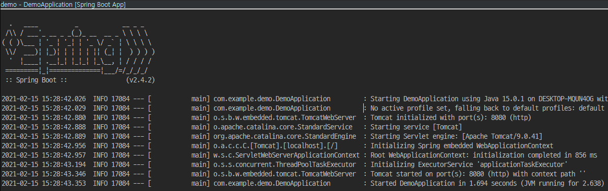

# [SpringBoot] 프로젝트 생성 및 실행

Spring Boot 프로젝트를 생성 및 실행 방법에 대해 알아보겠습니다.


## 프로젝트 생성 in Spring initializr

1. <https://start.spring.io/> 에 접속

2. 환경 선택 및 입력

   

   * Project: 어떤 빌드 관리 도구를 이용한 프로젝트인지 선택
   * Language: 사용할 언어
   * Spring Boot: 프로젝트 버전
   * Group: 사용할 그룹. 일반적으로 도메인
   * Artifact: 산출물 이름. 일반적으로 프로젝트명
   * Name: 프로젝트 이름
   * Description: 프로젝트 설명
   * Package Name: 초기 소스들이 만들어질 기본 패키지명
   * Packaging: 패키징 방법
   * Java: 사용할 Java 버전

3. GENERATE

4. IDE에서 실행시 압출 풀고 Import해서 사용


## 프로젝트 생성 in Eclipse

### 환경(Environments)

* Open JDK 15
* Eclipse 2020-12
* STS 4.9.0
* Spring Boot 2.4.2


1. Ctrl + N

2. Spring Starter Project 선택

   

3. new -> Spring Start Project

   

   * Name: 프로젝트 이름
   * Location: 프로젝트 저장 경로
   * Type: 빌드 관리 도구
   * Packaging: 패키징 방법
   * Java Version: 사용할 Java 버전
   * Language: 사용할 언어
   * Group: 사용할 그룹. 일반적으로 도메인
   * Artifact: 산출물 이름. 일반적으로 프로젝트명
   * Version: 프로젝트 버전
   * Description: 프로젝트 설명
   * Package: 초기 소스들이 만들어질 기본 패키지명

4. Lombok, Spring Web 선택

   

5. Finish 하고 우측 로딩바가 모두 완료될때까지 기다립니다.


## 테스트 코드 작성


*src/main/java/com/example/demo/DemoApplication.java*

```java
package com.example.demo;

import org.springframework.boot.SpringApplication;
import org.springframework.boot.autoconfigure.SpringBootApplication;
import org.springframework.web.bind.annotation.GetMapping;
import org.springframework.web.bind.annotation.RequestParam;
import org.springframework.web.bind.annotation.RestController;

@SpringBootApplication
@RestController
public class DemoApplication {

	public static void main(String[] args) {
		SpringApplication.run(DemoApplication.class, args);
	}
	
	@GetMapping("/hello")
	public String hello(@RequestParam(value = "name", defaultValue = "World") String name) {
		return String.format("Hello %s", name);
	}
}
```


## 애플리케이션 실행

1. DemoApplication 우클릭 - Run as - Spring Boot App

   

2. Console 탭이 활성화 되면서 Boot가 실행되는 것을 확인할 수 있습니다.

   

3. <http://localhost:8080/hello>에 접속하면 다음과 같은 화면이 나타납니다.

   


## 참조

* [spring.io](https://spring.io/quickstart)

