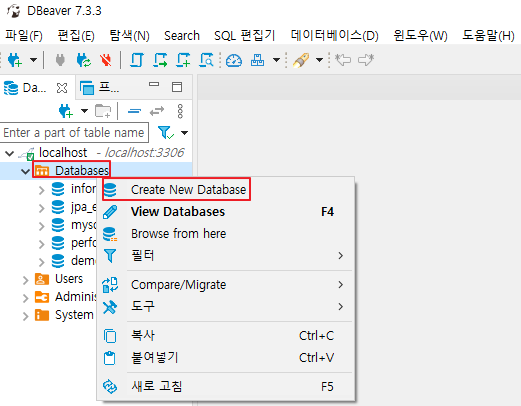
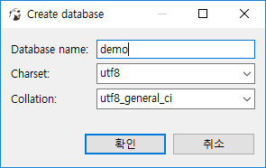
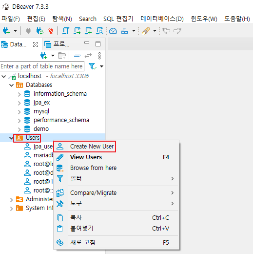
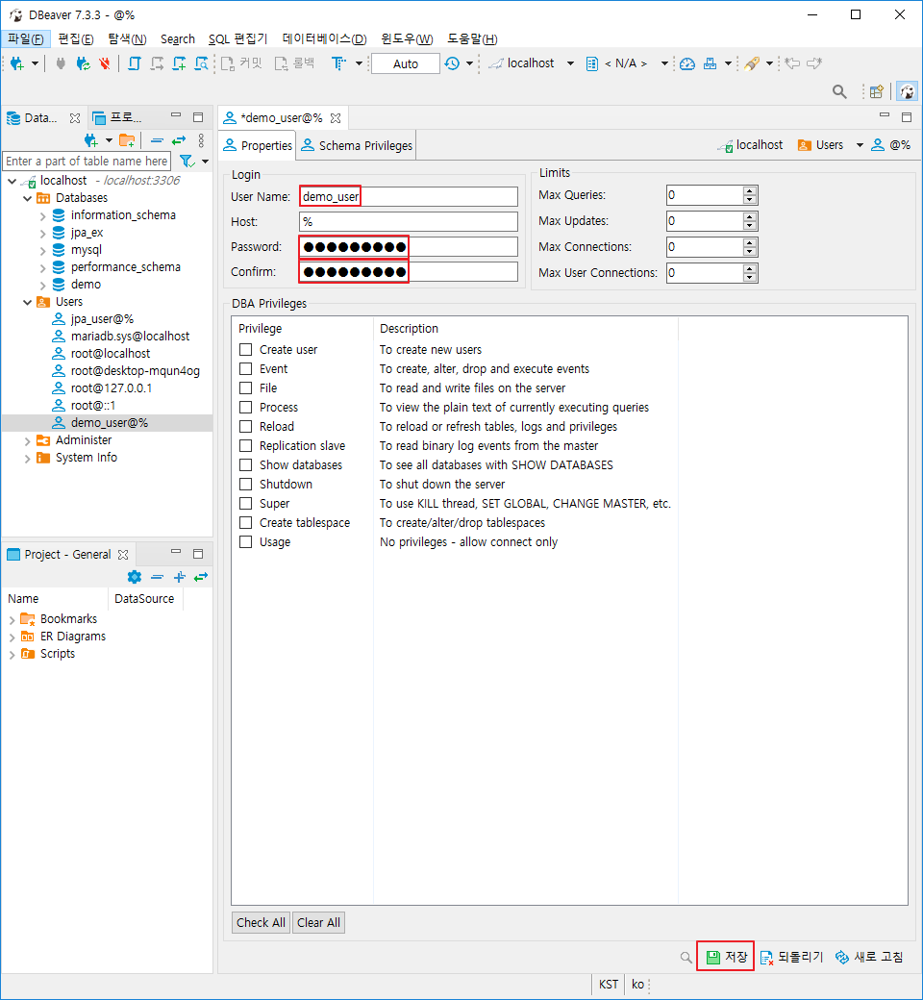
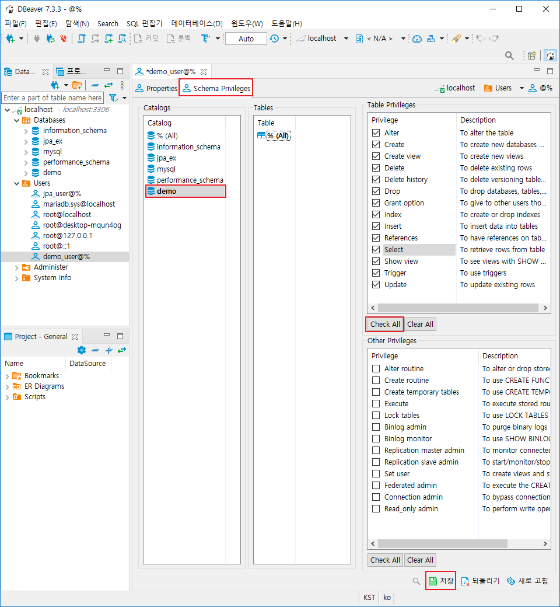
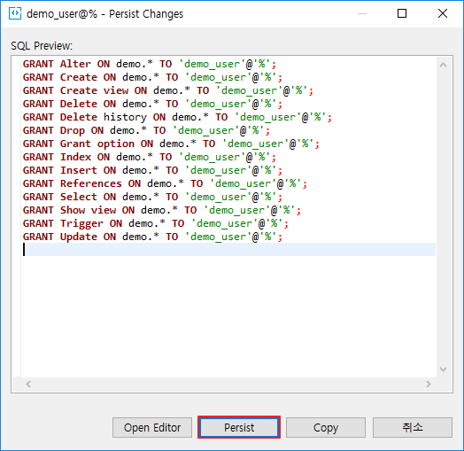

# [DBeaver] Database, User 추가 - Privileges 부여

DBearver Database, User 추가 방법에 대해 알아보겠습니다.

## Database 추가

1. Dbeaver 실행

2. Databases 우클릭 - Create New Database

   

3. Database name 입력 후 확인(demo)

   

## User 추가

1. Users 우클릭 - Create New User

   

2. User Name, Password, Confirm 입력 (모두 demo_user 입력) - 저장

   

## Privileges 부여

1. Schema Privileges - demo 클릭

2. Table Privileges - Check All - 저장

   

3. Persist

   

