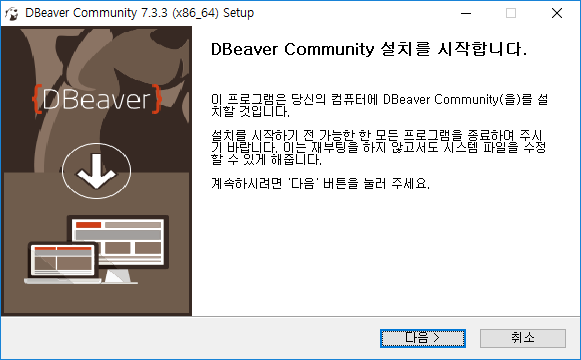

# [DBeaver] 디비버(DBeaver) 설치

디비버(DBeaver)는 Database를 관리할때 유용한 툴입니다.

DBearver 설치방법에 대해 알아보겠습니다.

## 설치 방법

1. https://dbeaver.io/  ← 사이트에 접속합니다.

2. Download를 클릭

   

3. 자신의 운영체제에 맞게 다운로드 (본인은 Windows 64 bit)

   

3. 설치된 파일 실행

4. 한국어 - OK

   

5. 다음

   

6. 동의함

   

7. 모든 유저가 사용할 수 있도록 For anyone ... 체크 후 다음

   

8. 기본값으로 다음

   

9. 원하는 설치 위치 정하고 다음

   

10. 시작 메뉴 아이콘 만들지 않으려면 체크 후 설치

    

12. 바탕화면에 아이콘 만들려면 체크하고 마침

    

## 링크

- [DBeaver 공식 홈](https://dbeaver.io/)

