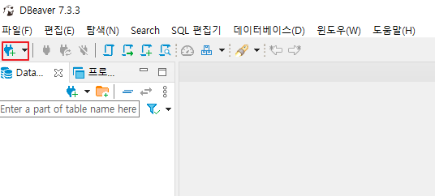
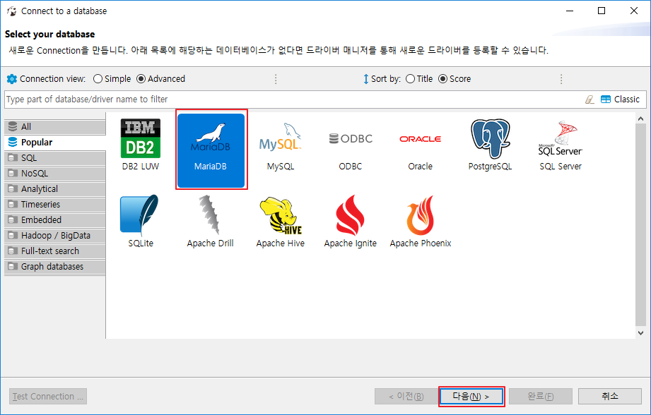
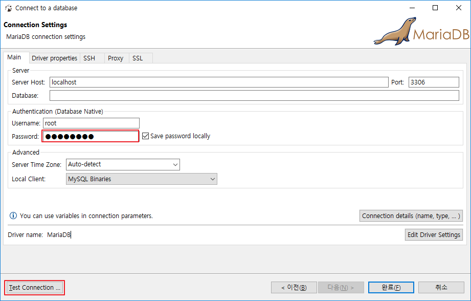
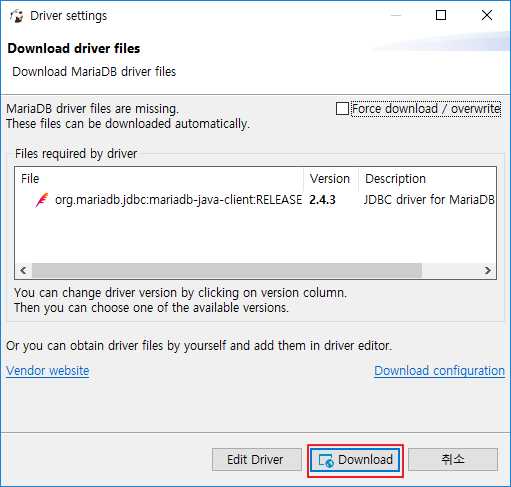
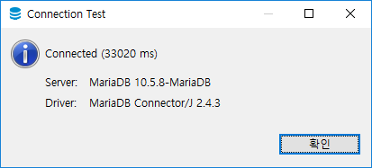
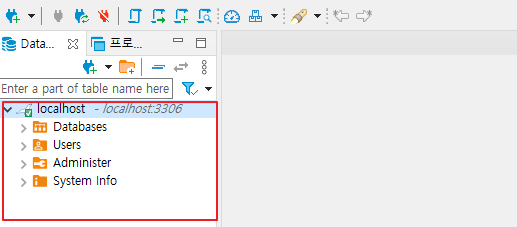

# [DBeaver] 커넥션(Connection) 추가하기

DBearver 커넥션 추가 방법에 대해 알아보겠습니다.

저는 MariaDB를 테스트 해보겠습니다.

사전에 [디비버 설치](https://poetic-code.tistory.com/102) 및 [MariaDB 설치](https://poetic-code.tistory.com/101?category=838098)를 선행해주세요.

# DBeaver에 DB 연동

1. DBeaver 실행

2. 콘센트모양 클릭

   

3. MariaDB 선택 - 다음

   

4. MariaDB 설치시 저장했던 root 비밀번호 입력

5. Test Connection ...

   

6. Download

   

7. 성공시 다음과 같은 팝업이 뜨면 확인

   

8. 완료하면 다음과 같이 DB가 추가된 것을 볼 수 있습니다.

   

# 링크

* [[DBeaver] 디비버(DBeaver) 설치](https://poetic-code.tistory.com/102)
* [[Database] MariaDB 설치](https://poetic-code.tistory.com/101?category=838098)

