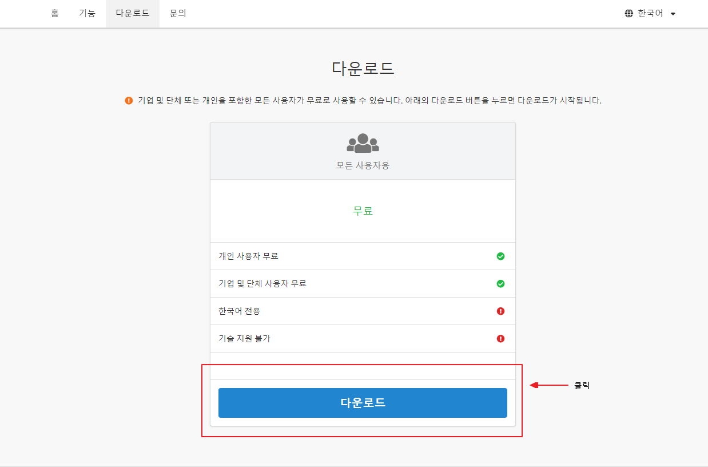
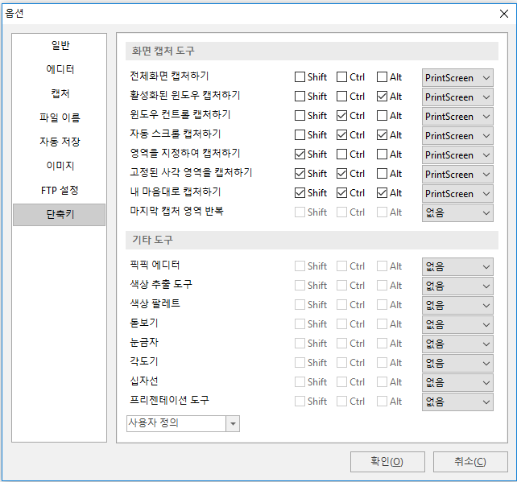
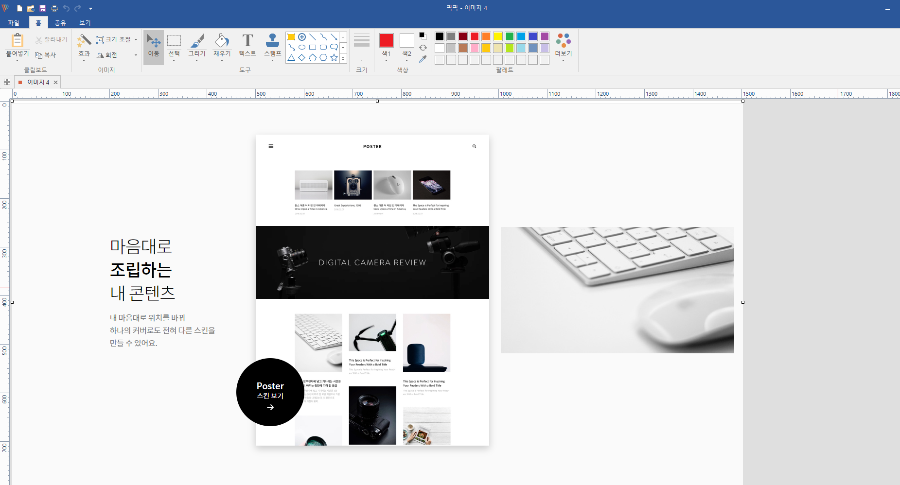

# [Tool] 스크린샷 툴 추천 - 픽픽(PickPick)

오늘은 [픽픽(PickPick)](https://picpick.app/ko/)에 대해서 소개해드리겠습니다.

픽픽은 국내 개발자가 만든 스크린샷 및 이미지 수정 소프트웨어입니다.

저는 이 툴을 이용하여 블로그 글이나 문서를 만들때 유용하게 사용하고 있습니다. 

개인적으로 직접 사용해보고 주변에 추천 드리고 있습니다.

## 장점

1. 전체 화면 캡처, 윈도우창만 캡처, 영역 지정 캡처 등 다양한 캡처 기능 제공
2. 캡처 이후 그림판으로 바로 이미지 수정 가능
3. 각도기, 눈금자, 프레젠테이션 도구 등
4. 무료

## 설치

아래 링크로 접속하여 공식 홈페이지에서 바로 다운로드를 받으실 수 있습니다.

<https://picpick.app/ko/download>

아래의 다운로드 버튼을 눌러 설치해주세요.

## 사용 방법

1. 원하는 단축키로 캡처

   * 기본값은 다음과 같습니다

   

   * 실행 아이콘의 우클릭을 사용하여도 무방합니다

2. 픽픽 툴에서 이미지 수정 후 저장

## 링크

* [PickPick 다운로드](https://picpick.app/ko/download)

