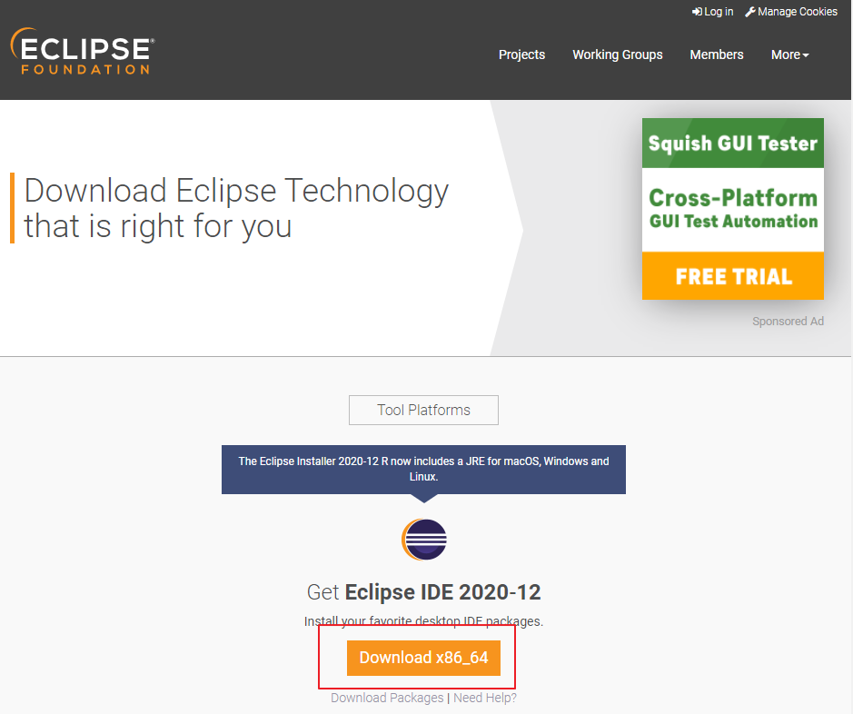
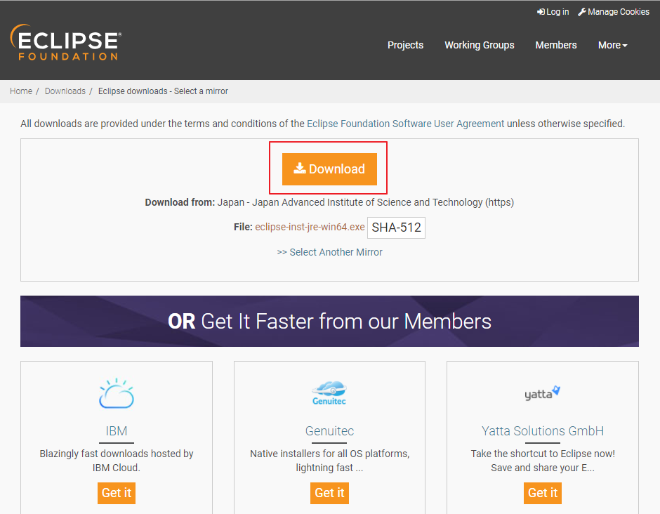
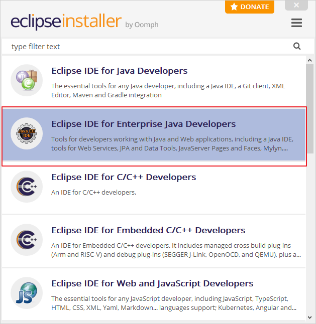
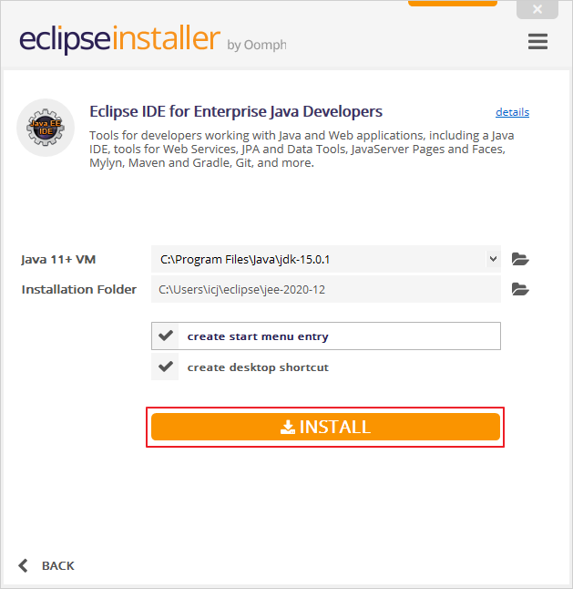
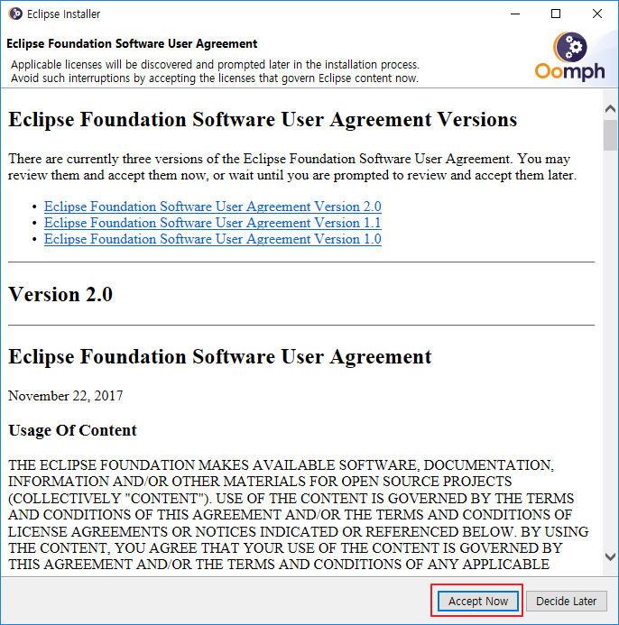
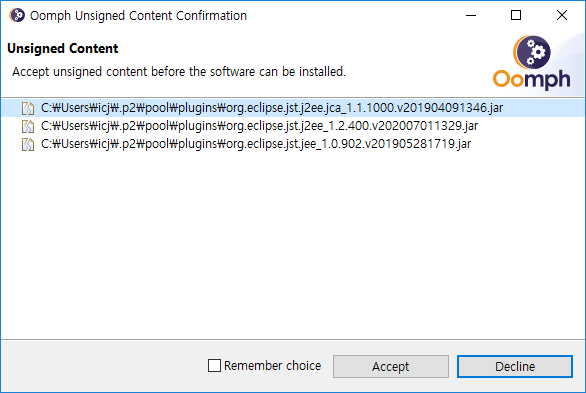
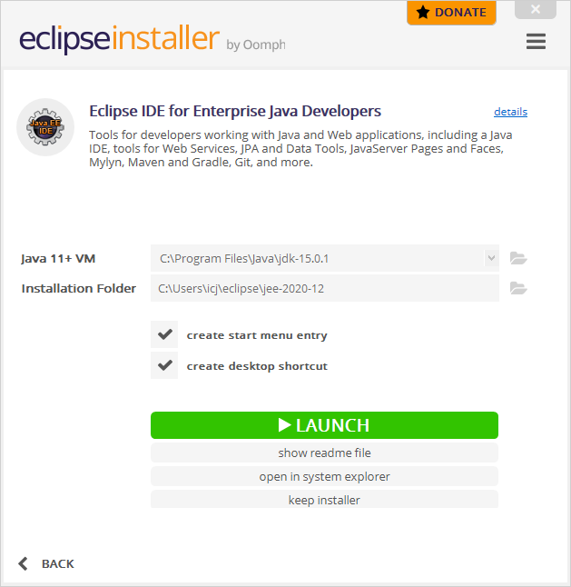

# [Eclipse] Eclipse IDE 2020‑12 설치

이클립스(Eclipse)를 설치해보겠습니다.

설치 이전에 Java를 설치하시기 바랍니다.

2020-09 버전 이후 부터는 JDK11 이상으로 요구사항이 바뀌었습니다.

따라서, 이클립스 설치전에 JDK11 이상으로 설치 및 환경 변수 설정을 하시기 바랍니다.

[[Java] Open JDK15 설치](https://poetic-code.tistory.com/76?category=832502) 글 참고.

## Eclipse 설치

1. <https://www.eclipse.org/>    <= 공식홈페이지에 접속

2. 우측 상단 Download 클릭

   

3. Download x86_64 클릭

4. Download 클릭

5. Eclipse IDE for Enterprise Java Developers 클릭

6. JDK11 이상 설치되어있는지 확인
7. 저장하고 싶은 위치로 InstallationFolder 설정
8. INSTALL 클릭

9. Accept Now 클릭

10. Accept 선택

11. 설치 완료!! 실행하려면 LAUNCH!!

## 링크

* [이클립스 다운로드 페이지](https://www.eclipse.org/downloads/)

