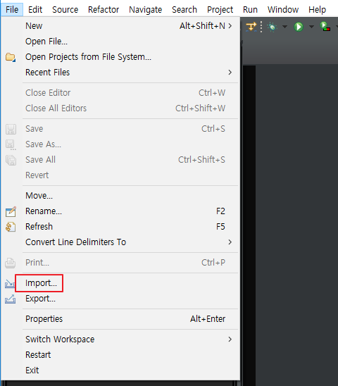

# [Eclipse] Eclipse Moonrise & RainbowDrops 테마 설정

이클립스(Eclipse)에 UI Theme를 설정해보겠습니다.

기존 Darkest Dark 테마를 사용하다가 이번에 이클립스를 재설치하면서 새로운 테마를 찾았습니다.

테마 설정 방법은 대부분 비슷하니 이 설치법으로 다른 테마를 사용하셔도 좋습니다.  

저는 Moonrise 테마와 RainbowDrops 테마의 Syntax Highlighting Scheme를 사용합니다.

[나는 개발자다](https://dream-kwon.tistory.com/38)님의 블로그를 보고 적용하였습니다.

## Moonrise & RainbowDrops 미리보기

## Moonrise UI Theme 설치

1. 이클립스 실행

2. 상단 메뉴의 Help - Eclipse Marketplace... 클릭

   

3. 'moonrise' 검색

4. Eclipse Moonrise UI Theme 의 Install 클릭

   

5. 설치 완료되면 이클립스 재시작  
   

## Moonrise UI Theme 설정

1. 상단 메뉴의 Window - Preferences

   

2. General - Appearance 클릭

3. Theme: MoonRise (standalone) 클릭

4. Apply and Close

   

  

## RainbowDrops Theme 설치

1. <http://www.eclipsecolorthemes.org/?view=theme&id=24587> 사이트에 접속

2. Eclipse Preferences 클릭

   * 아래 파일을 직접 받으셔도 됩니다.

   *  [RainbowDrops.epf](RainbowDrops.epf) 

   

   

## Syntax Highlighting Scheme 적용

1. 이클립스 실행

2. 상단 메뉴의 File - Import... 클릭

3. General - Preferences 선택 후 Next

4. 아까 다운받은 theme-24587 (혹은 RainbowDrops.epf) 불러오기 후 Finish

  

## 링크

* [Eclipse Moonrise UI Theme](https://marketplace.eclipse.org/content/eclipse-moonrise-ui-theme)
* [RainbowDrops](http://www.eclipsecolorthemes.org/?view=theme&id=24587)

