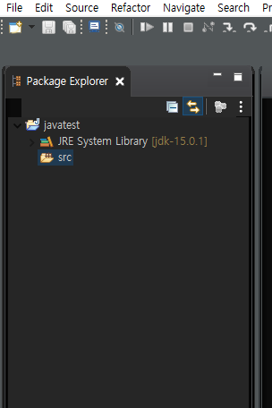
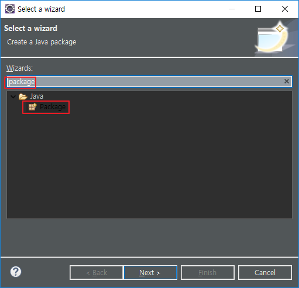

# [Eclipse] Java 프로젝트, 패키지, 클래스 생성

이클립스(Eclipse)에 Java 프로젝트를 생성 해보겠습니다.

이클립스가 설치 안되신 분들은 [Eclipse IDE 2020‑12 설치](https://poetic-code.tistory.com/77?category=832505) 를 참조하시길 바랍니다.


## 프로젝트(Project) 생성

1. 이클립스를 실행시킵니다.

2. 아래 방법 중 하나를 선택합니다.

   1. Ctrl + N
   2. File - New - Project...
   3. File - New - Java Project
   4. File - New - Other...

   

   > 저는 단축키 Ctrl - N을 활용합니다. 
   >
   > 앞으로 패키지나 파일을 만들때 유용하게 쓰이기 때문입니다.

3. 2-3 제외하고 다음 화면을 볼수 있습니다.

4. 'project' 를 입력하고 Java Project 선택

   

5. Project name 을 설정하고 사용할 JRE 선택 Finish를 누릅니다. (모르겠다면 기본값)

   

6. Don't Create를 누릅니다.

   

7. Package Explorer 에서 방금 만든 프로젝트를 확인할 수 있습니다.

   

   

## 패키지(Package) 생성

1. src에서 Ctrl - N 누르고 Package 입력 후 Next

   > 단어 'pa'만 눌러도 상단에 Package가 노출됩니다.

   

2. Name을 원하는 패키지명으로 변경후 Finish

   


## 클래스(Class) 생성

1. 방금 선택된 test 패키지 선택 후 Ctrl + N

2. Class 입력 후 선택 그리고 Next

   

3. 클래스 파일명을 입력한 뒤 Finish

   

4. 다음과 같이 입력한 후 F11을 눌러봅시다.

   ```JAVA
   package test;
   
   public class HelloWorld {
   	public static void main(String[] args) {
   		System.out.println("Hello World");
   	}
   }
   ```

   

5. 하단 Console 창에 Hello World가 출력된걸 확인할 수 있습니다.

   

   

> 생애 첫 프로그램을 생성하신것을 축하드립니다!!

