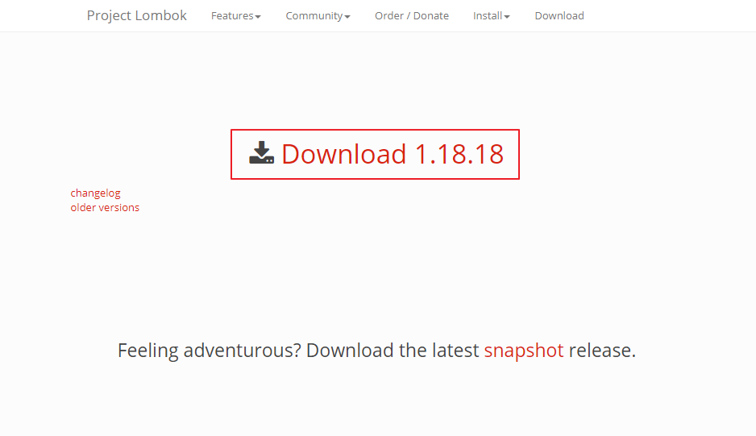
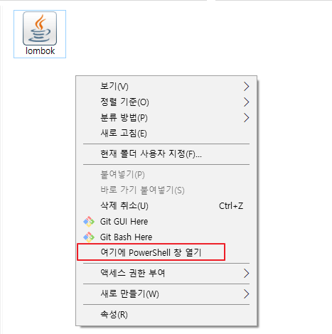
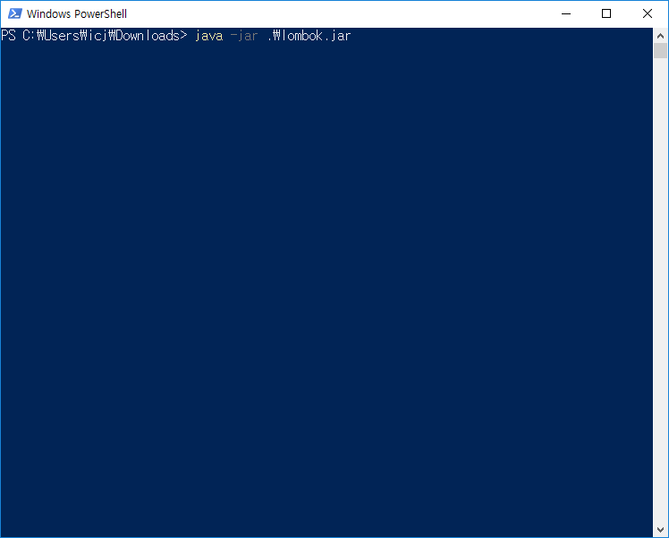
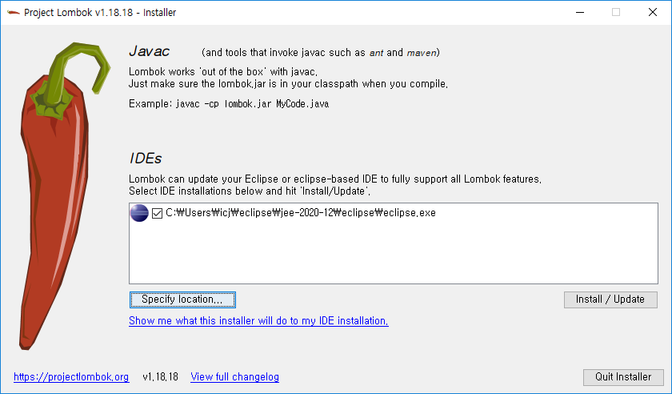
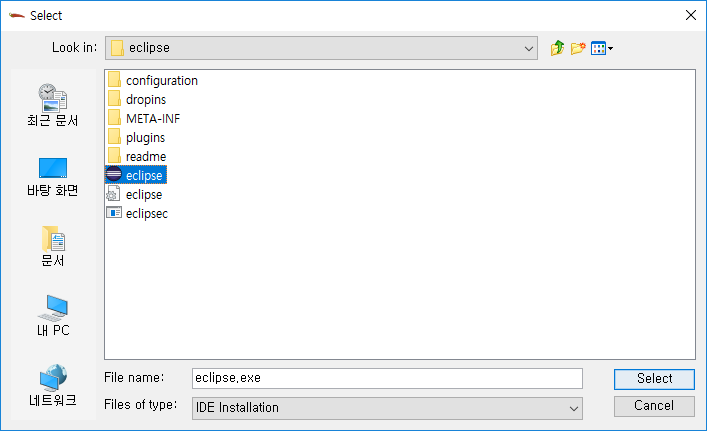
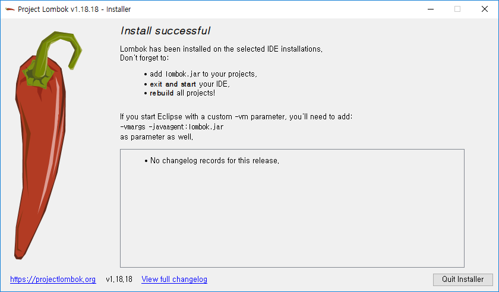
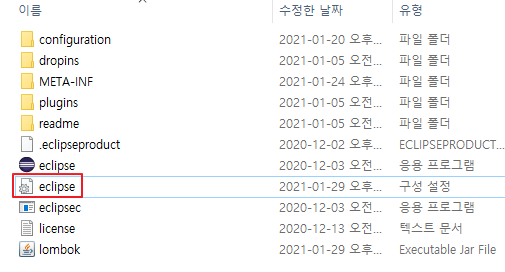
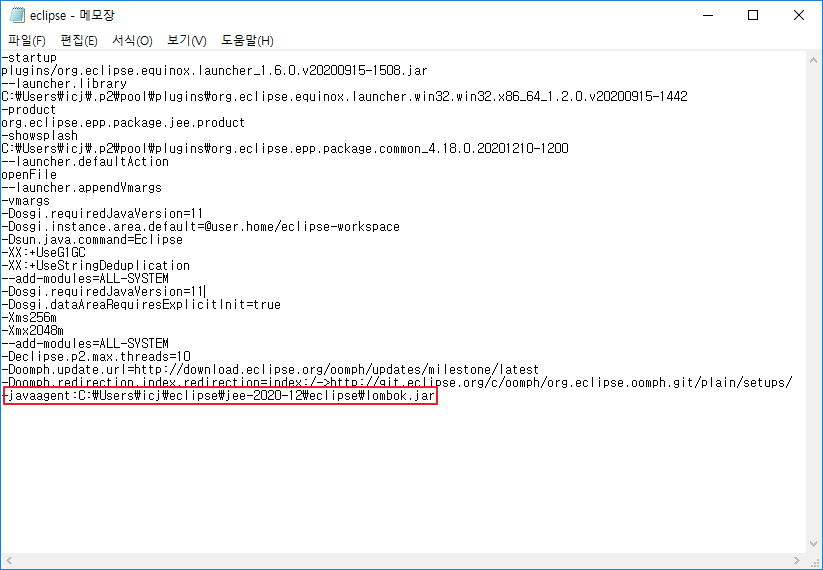

# [Eclipse] Lombok 설정

롬복은 Java에서 Domain, VO 등의 Model 객체를 생성할때 어노테이션을 이용하여 코드의 양을 대폭 줄일수 있는 라이브러리입니다.

이클립스에 롬복을 설정하는 방법에 대해 알아보겠습니다.


## Lombok 다운로드

1. <https://projectlombok.org/download> ← 사이트에 접속

2. Download [version] 클릭

   

3. 설치된 파일 실행

   1. 만약 실행이 안된다면 [JDK 설치와 환경변수 설정](https://poetic-code.tistory.com/75)을 선행해주세요.

   2. 설치된 파일 위치에서 Shift - 우클릭 - 여기에 PowerShell 창 열기

      

   3. 아래 명령어 입력

      ```shell
      java -jar .\lombok.jar
      ```

      

4. 자동으로 eclipse.exe 파일을 찾아줍니다.

   

   * 만약 찾지 못할 경우 Specify location.. 선택해 이클립스 실행 파일 찾기

     

5. Install / Update 클릭

   

6. Quit Installer


## Lombok 설치 확인

1. 이클립스 실행 파일 위치로 이동

2. eclipse.ini 파일 메모장으로 실행

   

3. 마지막 줄에 lombok.jar가 추가된 것을 확인할 수 있습니다.

   


## 링크

- [Lombok 공식 홈](https://projectlombok.org/)


