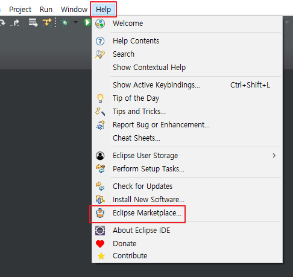
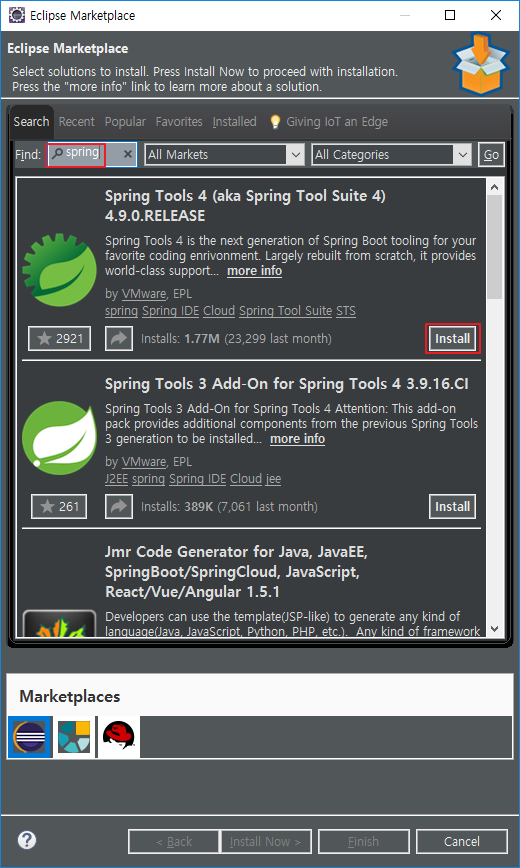
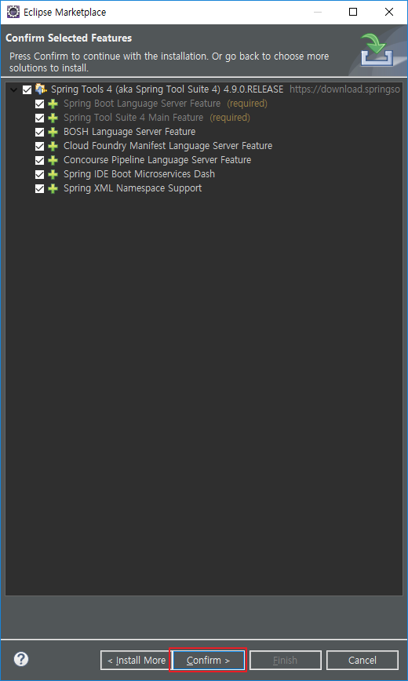
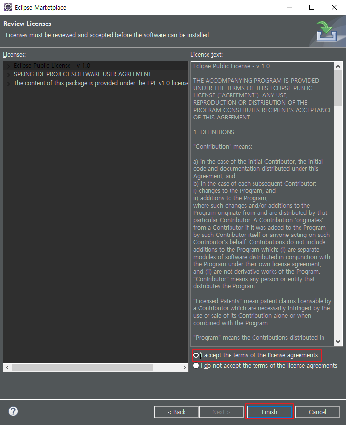
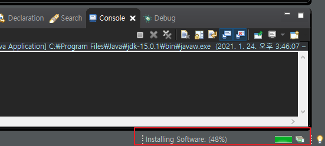
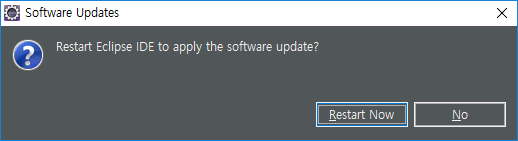

# [Eclipse] STS(Spring Tool Suit) 설치

Eclipse에 Spring Tool Suit 설치하는법에 대해 알아보겠습니다.

## 개발 환경

- Open JDK 15
- Eclipse 2020-12
- Spring Tools 4

## 설치 방법

1. 이클립스를 실행

2. Help - Eclipse Marketplace...

   

3. spring 검색 후 'Spring Tools 4' Install

   

4. Confirm

   

5. I accept the terms of the license agreements 체크 후 Finish

   

6. 우측 하단에 진행바가 생성되는것을 확인

   

7. 완료되면 Restart Now

   

   

## 링크

* [Spring 공식 홈](https://spring.io/tools)

