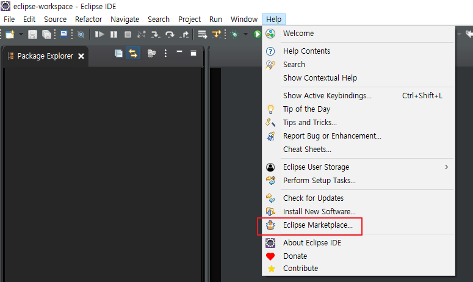
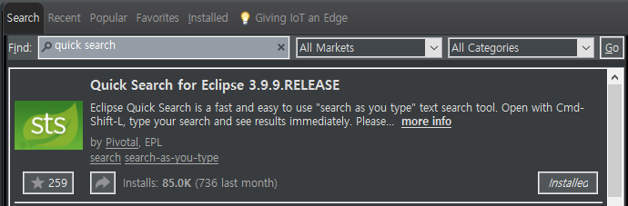
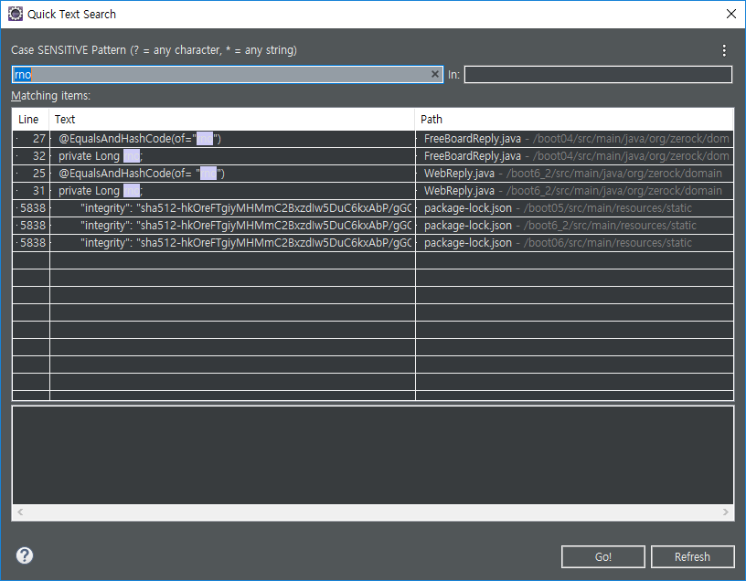
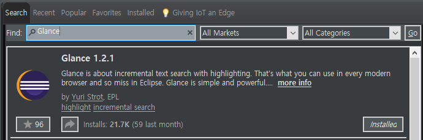
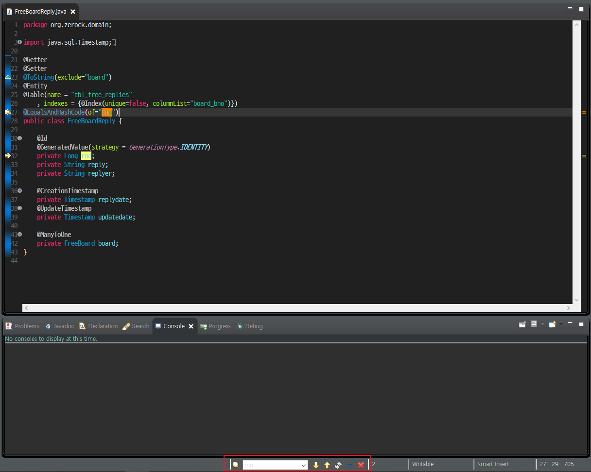
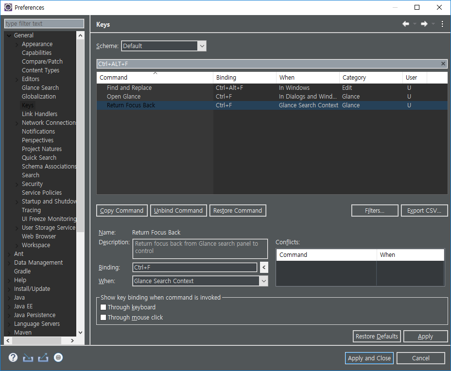
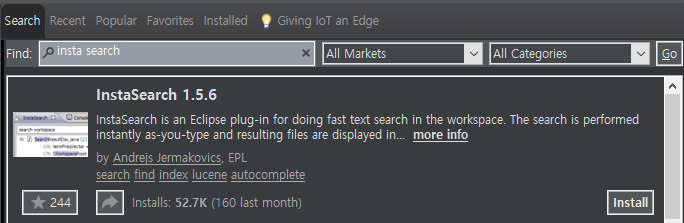
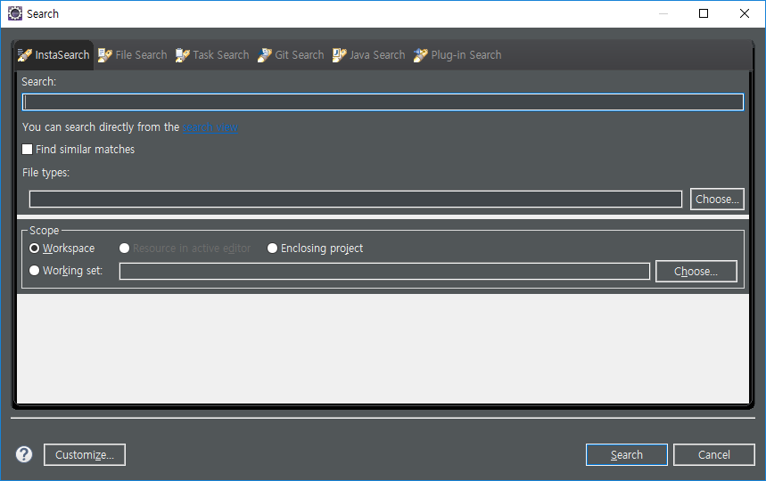

# [Eclipse] Search Plugins 추가 - 검색 환경 개선

이클립스를 사용하다 보면 검색할때 답답한 부분이 있습니다.

''무료니깐 참고 써야지..' 가 아니라 플러그인을 받아서 검색 환경을 개선해야합니다.

예를 들면, 단축키 `Ctrl + F`에 검색창을 안 보이게 하고 싶습니다.

대표적으로 아래 두 방법을 이용할 수 있습니다.

1. DevTools 테마에 포함된 Inline Search를 이용
2. Glance 플러그인 이용

저는 테마 자체는 Moonrise를 이용하기 때문에 두 번째 방법을 선호합니다.

그 밖에 다양한 플러그인들을 설치하여 개선된 환경에서 개발해봅시다.

## 플러그인 설치 방법

1. 상단 메뉴의 Help - Eclipse Marketplace... 클릭

   

2. 아래의 원하는 플러그인 검색 - install

## 추천 플러그인들

아래의 플러그인 중에서 원하는 것을 설치 받으시면 됩니다.

### 1. Quick Search for Eclipse

`Ctrl + Shift + L` 단축키로 아래와 같은 창에서 단어 검색을 할 수 있습니다.

### 2. Glance

`Ctrl + Alt + F` 단축키로 하단에서 작은 박스에서 검색을 할 수 있습니다.

> 저는 기본 검색 단축키와  Glace를 변경하여 사용하고 있습니다.
>
> 변경을 원하시면 Preferences - General - Keys 에서 다음과 같이 Binding을 변경하시면 됩니다.

### 3. InstaSearch

`Ctrl + G` 단축키에로 뜨는 검색창에 InstaSearch 탭이 추가된 것을 확인해 볼 수 있습니다. 

검색을 해보면 아시겠지만 기존에 File Search에서 쓰던 속도와 차원이 다릅니다.

> 다만 사전에 파일들에 미리 인덱싱을 해놓기 때문에 이클립스 실행시 느려집니다. 그래서 저는 Quick Search만 사용합니다.

### 링크

* [Quick Search](https://marketplace.eclipse.org/content/quick-search-eclipse)
* [Glance](https://marketplace.eclipse.org/content/glance)
* [Insta Search](https://marketplace.eclipse.org/content/instasearch)