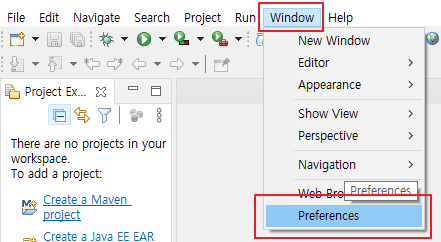

# [Eclipse] 인코딩 UTF-8 설정

이클립스(Eclipse)를 설치 이후 UTF-8 설정을 해보겠습니다.

설치 방법은 [[Eclipse] Eclipse IDE 2020‑12 설치](https://poetic-code.tistory.com/category/Tools/Eclipse) 글을 참고 하세요.

## 이클립스 인코딩 환경 설정

상단에 있는 탭에서 Window - preferences

아래 순서대로 설정하고 apply 

* General - Workspace - Other - UTF-8
* General - Editors - Text Editors - Speling - Encoding - Default (UTF-8)
* General - Content Types - Text - Java Properties File - Default encoding: UTF-8
* Web - CSS Files - Encoding - ISO 10646/Unicode(UTF-8)
* Web - HTML files - Encoding - ISO 10646/Unicode(UTF-8)
* Web - JSP files - Encoding - ISO 10646/Unicode(UTF-8)
* XML - XML files - Encoding - ISO 10646/Unicode(UTF-8)

