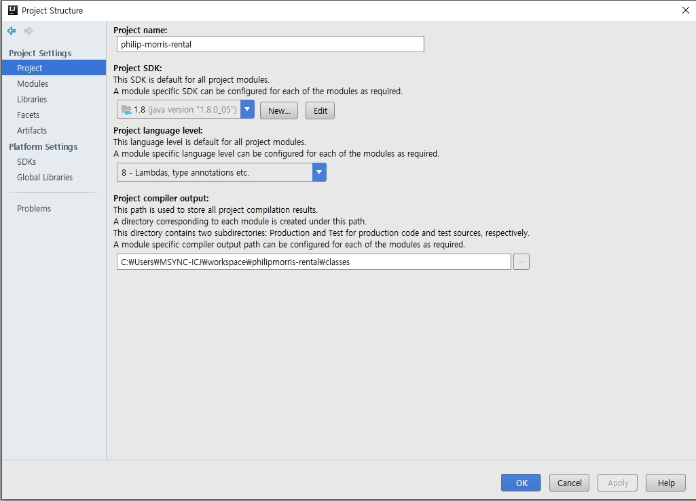
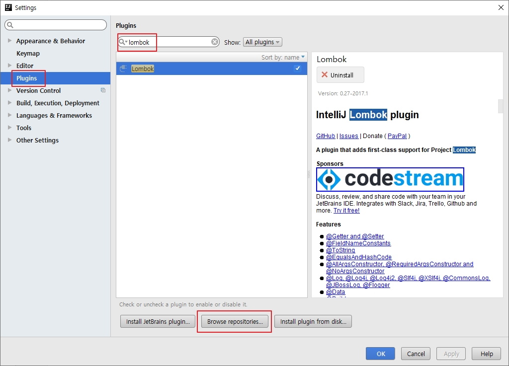
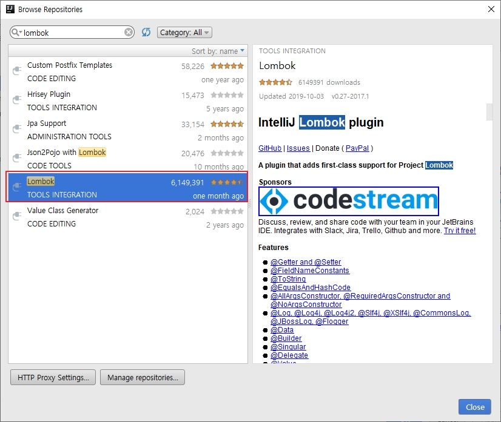
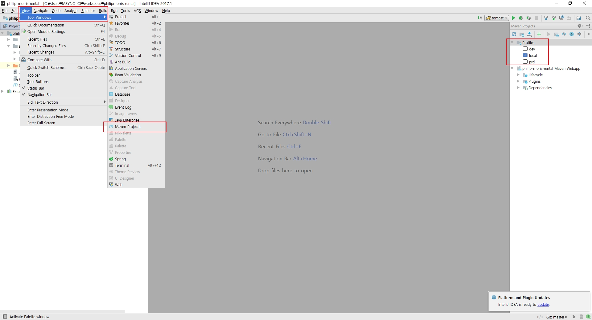
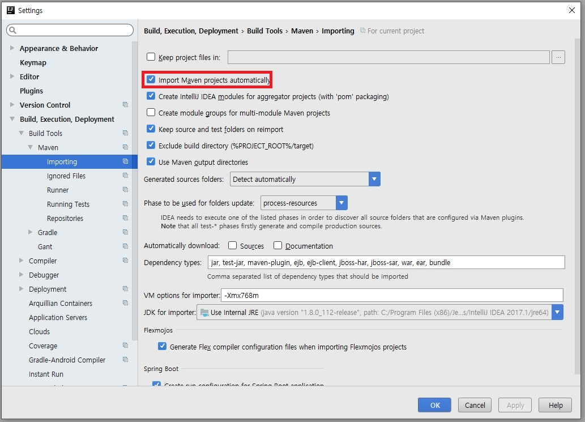
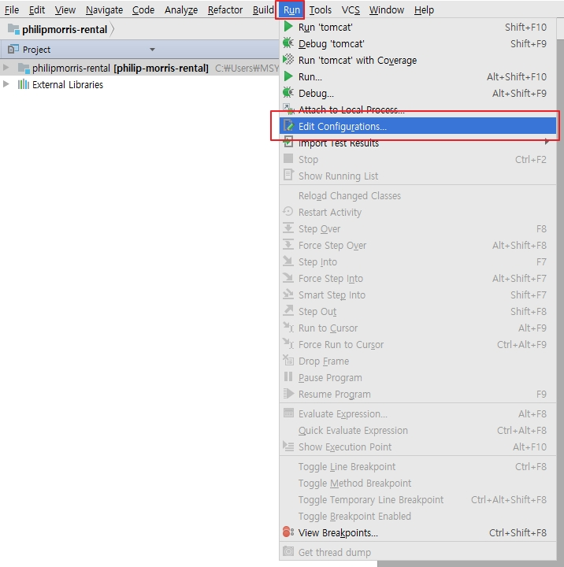
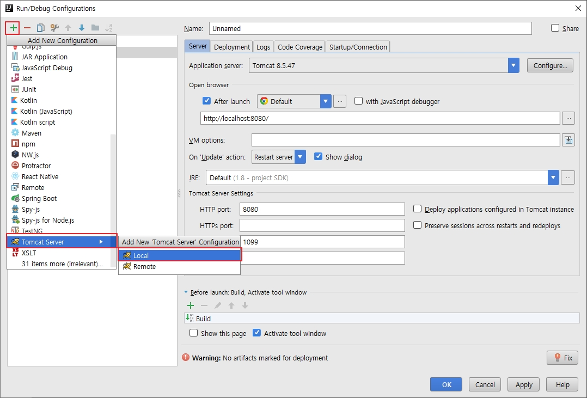

# [IntelliJ] 초기 설정

## License Server

1. IntelliJIDEALicenseServer_windows_amd64 실행
2. IntelliJ IDEA실행
3. Server 주소에 1에서 실행된 서버 URL 입력

## Import

시작 화면에서 Import 할 수 있다.

* Import 할때 workspace가 아닌 프로젝트를 선택하도록 한다.

## JDK

File - Project Structure - Project - Project SDK

설치 받은 JDK를 등록하도록 하자.

## Lombok

File - Settings - Plugins

*lombok* 검색.

제일 많이 받은거 설치.

## Maven View

View - Tool Windows - Maven Project

우측 메뉴가 생기며 props 를 선택할 수 있다.

## Maven Auto Import

File - Settings - Build, Execution, Deployment - Build Tools - Maven - Importing

Import Maven projects automatically V 체크.

> 메이븐이 빌드되면 USER/{ID}/.m2 파일에 라이브러리들이 저장된다.

## Run Configuration

Run - Edit Configurations

 혹은 초록 화살표 옆에있는 상자 클릭 - Edit Configurations

\+ 버튼 클릭 - Tomcat Server - Local - 환경설정 후 Apply

