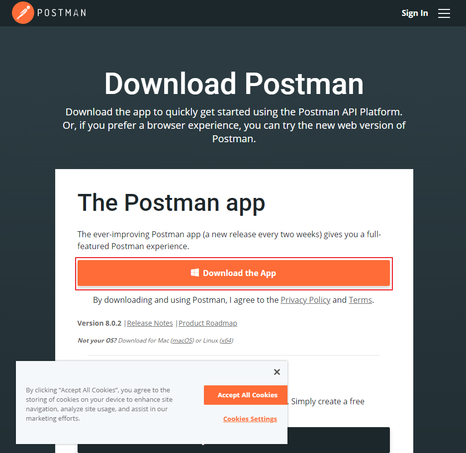
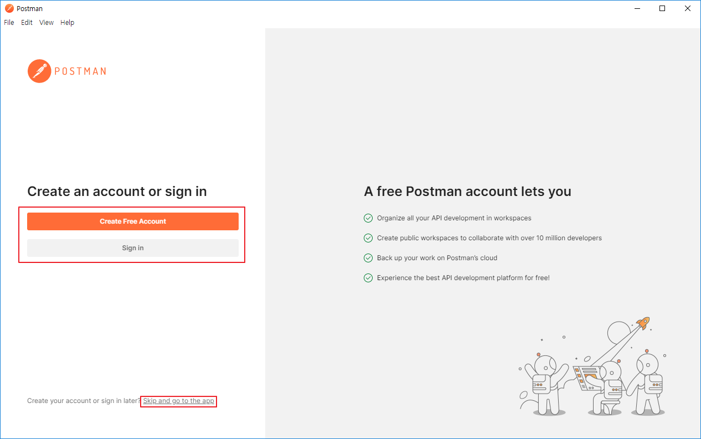
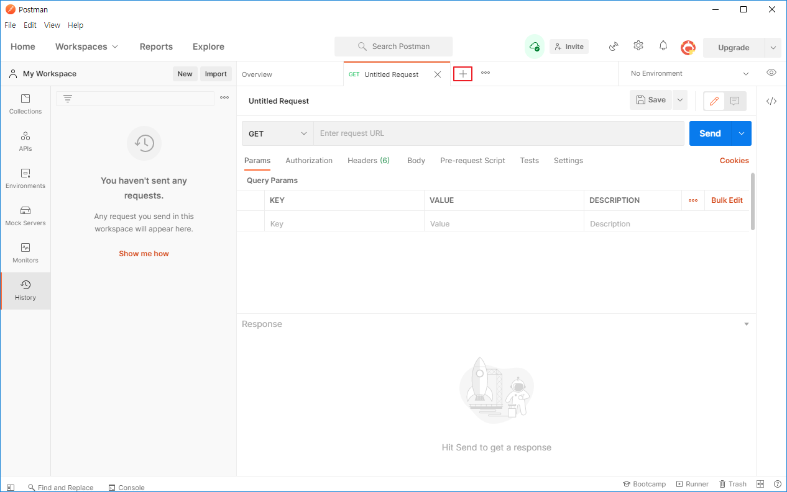
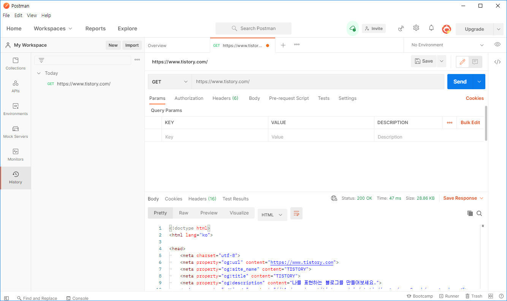

# [Postman] 포스트맨(Postman) 설치

포스트맨은 API 테스트를 할 수 있는 툴입니다.

윈도우에 설치 하는법을알아보겠습니다.

## 포스트맨 설치

1. <https://www.postman.com/downloads/> ← 사이트에 접속

2. Download the App 선택

   

3. 자신의 비트에 맞는 비트를 선택 (대체로 64bit)

4. 회원가입과 로그인을 사용할 분들은 위에 버튼을, 바로 사용하실 분들은 Skip and go to the app 선택

   

5. 상단의 `+` 버튼으로 새로운 Requset 생성할 수 있습니다.

   

6. 테스트를 위해 Tistory를 GET 방식으로 요청해보겠습니다.

   

7. 하단에 응답받은 HTML 코드를 확인할 수 있습니다.

## 링크

* [포스트맨 공식 홈](https://www.postman.com/)

