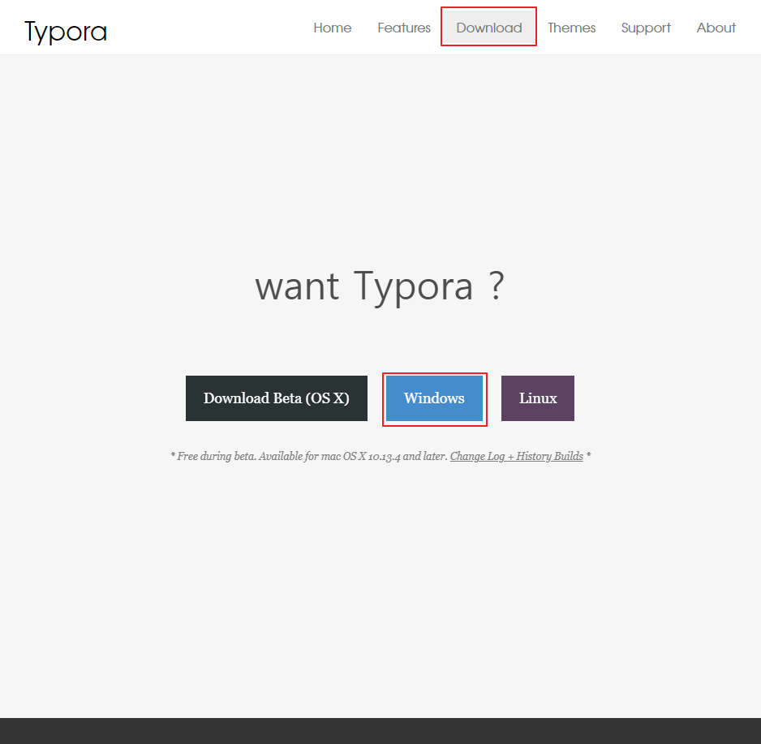
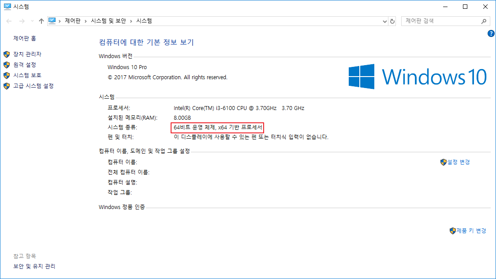
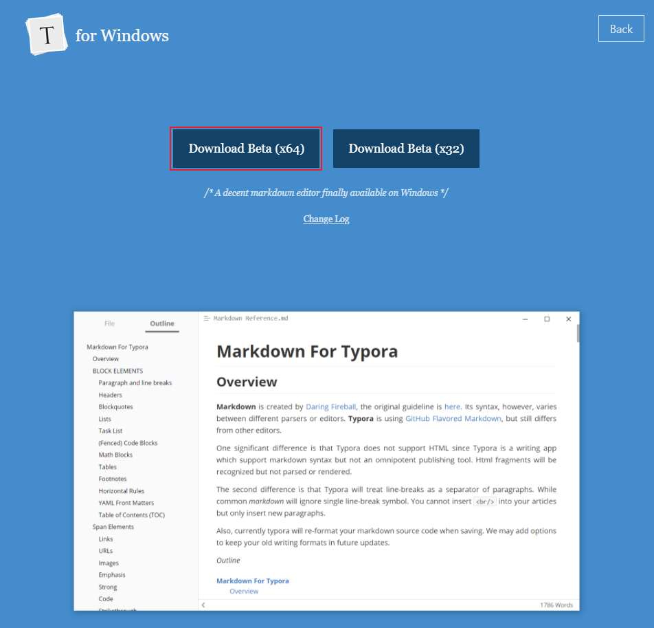
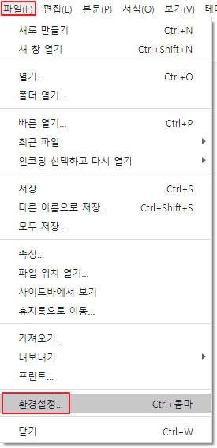
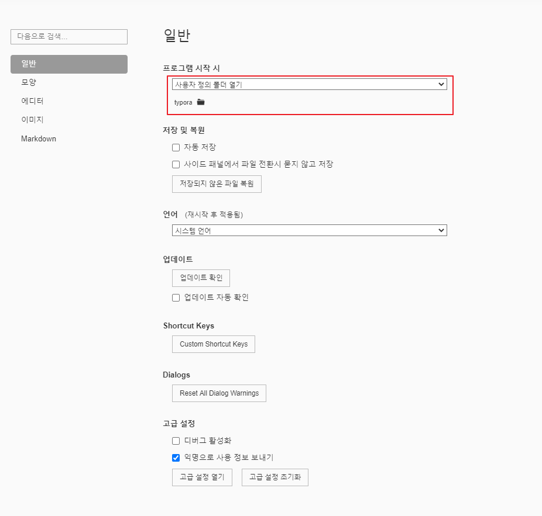
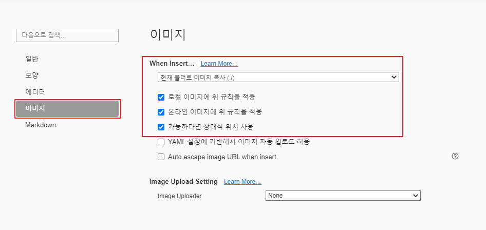

# [Typora] Typora 설치 및 설정

타이포라(Typora)는 Markdown 문법을 이용하여 문서를 작성하는 에디터입니다.

무료이고 사용법만 알면 쉽고 깔끔하게 문서를 작성할 수 있습니다.  

## Typora 설치

1. <https://typora.io/> 에 접속

2. ↓ 화살표를 누르고 상단 메뉴의 Download를 클릭

3. 운영체제에 맞는 버튼 클릭 (저는 Windows 기준)

   

4. 윈도우키 - 내 PC 우클릭 - 속성

5. 시스템 종류: 내 운영체제 비트 확인

   

6. Download Beta (`5에서 확인한 비트) 클릭

   

7. 설치 파일 실행하여 순차적으로 설치

## (선택) Typora 설정

사용해보며 미리 설정해두면 편하다고 생각하는 것들을 적었습니다.

1. 상단메뉴의 파일(F) - 환경설정...

   

2. 일반 - 프로그램 시작 시 - 사용자 정의 폴더 열기 - [문서 정리할 폴더]

   > 미리 폴더를 생성하여 지정해두면 문서를 정리할때 수월합니다.

   

3. 이미지 - When Insert... - 현재 폴더로 이미지 복사 (./)

   1. 로컬 이미지에 위 규직을 적용 체크
   2. 온라인 이미지에 위 규칙을 적용 체크
   3. 가능하다면 상대적 위치 사용

   > 이미지를 드래그앤 드롭했을때 문서와 같이 저장됩니다.
   >
   > 상대 주소로 복사되기 때문에 문서가 들어있는 폴더를 이동할때도 문제가 발생되지 않습니다.
   
   

## 링크

* [Typora](https://typora.io/)

