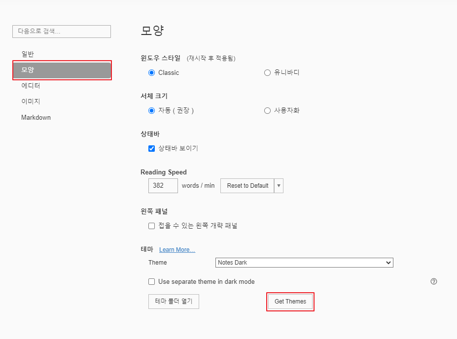
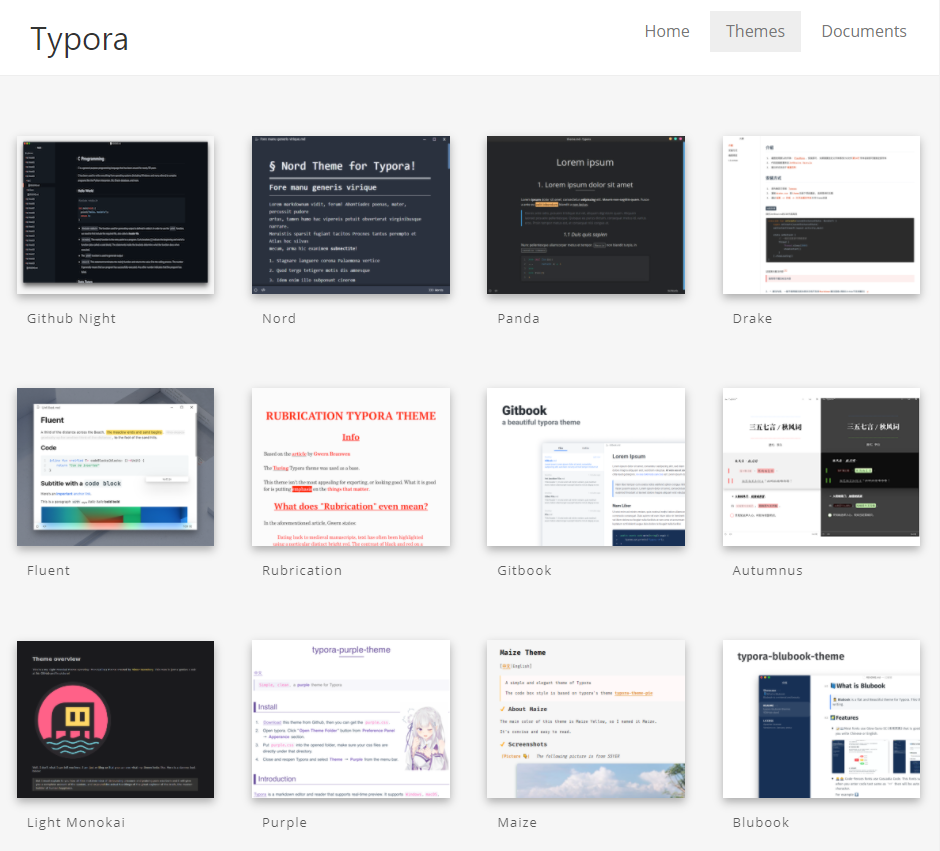

# [Typora] Typora 테마 적용

타이포라(Typora)에 테마를 적용하는 방법에 대해 알아보겠습니다.

처음에는 Github가 기본값으로 설정되어 있습니다.

저는 시력 보호를 위해 Notes Dark를 사용하고 있는데 새로운 테마를 적용시켜 보겠습니다.

## 적용된 테마 미리보기

## 테마 적용 방법

기본적으로 주어지는 테마와 새롭게 다운 받아서 적용하는 방법이 있습니다.

### 1. 기본 테마

- 상단 메뉴의 테마에서 원하는 테마 선택

  

  

### 2. 사용자 정의 테마

1. 상단 메뉴의 파일 - 환경설정...

   

2. 모양 - Get Themes 클릭

   

3. 원하는 테마 선택

   

4. Download 클릭

   

5. 압축 풀고 위 예제와 같은 이름의 CSS파일 복사

   * fonts와 images도 포함되어 있다면 모두 복사

   

6. 환경설정으로 돌아와서 테마 폴더 열기

   

7. 아까 복사했던 파일 및 폴더 붙여넣기

8. Typora 재시작

9. 기본 테마 적용하는 부분에 추가된 것을 확인할 수 있음

   

## 링크

* [Typora Theme](https://theme.typora.io/)
* [Typora Theme Docs](https://support.typora.io/About-Themes/)

