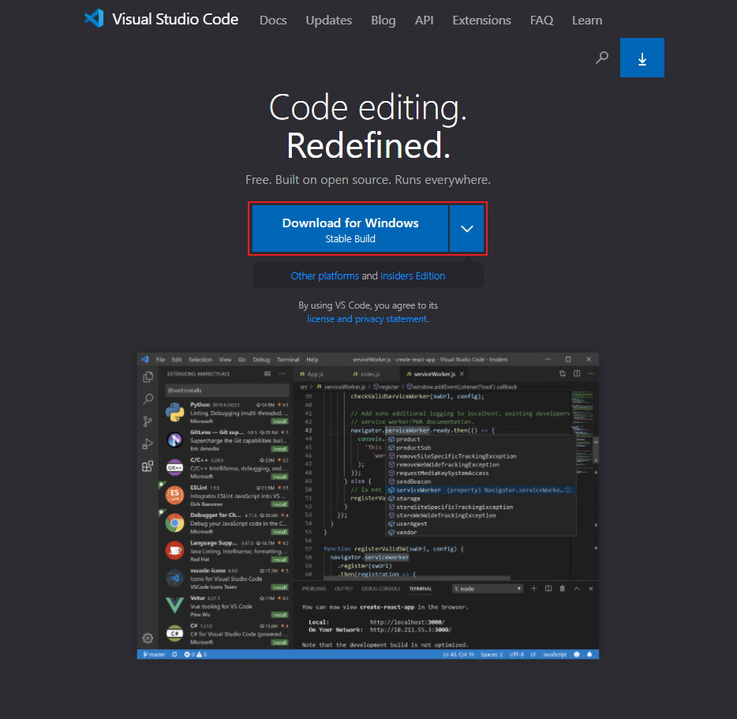
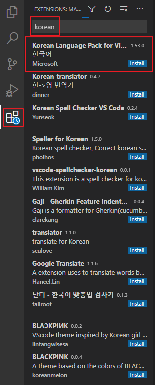
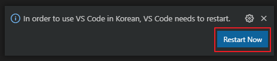

# [VSCode] VSCode 설치 및 한글 설정

[VSCode](https://code.visualstudio.com/)는 마이크로 소프트에서 제공해주는 코드 편집기입니다.

가볍게 사용할 수 있고 다양한 플러그인을 제공해줘서 유용하게 사용하고 있는 툴입니다.

VSCode 설치 방법과 한글설정에 대해 알아보겠습니다.  

## 설치

1. <https://code.visualstudio.com/> 에 접속
2. 자신의 운영체제에 맞는지 확인한 뒤 Download 버튼을 클릭

3. 설치 파일 실행

4. 기본 값에 두고 모두 다음 선택

   1. 설치 파일 경로를 변경하고 싶다면 변경해서 설치
   2. PATH에 추가(다시 시작한 후 사용 가능) 체크

   > 기본값으로 모두 설치해도 무관하기 때문에 스크린샷은 생략했습니다.

  

## 한글 설정

1. Ctrl + Shift + x
2. Korean 입력

3. Install 버튼 클릭
4. 설치가 완료되면 우측 하단에 Restart Now 버튼 클릭

## 링크

* [VSCode](https://code.visualstudio.com/)

