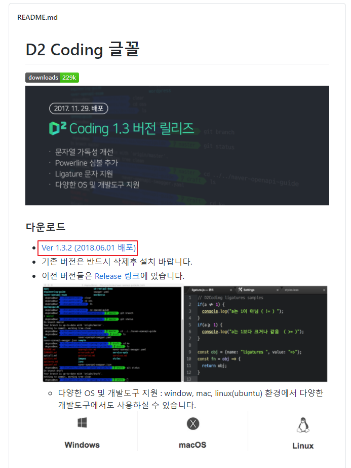
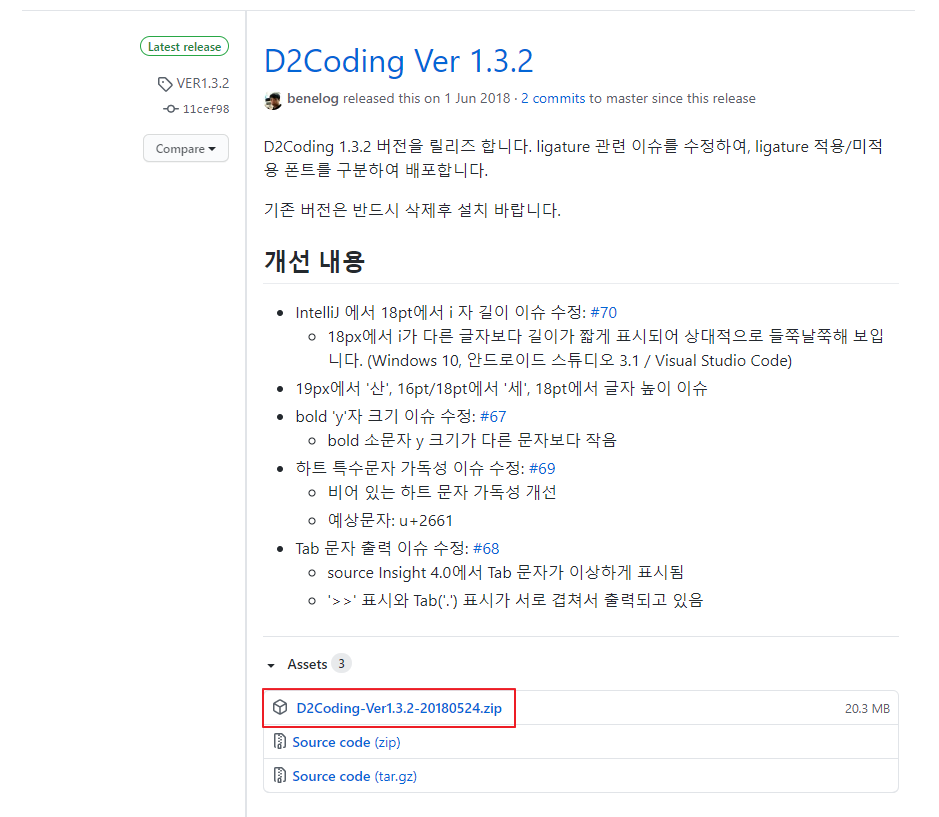
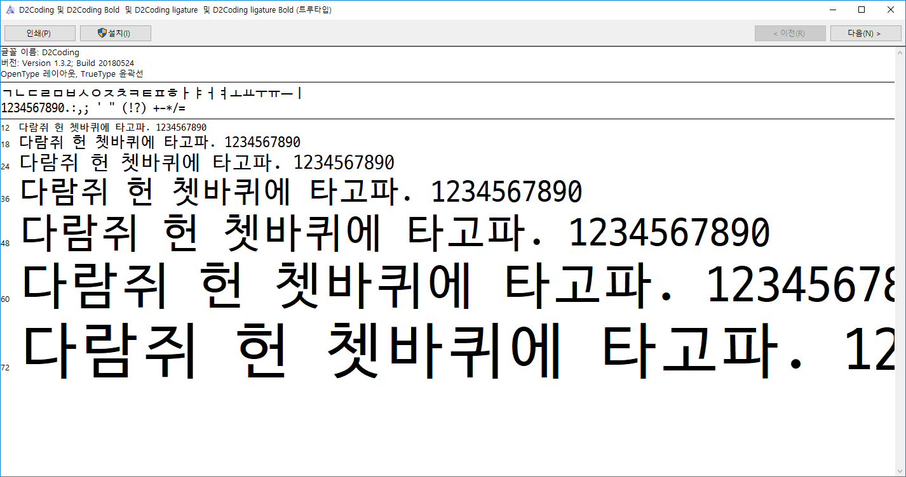
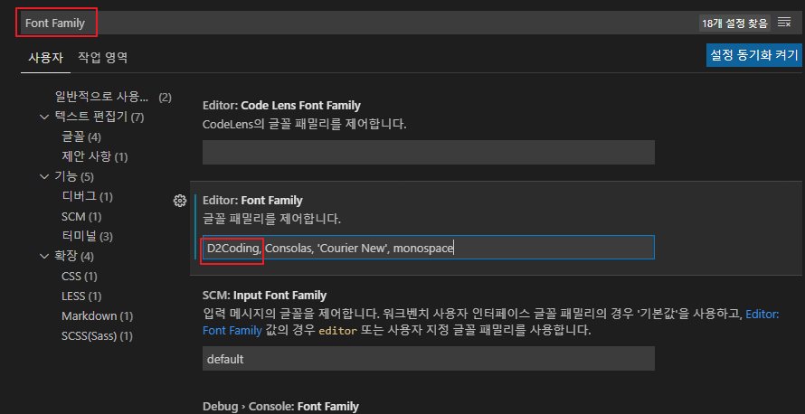

# [VSCode] VSCode에 D2Coding 설치 및  설정

D2Coding는 네이버에서 제공해주는 개발 전용 폰트입니다.

해당 폰트를 VSCode에 적용시켜 보겠습니다.  

## D2Coding 설치

1. <https://github.com/naver/d2codingfont> ← 사이트에 접속
2. '다운로드' 바로 아래에 있는 'Ver 1.3.2 (2018.06.01)' 클릭

   
   
   > 버전은 날짜에 따라 다를 수 있습니다.
   >
   > 위 버전은 2021-01-22 기준.

3. [D2Coding-Ver1.3.2-20180524.zip](https://github.com/naver/d2codingfont/releases/download/VER1.3.2/D2Coding-Ver1.3.2-20180524.zip) 클릭해서 설치 파일 받기
   
   * 위 링크를 클릭해서 받으셔도 무관합니다.
   * Git을 이용할 경우 Clone 해주세요.
   
   
   
4. 설치 받은 파일 압출 풀기

5. D2CodingAll - D2Coding-Ver1.3.2-20180524-all 열기

6. 설치 클릭

   

7. VSCode 실행

8. Ctrl + , 

9. 검색 창에 Font Family 입력

10. 글꼴 패밀리 맨 앞에 D2Coding 추가

    

11. 설정 창 닫고 문서를 열면 자동 적용됨  
    

## 링크

* [D2Coding](https://github.com/naver/d2codingfont)