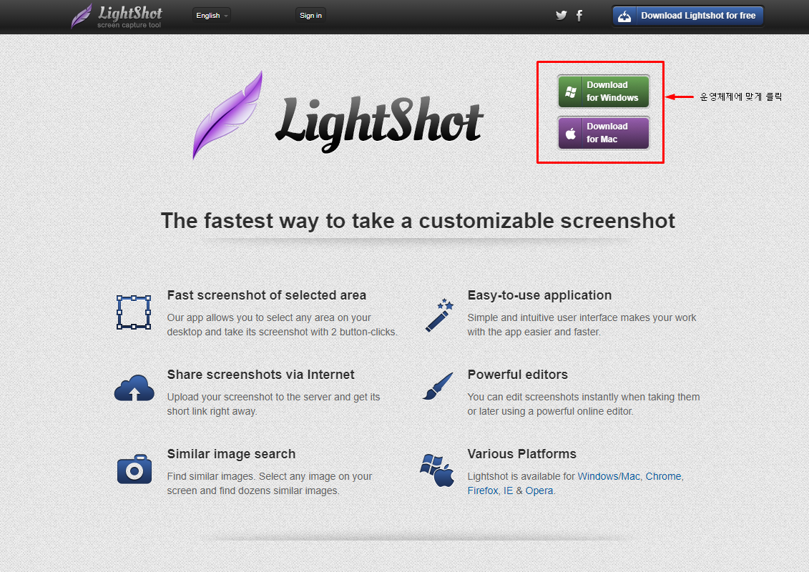
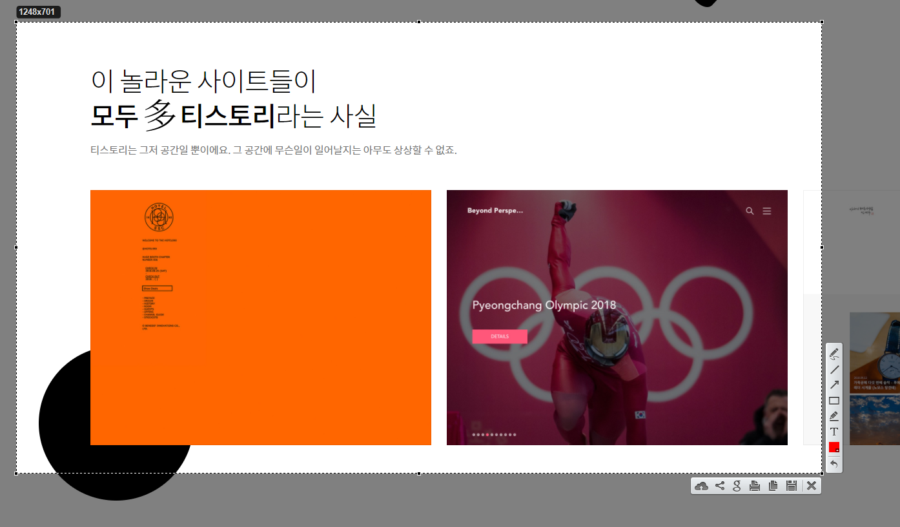

# 스크린샷 툴 추천 - 라이트샷(LightShot)

오늘은 [라이트샷(LightShot)](https://app.prntscr.com/en/)에 대해서 소개해드리겠습니다.

픽픽은 경량화된 스크린샷 및 이미지 수정 소프트웨어입니다.

개인적으로 직접 사용해보고 주변에 추천 드리고 있습니다.

## 장점

* [픽픽(PickPick)](https://poetic-code.tistory.com/73)에 비해 가볍다
* 캡처 이후 윈도우에서 직접 이미지 수정 가능
* 무료

## 설치

아래 링크로 접속하여 공식 홈페이지에서 바로 다운로드를 받으실 수 있습니다.

<https://app.prntscr.com/en/>

아래의 다운로드 버튼을 눌러 설치해주세요.

## 사용 방법

1. 키보드의 PrtSc키 눌러 영역을 지정
2. 우측의 원하는 도구 모음으로 이미지 수정

3. 하단의 공유하기 혹은 저장 버튼 클릭

## 링크

* [LightShot Download](https://app.prntscr.com/en/)

